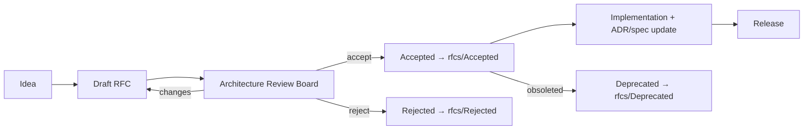

# DevOS — RFC Process (Request for Comments)

> **Status:** RELEASE CANDIDATE — For Ratification (no production code until ratified)
> **Version:** 1.0-rc1
> **Owner:** CTO / Architecture Review Board (ARB)
> **Companion:** Constitution (`01-product-constitution.md` T11 Transparency, T12 Open Standards), ADR (`03-adr.md`), Engineering Standards (`04-engineering-standards.md` §11 Kernel)

---

## 1. Purpose

Every **major architectural change** and **significant feature proposal** must pass through a Request for Comments (RFC) before implementation. The RFC process guarantees:
- Decisions are transparent, reviewed, and recorded (Constitution T11).
- Open standards are preferred; proprietary choices are justified (Constitution T12).
- Changes route through the Kernel authority and ARB, not ad-hoc commits.

RFCs are the **proposal layer**; accepted RFCs may produce one or more **ADRs** (the decision record) and/or spec updates.

## 2. When an RFC Is Required

| Trigger | RFC? |
|---------|------|
| New agent, provider, channel, or tool plugin | Yes |
| Change to Kernel authority (scheduling, lifecycle, registry) | Yes |
| New external protocol or API surface | Yes |
| Alteration of a Constitutional tenet or the core vision | Yes (unanimous) |
| Significant feature (new user-facing capability) | Yes |
| Internal refactor with no behavioral/contract change | No (PR only) |
| Bug fix | No (PR only) |
| Doc-only change | No |

When in doubt, open an RFC. Cheap to write, expensive to undo.

## 3. Lifecycle



| Stage | Owner | Exit criteria |
|-------|-------|---------------|
| Idea | Anyone | Capture in `rfcs/` as draft |
| Draft | Author | Follows template; references PRD/Constitution/ADR |
| Architecture Review | ARB (CTO + architects) | Decision recorded; ≥ 1 ARB approver |
| Accepted | ARB | Moved to `rfcs/Accepted/`; implementation planned |
| Rejected | ARB | Moved to `rfcs/Rejected/` with rationale |
| Deprecated | ARB | Moved to `rfcs/Deprecated/` when superseded |
| Implementation | Eng | Conforms to DoD (`10-definition-of-done.md`) |
| Release | Release Eng | Per Release Strategy (`09-release-strategy.md`) |

## 4. RFC Template (`rfcs/000-template.md`)

```
# RFC-XXXX — <Title>
- Status: Draft | Accepted | Rejected | Deprecated (superseded by RFC-YYYY)
- Author: <name>
- Date: YYYY-MM-DD
- Related: <PRD §, Constitution tenets, ADRs, specs>

## Problem / Motivation
Why is this needed? What forces apply?

## Proposal
What we propose, concretely. Include interfaces, flows, diagrams (Mermaid).

## Alternatives Considered
What we rejected and why.

## Open Standards Check (T12)
Which open standards are used (MCP/OpenAPI/Git/OCI/OAuth/Webhooks)?
If proprietary, document the justification.

## Transparency Plan (T11)
How will each action expose: why, agent, provider, cost, files, rollback?

## Kernel Authority (§11)
Which Kernel-owned capability (schedule/agent/workspace/provider/plugin/runtime)
is touched? How does the Kernel remain the sole authority?

## Impact
Affected services, specs, ADRs, users, cost.

## Rollout & Risk
Phased plan, rollback strategy, failure modes.
```

## 5. Numbering & Storage

- RFCs are numbered sequentially: `RFC-0001`, `RFC-0002`, …
- Source of truth: `governance/rfcs/`
  - `rfcs/Accepted/` — ratified proposals (the live record)
  - `rfcs/Rejected/` — proposals with rationale (institutional memory)
  - `rfcs/Deprecated/` — superseded proposals, linked to successors
- A proposal moves **between folders** as its status changes; the file is never deleted.
- `rfcs/README.md` indexes all RFCs with status + link.

## 6. Review Board & Cadence

- The **Architecture Review Board (ARB)** = CTO + designated architects (min 2). 
- Reviews at least weekly; urgent RFCs within 3 business days.
- ARB may request changes; the author revises; no implementation before `Accepted`.
- Tenet- or vision-touching RFCs require **unanimous** ratifier approval (Constitution Article VIII, Article VI).

## 7. Relationship to ADR & Specs

- An Accepted RFC **may** spawn an ADR (decision record) and spec updates.
- ADRs implemented without an RFC are allowed only for small, non-controversial internal decisions; major ones go through RFC first.
- The RFC is the *narrative*; the ADR is the *binding decision*; the spec is the *design*.

## 8. Approval (this document)

| Role | Name | Accept? | Date |
|------|------|---------|------|
| CTO | __________ | ☐ Yes ☐ No | ______ |
| Head of Engineering | __________ | ☐ Yes ☐ No | ______ |

*End of RFC Process v1.0-rc1.*
