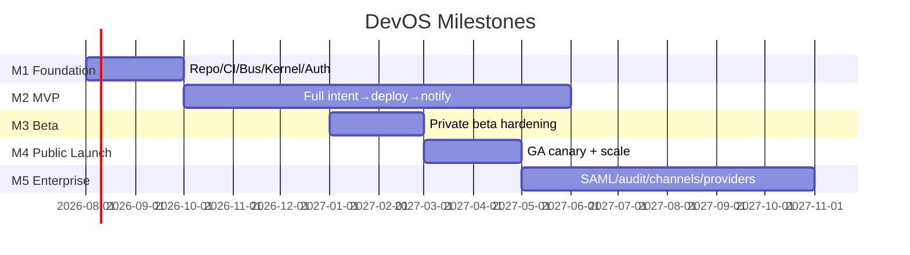

# 01 — Product Milestones

> **Part of:** Implementation Planning Package (Batch 1) · **Traceability:** every milestone references PRD + ADR + SDD.
> **Companion:** PRD (`/product/PRD.md`), ADRs (`/governance/03-adr.md`), SDD (`/sdd/`)

---

## Milestone Summary

| Milestone | Sprints | Primary PRD | Primary ADR | Primary SDD |
|-----------|---------|-------------|-------------|-------------|
| **M1 Foundation** | S0–S1 | FR-17, D8/D9 | ADR-001, ADR-003 | §11, §02, §05 |
| **M2 MVP** | S2–S10 | §6.1, FR-1…FR-18, G1–G6 | ADR-002,004,005,006,007,008 | §01,§03,§04,§06,§07,§08,§10 |
| **M3 Beta** | S11–S12 | G2, G4, §11 KPIs | ADR-001 (replay) | §04,§07,§08 |
| **M4 Public Launch** | S13–S14 | G1, G3, §11 | ADR-003 | §02,§08 |
| **M5 Enterprise** | S15+ | D1–D7 (expansion), G5 | ADR-004 (microVM) | §05,§06,§09,§10 |

---

## M1 — Foundation
**Objective:** Stand up the runnable skeleton — repo, CI, event bus, kernel core, auth, one provider adapter (Claude), one workspace type — able to run a single scripted agent loop end-to-end.
- **PRD:** FR-17 (accounts/multi-tenancy), D8 (NATS), D9 (containers), §6.1 (MVP scope).
- **ADR:** 001 (event bus), 003 (provider ports), 005 (CRDT, scaffold), 008 (budget scaffold).
- **SDD:** §11 Kernel, §02 API Gateway (skeleton), §05 Provider Gateway (Claude), §06 Workspace Manager (single stack).
- **Exit:** A committed `hello-agent` flow runs locally: intent → bus → agent → workspace → artifact. (Full exit criteria in 10-milestone-exit-criteria.md.)

## M2 — MVP
**Objective:** Deliver the v1 product — natural-language intent across Web + REST + Discord producing a deployed, tested, monitored app via a coordinated 8-agent team, with HITL, budget governance, and CRDT multi-surface sync.
- **PRD:** §6.1 MVP scope; FR-1…FR-18; Goals G1 (≤30min), G2 (70% tests pass), G3 (cross-surface), G4 (safety), G5 (margin), G6 (no lock-in); Decisions D1–D10.
- **ADR:** 002 (DAG), 004 (workspace isolation), 005 (CRDT), 006 (uniform intent), 007 (HITL), 008 (budget).
- **SDD:** §01 Ingress, §03 Orchestration, §04 Agent Runtime, §06 Workspace, §07 Notification, §08 Query, §10 Channel Adapters (Web/REST/Discord).
- **Exit:** Private-beta-ready MVP meeting G1–G6 (Batch 3: 10-milestone-exit-criteria.md).

## M3 — Beta
**Objective:** Harden MVP for invited users; raise agent quality, prove resilience (chaos), close security review.
- **PRD:** G2 (quality), G4 (safety), §11 KPIs (funnel/quality).
- **ADR:** 001 (replay for debugging), 004 (isolation validation).
- **SDD:** §04 (agent behavior eval), §07 (notification hardening), §08 (observability).
- **Exit:** Internal + invited beta with ≥ 60% intent→deploy rate and zero secret incidents.

## M4 — Public Launch
**Objective:** General availability with canary rollout, scaling, and full monitoring.
- **PRD:** G1 (latency), G3 (multi-surface), §11 (business KPIs), G5 (margin).
- **ADR:** 003 (provider fallback at scale).
- **SDD:** §02 (gateway scale), §08 (read scale), §05 (cost ledger at scale).
- **Exit:** Public v1 with SLOs met (§11), auto-rollback proven.

## M5 — Enterprise (outline)
**Objective:** Enterprise tier — SAML/SCIM, audit export, compliance mode, expanded channels (Slack/Telegram/Mobile), providers (Codex/Gemini/Ollama), agents (Security/Docs/Monitoring), A2A gateway, Voice.
- **PRD:** D1–D7 expansion, G5 (margin via more providers).
- **ADR:** 004 (Firecracker microVMs for tenant isolation).
- **SDD:** §05 (more adapters), §06 (microVM), §09 (A2A cards), §10 (more channels).
- **Exit:** Enterprise customers onboarded with SOC2-path controls.

---

*Batch 1 artifact. Sprint-level detail in 05-sprint-planning.md (Batch 2). Exit criteria detail in 10-milestone-exit-criteria.md (Batch 3).*
