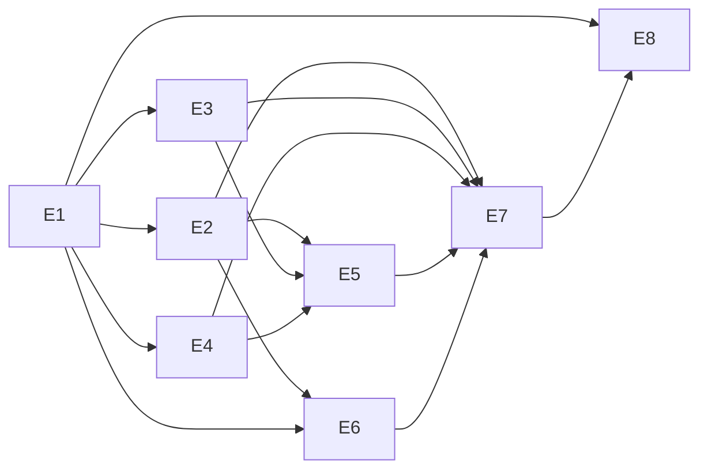

# 02 — Engineering Epics

> **Part of:** Implementation Planning Package (Batch 1) · **Traceability:** each epic maps to PRD + ADR + SDD.
> **Format per epic:** Goals · Deliverables · Dependencies · Acceptance Criteria · Risks · Complexity.

---

## E1 — Platform Foundation
- **Goals:** Repo, CI, event bus, kernel core, auth, observability scaffold. [PRD:FR-17,D8][ADR-001,003][SDD:§11,§02]
- **Deliverables:** Monorepo init (19-repo-init), Go/TS/Py toolchains, NATS JetStream deployed, `core/` (bus/di/registry-client/domain), JWT/OIDC auth, OTel pipeline, base CI.
- **Dependencies:** None (first epic).
- **Acceptance:** `hello-agent` loop runs locally end-to-end; CI green on empty services; traces visible.
- **Risks:** Bus ops complexity (mitigated: managed NATS). 
- **Complexity:** XL

## E2 — Intent & Orchestration
- **Goals:** Receive intent, plan as DAG, coordinate agents with HITL + budget. [PRD:FR-1,FR-3,FR-4,G3][ADR-002,006,007,008][SDD:§01,§03,§09]
- **Deliverables:** Intent Ingress (REST/Web first), API Gateway (auth/route/stream), Orchestration (Planner, DAG Executor, Coordinator, Scheduler, Governor, HITL), Registry.
- **Dependencies:** E1 (bus, auth, kernel).
- **Acceptance:** Intent → approved plan → task.assigned events; HITL blocks on plan; budget pauses on exceed.
- **Risks:** DAG executor complexity; HITL timeout handling.
- **Complexity:** XL

## E3 — Agent Runtime & Provider
- **Goals:** Run agent loops; abstract LLM/tool/deploy providers with routing + fallback. [PRD:FR-5,FR-15,FR-16,D2,G6][ADR-003][SDD:§04,§05]
- **Deliverables:** Agent Runtime (loop/context/memory/tools/stream), Provider Gateway (router/circuit/cost), Claude + OpenRouter adapters, Agent Plugin framework.
- **Dependencies:** E1 (bus, kernel), E4 (workspace for tools) partially; Provider GW independent of Workspace.
- **Acceptance:** Agent streams tokens; Claude→OpenRouter fallback works; cost ledger accurate.
- **Risks:** Provider 429 storms; cost leakage.
- **Complexity:** XL

## E4 — Workspace & Execution
- **Goals:** Isolated, reproducible workspaces with secret-safe tool execution. [PRD:FR-9,FR-10,FR-11,T4][ADR-004][SDD:§06]
- **Deliverables:** Workspace Manager (warm pool, K8s provisioner), Secret Proxy (OIDC egress), tool surface (fs/git/shell/browser/db/secret/deploy), snapshot/recycle.
- **Dependencies:** E1 (kernel lifecycle authority).
- **Acceptance:** Pod provisions <5s p95; agent cannot read raw secret; isolation verified.
- **Risks:** Cold-start latency; secret-proxy outage.
- **Complexity:** L

## E5 — Delivery & Notification
- **Goals:** Deploy artifacts and notify across channels. [PRD:FR-12,FR-13,FR-14][ADR-006][SDD:§07,§10]
- **Deliverables:** Deploy providers (Vercel, Fly), Notification Service, Discord + REST/Web channel adapters (send half), progress batching.
- **Dependencies:** E2 (events), E3 (deploy provider), E4 (artifact output).
- **Acceptance:** Live URL pushed to Discord; auto-rollback on health fail; no secret in message.
- **Risks:** Channel API limits; deploy flake.
- **Complexity:** L

## E6 — Client Experience
- **Goals:** Rich multi-surface UI with offline-first CRDT sync. [PRD:FR-2,G3][ADR-005][SDD:§08,§10]
- **Deliverables:** Web PWA, SDK, `ui-kit`, Yjs CRDT sync, task board/agent panel/plan review, mobile-responsive.
- **Dependencies:** E2 (streaming APIs), E1 (auth).
- **Acceptance:** Same project state on Web + Discord within 1s; offline queue flushes.
- **Risks:** CRDT memory overhead; offline conflict.
- **Complexity:** L

## E7 — Quality & Safety
- **Goals:** Prove correctness, resilience, and safety before launch. [PRD:G2,G4][ADR-001,004][SDD:§04,§07,§08]
- **Deliverables:** Agent-behavior eval suite, integration/e2e, chaos tests, security review, secret-leak assertions, SLO dashboards.
- **Dependencies:** All build epics (E1–E6).
- **Acceptance:** Golden tasks pass; chaos game-days green; zero secret incidents.
- **Risks:** Flaky eval; undetected regression.
- **Complexity:** M

## E8 — Scale & Launch
- **Goals:** Production-grade infra, CI/CD, deployment, monitoring. [PRD:§11,G1,G5][ADR-003][SDD:§02,§05,§08]
- **Deliverables:** K8s/GitOps, CI/CD pipeline, canary, HPA tuning, multi-AZ, cost attribution, on-call runbooks.
- **Dependencies:** E1–E7.
- **Acceptance:** SLOs met at GA; auto-rollback proven; margin ≥60%.
- **Risks:** Scale surprises; cost overrun.
- **Complexity:** L

---

*Batch 1 artifact. Sprint mapping in 05-sprint-planning.md (Batch 2).*
