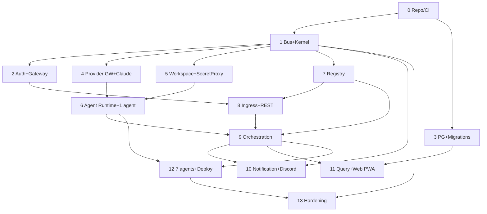

# 03 — Build Order

> **Part of:** Implementation Planning Package (Batch 1) · **Traceability:** each step references PRD + ADR + SDD.
> **Purpose:** Justify *why* services are built in this sequence. Dependency reasoning cross-references 04-dependency-graph.md.

---

## Sequenced Build Plan

| Step | Component | Builds | Blocked By | Justification |
|------|-----------|--------|------------|---------------|
| 0 | Monorepo + CI + toolchains | E1 | — | Everything compiles/runs. Repo standards (Repo Std) + CI gate first. [PRD:D8][ADR-001][SDD:§11] |
| 1 | NATS bus + Kernel core (`core/`) | E1 | Step 0 | Bus is the integration backbone; kernel owns scheduling/lifecycle. Nothing else can communicate without it. [PRD:D8][ADR-001][SDD:§11] |
| 2 | Auth + API Gateway skeleton | E1/E2 | Step 1 | Identity + ingress boundary needed before any protected service. [PRD:FR-17][ADR-006][SDD:§02] |
| 3 | PostgreSQL + migrations + read-model base | E1/E2/E8 | Step 0 | Durable state for aggregates; needed by Orchestration/Query. [PRD:FR-17][SDD:§08] |
| 4 | Provider Gateway + Claude adapter | E3 | Step 1 | Agents need an LLM; build the abstraction + first adapter so later agents are provider-agnostic by construction. [PRD:D2,G6][ADR-003][SDD:§05] |
| 5 | Workspace Manager (1 stack) + Secret Proxy | E4 | Step 1 | Tool execution requires isolated env + secret safety before any real agent work. [PRD:FR-9,FR-10,T4][ADR-004][SDD:§06] |
| 6 | Agent Runtime + 1 agent (e.g., Frontend) + tool surface | E3 | Steps 4,5 | Now a real agent can run: LLM (4) + workspace (5). Proves the runtime end-to-end. [PRD:FR-5][ADR-003,004][SDD:§04] |
| 7 | Registry Service | E2 | Step 1 | Agent/provider discovery; Orchestration and Provider GW depend on it. [PRD:D2][ADR-003][SDD:§09] |
| 8 | Intent Ingress + REST/Web Channel Adapter (inbound) | E2 | Steps 2,7 | Intent entry; uses Gateway auth + Registry. Web/REST first (no ACK-deadline pressure). [PRD:FR-1][ADR-006][SDD:§01,§10] |
| 9 | Orchestration Service | E2 | Steps 6,7,8 | Plan→coordinate; consumes task.assigned from Agent Runtime (6) and Registry (7); triggered by Ingress (8). [PRD:FR-3,FR-4][ADR-002,007,008][SDD:§03] |
| 10 | Notification + Discord adapter (outbound) | E5 | Steps 1,9 | Consumes events from Orchestration; Discord chosen for MVP (D1). [PRD:FR-14][ADR-006][SDD:§07,§10] |
| 11 | Query Service + CRDT sync + Web PWA | E6 | Steps 3,9 | Read models + multi-surface UI; depends on events + read DB. [PRD:FR-2,G3][ADR-005][SDD:§08] |
| 12 | Remaining 7 agents + Deploy (Vercel/Fly) | E3/E5 | Steps 6,9 | Completes the 8-agent team and the deploy path. [PRD:FR-12,§6.1][SDD:§04,§05] |
| 13 | Hardening: chaos + eval + security | E7 | Steps 1–12 | Resilience/safety validation before Beta. [PRD:G2,G4][ADR-001,004][SDD:§04,§07] |

---

## Why this order (key rationales)
1. **Bus + Kernel before everything (Steps 1):** ADR-001 mandates event-driven communication; the kernel is the sole runtime authority (Eng §11). No service can integrate without them.
2. **Provider + Workspace before Agent Runtime (Steps 4,5 → 6):** An agent is useless without an LLM (provider) and a sandbox (workspace). Building the runtime first would leave it unable to act.
3. **Registry before Orchestration (Step 7 → 9):** Orchestration resolves agents by capability; the Registry must exist.
4. **Ingress before Orchestration (Step 8 → 9):** Orchestration is triggered by `intent.created`; the ingress produces it.
5. **Notification after Orchestration (Step 10):** It only consumes events; safe to defer.
6. **Client last (Step 11):** UI binds to stable APIs/events; building it earlier risks churn.

*Batch 1 artifact. Sprint assignment of these steps in 05-sprint-planning.md (Batch 2).*
