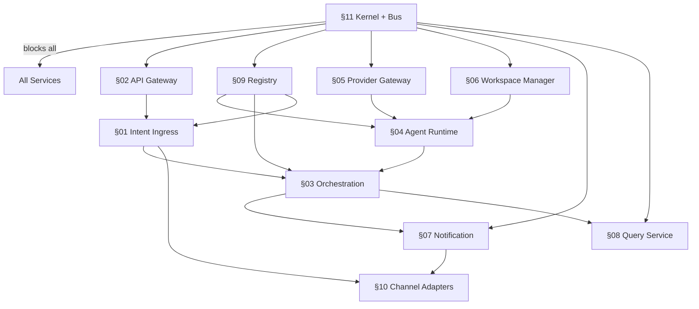

# 04 — Dependency Graph

> **Part of:** Implementation Planning Package (Batch 1) · **Traceability:** edges reference the SDD service that blocks, plus governing PRD/ADR.
> **Purpose:** Show, explicitly, **which services block which** so the build order (03) and sprints (Batch 2) respect hard dependencies.

---

## 1. Blocking Rules (who must exist first)



**Legend:** `A --> B` means "**A blocks B**" (B cannot be built/integrated until A exists).

## 2. Hard Blocking Edges (explicit list)

| Blocker (must exist) | Blocked (cannot integrate) | Governing refs |
|----------------------|------------------------------|----------------|
| §11 Kernel + Bus | Every service | [PRD:D8][ADR-001][SDD:§11] |
| §02 API Gateway | §01 Intent Ingress | [PRD:FR-17][ADR-006][SDD:§02,§01] |
| §09 Registry | §04 Agent Runtime (agent defs), §03 Orchestration (resolve), §01 Ingress | [PRD:D2][ADR-003][SDD:§09] |
| §05 Provider Gateway | §04 Agent Runtime (LLM calls) | [PRD:G6][ADR-003][SDD:§05,§04] |
| §06 Workspace Manager | §04 Agent Runtime (tools) | [PRD:T4][ADR-004][SDD:§06,§04] |
| §04 Agent Runtime | §03 Orchestration (task.assigned consumer) | [PRD:FR-5][ADR-002][SDD:§04,§03] |
| §01 Intent Ingress | §03 Orchestration (emits intent.created) | [PRD:FR-1][ADR-006][SDD:§01,§03] |
| §03 Orchestration | §07 Notification, §08 Query (events) | [PRD:FR-14][ADR-001][SDD:§03,§07,§08] |
| §01 / §07 | §10 Channel Adapters | [PRD:D1][ADR-006][SDD:§10] |

## 3. Layered View (integration waves)

```mermaid
flowchart LR
    subgraph L0[Wave 0 - Foundation]
      K[§11 Kernel/Bus]
      CI[Repo/CI]
      DB[PostgreSQL]
    end
    subgraph L1[Wave 1 - Core services]
      GW[§02 Gateway]
      REG[§09 Registry]
      PG[§05 Provider GW]
      WM[§06 Workspace]
    end
    subgraph L2[Wave 2 - Runtime + Entry]
      AR[§04 Agent Runtime]
      ING[§01 Ingress]
    end
    subgraph L3[Wave 3 - Coordination + Output]
      ORCH[§03 Orchestration]
      NOT[§07 Notification]
      QRY[§08 Query]
    end
    subgraph L4[Wave 4 - Surface]
      CH[§10 Channel Adapters]
    end
    L0 --> L1 --> L2 --> L3 --> L4
```



## 4. Critical Path

The longest blocking chain (drives MVP schedule):

```
§11 Kernel/Bus
  → §05 Provider GW + §06 Workspace
    → §04 Agent Runtime
      → §03 Orchestration (needs §09 Registry + §01 Ingress first)
        → §07 Notification + §08 Query
          → §10 Channel Adapters
```

This is why **Build Order (03) steps 1→13** follow exactly this chain. Any slip in §11, §04, or §03 directly delays MVP (M2).

## 5. Notes
- **No service calls another's database** (Constitution T7, ADR-001): the only allowed cross-service coupling is via the bus or ports — reflected by all edges routing through §11/Kernel.
- **§10 Channel Adapters are leaves**: they depend on Ingress (inbound) / Notification (outbound) but block nothing, so they can be added per-channel without reshaping the graph. [PRD:D1][SDD:§10]
- **Cyclic risk:** none — the graph is a DAG (verified above). Orchestration consumes Agent Runtime output via bus only; Agent Runtime never calls Orchestration.

---

*Batch 1 artifact (final). Batch 1 complete: README + 01 + 02 + 03 + 04. Await review/approval before Batch 2 (05 Sprint Planning onward).*
