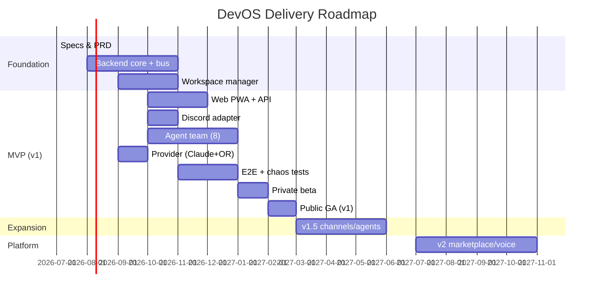

# DevOS — Product Requirements Document (PRD)

> **Document Owner:** CTO
> **Status:** DRAFT — For Executive Approval (no production code until approved)
> **Version:** 1.0-draft
> **Last Updated:** 2026-07-20
> **Companion Docs:** Engineering Specification (Phases 0–9) under `/specs/`
> **Approval Gate:** This document must be reviewed and approved by CEO + CTO + Head of Product before any production implementation begins.

---

## 1. Executive Summary

### 1.1 Vision
An **AI-Native Development Operating System** where software is built, managed, deployed, and monitored through natural-language intent — controllable from any surface a developer already lives in (Desktop, Web, Mobile, WhatsApp, Telegram, Discord, Slack, Voice, REST API).

### 1.2 Mission (this PRD)
Ship **DevOS v1**: a product where a developer can say *"Build an ecommerce platform with Stripe payments"* and, with at most a couple of human approvals, receive a deployed, tested, monitored application — produced by a coordinated team of specialized AI agents running in isolated workspaces.

### 1.3 Why Now
The research phase (see `/specs/00-research/`) confirmed the market has split into editor-centric tools (Cursor, Windsurf), single-agent tools (Devin, Codex), and research frameworks (MetaGPT, CrewAI) — but **no product unifies all nine control surfaces behind one orchestration backend with a pluggable, provider-agnostic, workspace-isolated multi-agent team.** That gap is our wedge.

### 1.4 What This Document Is / Isn't
- **Is:** The product definition — scope, users, requirements, MVP, metrics, roadmap, risks, and the approval gate.
- **Isn't:** The architecture or implementation plan (those live in `/specs/`). This PRD references them but is decoupled.

---

## 2. Problem Statement

| # | Problem | Evidence / Pain |
|---|---------|-----------------|
| P1 | Software development is fragmented across many manual steps (plan, code, test, commit, deploy, monitor). | Even senior devs lose ~40% of time to glue work, not core logic. |
| P2 | Existing AI dev tools are siloed into one interface (an IDE tab or a chat box). | Users must copy context between tools; no single source of truth. |
| P3 | Non-specialists and time-poor builders can't ship without learning the whole stack. | "I have an idea but can't code" remains unsolved at production quality. |
| P4 | AI vendor lock-in is real and risky. | Hardcoded providers create cost and continuity risk. |
| P5 | Autonomous agents are unsafe without human checkpoints and isolation. | Unbounded agent actions → secret leaks, broken deploys, runaway cost. |

---

## 3. Goals & Non-Goals

### 3.1 Goals (measurable)
- **G1 — Time-to-deployed-app:** A standard template app (e.g., ecommerce, blog, API) goes from NL intent to a live URL in **≤ 30 minutes** for ≥ 70% of attempts.
- **G2 — Quality:** ≥ 70% of agent-produced apps **pass their own generated test suite** on first deploy attempt.
- **G3 — Multi-surface:** A project started on one surface (e.g., Discord) is fully controllable from another (e.g., Web) with **zero re-onboarding**.
- **G4 — Safety:** Zero raw-secret exposure incidents; ≤ 1 catastrophic deploy per 1,000 intents (auto-rollback).
- **G5 — Cost control:** Platform gross margin on token spend stays **≥ 60%** via routing + budgeting.
- **G6 — No lock-in:** Switching the primary LLM provider requires **zero code changes** to agent logic.

### 3.2 Non-Goals (v1)
- Not building a general-purpose chatbot or a replacement for human developers.
- Not targeting enterprise on-prem / air-gapped deployments in v1 (roadmap only).
- Not supporting non-software "build me a business" requests beyond software artifacts.
- Not a code-hosting platform (we integrate GitHub; we don't replace it).
- Not real-time collaborative *human* pair-programming in v1 (agent collaboration only).

---

## 4. Target Market & Personas

### 4.1 Market Segments
1. **Indie builders / solopreneurs** (primary v1) — want to ship fast without a full-stack skillset.
2. **Small product teams (2–20)** — want to offload scaffolding, CRUD, tests, CI.
3. **Agencies** — want to spin up client MVPs from a sentence.
4. **Platform/API consumers** — want to drive DevOS programmatically (CI, internal tools).

### 4.2 Primary Persona — "Maya, the Indie Builder"
- **Role:** Solo founder / hobbyist; comfortable with product thinking, weak on backend/infra.
- **Goal:** Ship a working MVP this weekend.
- **Friction today:** Juggles ChatGPT + Cursor + Vercel + Stripe docs; loses context.
- **DevOS value:** One sentence → deployed app; she approves plans and deployments, DevOS does the rest.

### 4.3 Secondary Persona — "Dev, the Platform Engineer"
- **Role:** Integrates DevOS into CI / internal tooling via REST API.
- **Goal:** Programmatically generate and deploy service scaffolding.
- **DevOS value:** REST API + webhooks; observable, auditable, token-budgeted.

---

## 5. Core Use Cases (User Stories)

> Mapped to the canonical flow: **Human → Intent → Planner → Agent Team → Workspace → Deploy → Monitor.**

### UC-1: Conversational Build (Primary)
> *As Maya, I want to type "Build an ecommerce platform with Stripe payments" in Discord, so that I get a live store without writing code.*

**Acceptance:**
1. DevOS ACKs within the channel's window (Discord ≤ 3s).
2. DevOS proposes a plan (DAG) I can Approve/Revise.
3. On approval, a team of agents builds frontend/backend/DB, runs tests, commits, deploys.
4. I receive a live URL + summary in the same channel.
5. I can drill into any agent's work from the Web app.

### UC-2: Cross-Surface Continuity
> *As Maya, I want to start on Discord and review on the Web app, so that I'm not locked to one device.*

**Acceptance:** Same project state (tasks, files, agent panel) visible on Web within 1s of sync (CRDT).

### UC-3: Human-in-the-Loop Safety
> *As Dev, I want explicit approval before any deploy and before secret access, so that autonomous actions stay safe.*

**Acceptance:** `plan.approve` and `deploy.execute` are gated; secret access routes through a proxy, never into agent context.

### UC-4: Provider Portability
> *As CTO, I want to switch the default LLM from Claude to OpenRouter without code changes, so that we avoid lock-in and optimize cost.*

**Acceptance:** Change via config/registry; agents unaffected.

### UC-5: Failure Recovery
> *As Maya, if a build fails, I want DevOS to retry or tell me clearly, so that I'm never stuck.*

**Acceptance:** Transient failures auto-retry (≤5); deterministic failures route back to the author agent (≤3 loops) or surface an actionable error.

### UC-6: Programmatic Control (API)
> *As Dev, I want to create an intent and stream events via REST + webhook, so that I can embed DevOS in my pipeline.*

**Acceptance:** REST `/v1/intents` + SSE stream + webhook notifications per Phase 2.1.

---

## 6. Product Scope — Phased

### 6.1 MVP (v1) — "Conversational Build & Deploy"
**Channels (3 proof points):** Web PWA (rich + mobile-responsive), Discord (messaging), REST API (programmatic).
**Rationale:** Covers rich UI, a thin messaging surface, and programmatic control — proving the "one backend, many surfaces" thesis without building all 9 adapters.

**Providers (2):** Claude (primary), OpenRouter (fallback + multi-model access).
**Rationale:** Two adapters prove the abstraction; more added post-MVP.

**Agents (8):** Planner, Frontend, Backend, Database, QA, Reviewer, Git, Deployment.
**Deferred agents:** Security, DevOps(full), Documentation, Monitoring, Memory, Research, PM, Automation (folded into others or later phases).

**Workspace:** Container-based (K8s pod), one stack template family initially (TypeScript full-stack: Next.js + Postgres + Prisma) to bound scope; more stacks later.

**Deploy targets (2):** Vercel, Fly.io.

**Core flows:** Intent → Plan (HITL) → Multi-agent build → Test → Commit → Deploy (HITL) → Notify.

### 6.2 v1.5 — Expansion
- Channels: Slack, Telegram, Mobile native (RN).
- Providers: Codex, Gemini, Ollama (local), Aider.
- Agents: Security, Documentation, Monitoring.
- Workspaces: additional stack templates (Python/FastAPI, Rust).
- Deploy: AWS, Railway.

### 6.3 v2 — Platform
- WhatsApp, Voice channels.
- Agent marketplace (third-party plugins).
- Self-improving planner (RL orchestrator).
- A2A gateway (external agents join teams).
- Enterprise tier (SAML, audit export, compliance mode).

---

## 7. Functional Requirements

### 7.1 Intent & Planning
- FR-1: Accept NL intent from any connected channel; parse to a canonical envelope.
- FR-2: Generate a plan as a task DAG with agent assignments.
- FR-3: Present plan for human approval (Approve/Reject + feedback) on every channel.
- FR-4: Support intent cancellation and re-planning.

### 7.2 Agent Execution
- FR-5: Run specialized agents in isolated workspaces via a tight tool surface (fs, git, shell, browser, db, secret-proxy, deploy).
- FR-6: Stream agent output (tokens, artifacts, status) to all linked surfaces in real time.
- FR-7: Enforce max-iteration and token-budget guards per run.
- FR-8: Route failed/passed code through Reviewer → QA before deploy.

### 7.3 Workspace & Secrets
- FR-9: Provision isolated workspaces < 5s via warm pool.
- FR-10: Resolve secrets only at proxy egress; never expose raw secrets to agents.
- FR-11: Snapshot/recycle workspaces; persist artifacts to object store.

### 7.4 Deployment & Monitoring
- FR-12: Deploy to configured target; surface live URL + health.
- FR-13: Auto-rollback on health failure.
- FR-14: Notify originating + linked channels on completion/failure.

### 7.5 Provider & Cost
- FR-15: Route model calls by tier/cost/latency; circuit-break and fall back across providers.
- FR-16: Enforce per-org/project token & cost budgets (Budget Governor).

### 7.6 Accounts & Multi-Tenancy
- FR-17: Org + user + API-key auth with scoped permissions.
- FR-18: Per-tenant quotas and isolation (no cross-tenant workspace/file access).

---

## 8. Non-Functional Requirements

| Category | Requirement |
|----------|-------------|
| **Performance** | Channel ACK ≤ provider window (3s Discord / 20s WhatsApp); workspace cold-start p95 < 5s; token-stream render p95 < 200ms. |
| **Reliability** | Intent success (deploy or safe-fail) ≥ 95%; agent-run fault tolerance via retry/escalation; bus at-least-once delivery. |
| **Scalability** | Stateless services autoscale (HPA); Agent Runtime 5→200 pods on queue depth; support 100M+ intents via `org_id` sharding. |
| **Security** | OIDC short-lived creds; secrets never in agent context; tenant network isolation; full audit log on every mutation; SOC2 path in v2. |
| **Cost** | Gross margin ≥ 60% on token spend; per-tenant cost attribution; autoscale-to-zero for idle workspaces. |
| **Observability** | Every service + agent span traced (OTel) from day one; SLO dashboards; error-rate alerting. |
| **Usability** | NL-first on all surfaces; ≤ 2-level progressive disclosure; WCAG 2.2 AA. |
| **Availability** | Control plane multi-AZ; RTO < 15 min, RPO < 5 min. |

---

## 9. Channel Strategy

| Channel | MVP? | Role |
|---------|------|------|
| Web PWA | ✅ | Primary rich surface (desktop + mobile-responsive) |
| REST API | ✅ | Programmatic / CI |
| Discord | ✅ | Messaging proof point + community |
| Slack | v1.5 | Team adoption |
| Telegram | v1.5 | Broader messaging |
| Mobile (RN) | v1.5 | Native mobile |
| WhatsApp | v2 | Highest-friction onboarding |
| Voice | v2 | Differentiated, high-complexity |
| Desktop (Electron) | v2 (or post) | Power-user native shell |

**Principle:** All channels funnel to one `IntentCreated` envelope (Phase 1 ADR-006). Core logic is channel-agnostic.

---

## 10. Agent & Provider Strategy

- **Agent taxonomy v1:** Planner → Architect(folded into Planner) → Frontend / Backend / Database → QA → Reviewer → Git → Deployment.
- **Communication:** Pub-sub artifacts on the bus; no direct agent-to-agent calls (Phase 2.3).
- **Provider abstraction:** `LLMProvider` port; Claude + OpenRouter in MVP; capability flags drive routing (Phase 5.2).
- **Model tiers:** cheap (triage/reflection) / standard (most work) / premium (synthesis/review) — ~40–50% token savings vs all-premium.

---

## 11. Success Metrics (KPIs)

### 11.1 North-Star
**Weekly Active Builders (WAB):** distinct users who created ≥ 1 intent that reached a deploy (success or safe-fail) in a 7-day window.

### 11.2 Funnel & Quality
| Metric | Target (90 days post-GA) |
|--------|--------------------------|
| Intent → Plan approval rate | ≥ 60% |
| Approved plan → Deployed URL | ≥ 70% |
| Deployed app passes own tests | ≥ 70% |
| Cross-surface reuse rate | ≥ 30% of projects touched on 2+ surfaces |
| Time-to-live (p50) | ≤ 30 min |

### 11.3 Business
| Metric | Target |
|--------|--------|
| Free→Paid conversion | ≥ 8% |
| Token gross margin | ≥ 60% |
| 30-day retention (Pro) | ≥ 40% |
| NPS | ≥ 40 |

### 11.4 Reliability / Safety
- Secret-exposure incidents: **0**
- Catastrophic deploys per 1,000 intents: **≤ 1** (auto-rolled-back)
- Platform uptime: **≥ 99.9%**

---

## 12. Competitive Differentiation

| Us | Cursor / Windsurf | Devin / Codex | MetaGPT / CrewAI |
|----|-------------------|---------------|------------------|
| Multi-surface (9) OS | IDE-only | Single surface | Framework, no product |
| Orchestrated agent team | Single assistant | Single autonomous agent | Multi-agent, dev-only |
| Provider-agnostic | Partial | Provider-tied | Yes (research) |
| Workspace-isolated + secret-safe | N/A | Yes | Varies |
| Human-in-the-loop gates | Manual | Minimal | Configurable |

**Wedge:** *One backend, every surface, a safe agent team, no lock-in.*

---

## 13. Risks & Mitigations

| Risk | Impact | Likelihood | Mitigation |
|------|--------|-----------|------------|
| Multi-agent token cost explodes | High | High | Budget Governor + model routing (FR-16) |
| Agent output quality inconsistent | High | Med | Golden-task eval + Reviewer gate (Phase 8) |
| Workspace cold-start too slow | Med | Med | Pre-warmed pool (Phase 5.3) |
| Provider outage / rate limit | High | Med | Circuit breaker + fallback chain (Phase 5.2) |
| Secret leakage | Critical | Low | Secret Proxy, never in context (FR-10) |
| 9-surface maintenance burden | Med | Med | Shared `ChannelProvider` SDK + ui-kit (Phase 2.5, 3.1) |
| Thin-channel UX frustration | Med | Med | Calm-by-default, batch updates (Phase 3.3) |
| Scope creep (build everything) | High | High | Strict MVP boundary (§6.1); phase gates |

---

## 14. Dependencies

- **Engineering Specs (Phases 0–9):** Architecture, API, data models, agent protocol, bus, channels, backend, frontend, AI runtime, testing, deployment — *already drafted and referenced throughout.*
- **Infrastructure:** Kubernetes cluster, NATS JetStream, PostgreSQL, Redis, Qdrant/pgvector, object store, container registry.
- **External:** LLM provider API keys (Claude, OpenRouter), GitHub OAuth, Vercel/Fly accounts, Discord application.
- **Hiring:** Backend (Go/Rust), Agent Runtime (Python/LLM), Frontend (React/RN), Platform/DevOps, Product Design.

---

## 15. Roadmap (Phased, tied to architecture)

*Dates are indicative; sequencing assumes specs are approved and infra is provisioned.*

---

## 16. Decisions Required for Approval

> The following are **CTO recommendations** baked into this draft. They require explicit confirmation (or override) by the approvers before code starts. Mark each ✅ / ❌ / ✏️(revise).

| # | Decision | Recommendation |
|---|----------|----------------|
| D1 | **MVP channels** | Web PWA + REST + Discord (not all 9) |
| D2 | **MVP providers** | Claude + OpenRouter (not all 6) |
| D3 | **MVP agents** | 8 core agents (defer Security/Docs/Monitoring/etc.) |
| D4 | **MVP stack template** | TypeScript full-stack (Next.js + Postgres) only |
| D5 | **MVP deploy targets** | Vercel + Fly.io |
| D6 | **Primary persona** | Indie builders (Maya), with API for platform engineers |
| D7 | **Business model** | Freemium SaaS, usage-based on tokens/agents |
| D8 | **Bus technology** | NATS JetStream (per ADR-001) |
| D9 | **Workspace runtime** | Containers (K8s) for MVP; Firecracker microVMs as v2 security upgrade |
| D10 | **OKRs / targets** | Adopt §11 targets as the v1 success definition |

---

## 17. Assumptions

- A1: We can obtain Claude + OpenRouter API access and quota at launch.
- A2: Kubernetes + managed NATS/PG/Redis are available (cloud account funded).
- A3: The engineering specs (Phases 0–9) are accepted as the implementation blueprint.
- A4: A small founding team (≤ 8 engineers) can deliver MVP in ~6 months.
- A5: Users will accept Approve/Reject gates as part of the autonomous flow.

---

## 18. Approval

| Role | Name | Decision | Date |
|------|------|----------|------|
| CEO | __________ | ☐ Approve ☐ Approve w/ changes ☐ Reject | ______ |
| CTO | __________ | ☐ Approve ☐ Approve w/ changes ☐ Reject | ______ |
| Head of Product | __________ | ☐ Approve ☐ Approve w/ changes ☐ Reject | ______ |

> **Gate:** Production implementation may begin only after all three approvals are recorded above. Changes requested are tracked as PRD revisions (version bump) and re-approved.

---

*End of PRD v1.0-draft. Companion engineering specs: `/specs/README.md`.*
