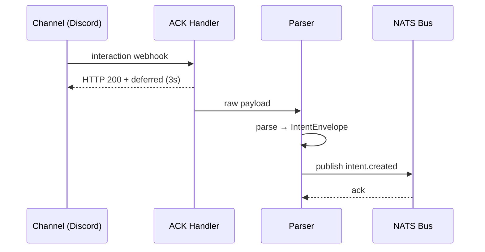
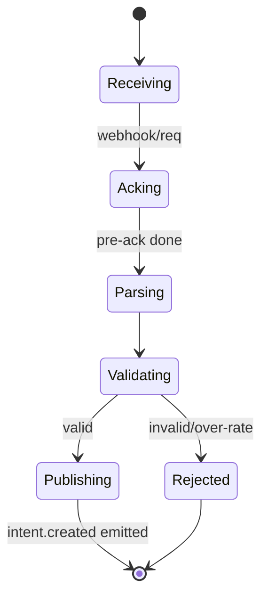
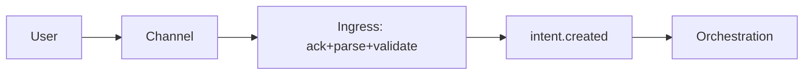

# SDD — 01. Intent Ingress

> **Part of:** DevOS SDD v1.0-draft · **Specs:** Phase 5.1 (`apps/ingress`), Phase 2.5 (Channel Adapters) · **Governance:** Constitution T1 (channel-agnostic), T6 (observability), ADR-006 (uniform intent), ADR-001 (bus)

---

## 1. Purpose
The Intent Ingress is the **single entry point for all inbound channel traffic**. It acknowledges the channel within its hard deadline, normalizes raw input into a canonical `IntentCreated` event, and publishes it to the bus. It owns the *receiving* half of the channel boundary; the *sending* half lives in Notification (§07).

## 2. Responsibilities
- Accept webhooks/WS from all 9 channels (Discord, Slack, Telegram, WhatsApp, Voice, Web, Desktop, Mobile, REST).
- **ACK within the channel's deadline** (Discord 3s, WhatsApp 20s, Telegram none, Slack 3s).
- Parse raw input → canonical `IntentEnvelope` (channel, userId, text, projectId, locale, attachments, traceId).
- Validate (size, rate, auth signature) and publish `intent.created` to the bus.
- Pre-ACK then process asynchronously when the deadline is tight.

## 3. Architecture
```mermaid
flowchart LR
    subgraph CH[Channels]
      D[Discord] S[Slack] T[Telegram] W[WhatsApp] V[Voice] R[REST]
    end
    subgraph ING[Intent Ingress]
      AC[ACK Handler]
      PR[Parser]
      VAL[Validator]
    end
    B[(NATS JetStream)]
    CH --> AC
    AC --> PR
    PR --> VAL
    VAL --> B
```

## 4. Interaction Sequence


## 5. Interfaces (ports)
- `ChannelProvider.ack(raw)` / `parse(raw): IntentEnvelope` (adapters in `plugins/channels/`).
- `BusPublisher.publish("intent.created", envelope)`.
- `RateLimiter.check(orgId)` (Redis).

## 6. APIs
- `POST /webhooks/:channel` — inbound from messaging/voice platforms (HMAC/header signature verified).
- `POST /v1/intents` — direct REST channel intent (from Web/Desktop/Mobile/API).
- `GET /healthz`, `GET /readyz`.
- No query APIs (those are Query Service §08).

## 7. Events
- **Publishes:** `intent.created` (to bus, consumed by Orchestration §03).
- **Consumes:** none (it is a source).

## 8. State Machine


## 9. Folder Structure
```
apps/ingress/
  main.go
  ack/          # per-channel ack strategies (3s/20s/none)
  parse/        # raw → IntentEnvelope
  validate/     # size/rate/signature
  bus/          # NATS publisher
  config/
```

## 10. Dependencies
- Channel adapter plugins (`plugins/channels/`).
- NATS JetStream (bus).
- Redis (rate/budget state).
- Notification §07 (paired outbound side).

## 11. Data Flow


## 12. Failure Handling
- **ACK deadline risk:** pre-ACK immediately, process async; never block ACK on parsing.
- **Invalid signature:** reject 401, log, no publish.
- **Bus unavailable:** retry with backoff; if exhausted, DLQ + alert (intent lost only on total bus failure).
- **Over-rate:** reject with `429` + `Retry-After`; do not publish.
- **Oversized input:** reject at validator before parse.

## 13. Security
- Verify every webhook signature (HMAC/token) before parsing.
- Strip/limit attachment size and type.
- Never log raw secrets; redact PII in traces.
- Rate-limit per org/channel to prevent abuse (Constitution T10).

## 14. Scalability
- Stateless; horizontal pods (HPA on CPU).
- Pre-ACK + async makes it resilient to spikes.
- Channel-specific instances possible if one channel dominates.

## 15. Testing Strategy
- Unit: parser per channel (golden inputs → envelope).
- Unit: validator (size/rate/signature edge cases).
- Integration: webhook → bus with signature mock.
- **Timing tests:** assert ACK within 3s (Discord) / 20s (WhatsApp) under load.
- Chaos: bus down → DLQ + recovery.

## 16. Future Extensions
- Voice streaming ingress (WS, interim ASR frames).
- Richer parsing (multi-turn context, attachments → artifacts).
- Edge ingress (Cloudflare Worker) for lowest-latency ACK.
