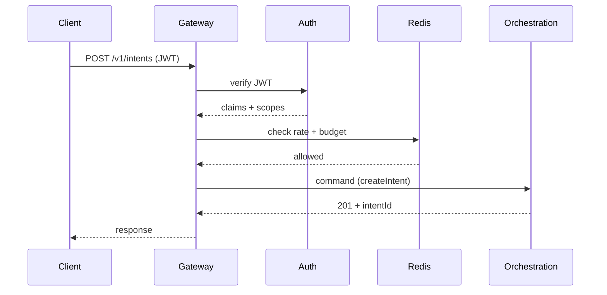
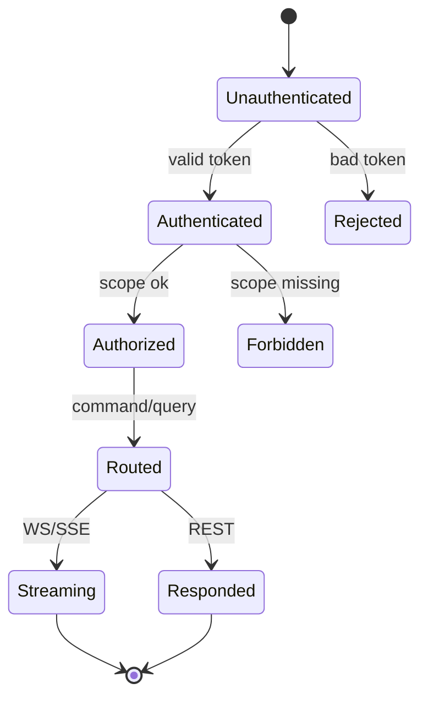
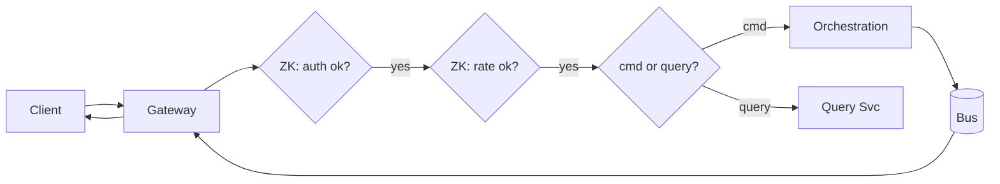

# SDD — 02. API Gateway

> **Part of:** DevOS SDD v1.0-draft · **Specs:** Phase 5.1 (`apps/gateway`), Phase 2.1 (API Contracts) · **Governance:** Constitution T1/T6/T10, ADR-001, ADR-008 (budget via rate), Eng §6 (observability)

---

## 1. Purpose
The API Gateway is the **unified front door for authenticated clients and services**. It enforces AuthN/Z, rate-limiting and quotas, splits commands from queries (CQRS), terminates WebSocket/SSE, and routes to the correct backend. It never contains business logic.

## 2. Responsibilities
- Verify identity: Bearer JWT, API Key, OIDC exchange.
- Enforce **scope** claims (`intent:write`, `deploy:execute`, …).
- Rate-limit + read budget state (Redis).
- Route commands → Orchestration §03; queries → Query §08; streams → both.
- Terminate and authorize WS (`/v1/stream`) and SSE.

## 3. Architecture
```mermaid
flowchart LR
    subgraph CL[Clients]
      W[Web] D[Desktop] M[Mobile] A[REST/CI]
    end
    GW[API Gateway: Envoy/Kong + auth]
    subgraph CTRL[Control Plane]
      ORCH[Orchestration]
      QRY[Query Svc]
    end
    RD[(Redis: rate/budget)]
    AUTH[Auth Provider]
    CL --> GW
    GW --> AUTH
    GW --> RD
    GW --> ORCH
    GW --> QRY
```

## 4. Interaction Sequence


## 5. Interfaces (ports)
- `AuthProvider.verify(token) → Claims`.
- `RateLimiter.check(orgId, key)`.
- `Router.command(intent)` / `Router.query(req)`.
- `StreamTerminator.upgrade(ws)` → forwards to Orchestration/Query.

## 6. APIs
- **REST** (Phase 2.1): `/v1/intents`, `/v1/projects`, `/v1/plans`, `/v1/tasks`, `/v1/agents`, `/v1/workspaces`, `/v1/deployments`, `/v1/projects/:id/metrics`.
- **WebSocket:** `wss://api.devos.ai/v1/stream?intentId=`.
- **SSE:** `GET /v1/intents/:id/stream`.
- **Webhooks:** `/webhooks/:channel` are *not* here (they hit Ingress §01 directly).

## 7. Events
- Consumes: none directly (acts as proxy).
- May emit: `auth.failure` (security telemetry).
- Forwards all domain events from bus to authorized WS/SSE subscribers.

## 8. State Machine


## 9. Folder Structure
```
apps/gateway/
  envoy.yaml / kong.yaml   # or Go custom
  auth/        # JWT/APIKey/OIDC
  ratelimit/   # Redis-backed
  router/      # command/query split
  stream/      # WS/SSE upgrade + authz
  middleware/
```

## 10. Dependencies
- Auth Provider (OIDC/JWT issuer).
- Redis (rate/budget).
- Orchestration §03, Query §08.
- NATS (for event fan-out to streams).

## 11. Data Flow


## 12. Failure Handling
- **Auth provider down:** fail closed (401) — never allow unauthenticated pass.
- **Upstream (Orchestration/Query) down:** return `503` with `Retry-After`; do not cache.
- **Rate exceeded:** `429` + `X-Budget-Remaining` / `Retry-After`.
- **WS drop:** client reconnects; gateway resumes from last event id (dedupe).

## 13. Security
- mTLS between gateway and backends where possible.
- Scope enforced on every route; default deny.
- WAF + request size limits; secret redaction in logs.
- Audit log on authz decisions (Constitution T10).

## 14. Scalability
- Stateless; HPA on CPU/connections.
- Redis for shared rate/budget state across instances.
- Edge termination (CDN) for static; dynamic at gateway.

## 15. Testing Strategy
- Unit: auth (JWT/APIKey/OIDC) positive/negative.
- Unit: rate-limit + budget logic with fake Redis.
- Integration: full REST + WS flow against stub backends.
- Security: forbidden-scope, bad-token, oversize tests.
- Load: sustain 10× intent rate with ACK SLA.

## 16. Future Extensions
- GraphQL gateway for complex client queries.
- API subscriptions (webhook callbacks for users).
- Edge gateway (Cloudflare) for global low-latency auth.
