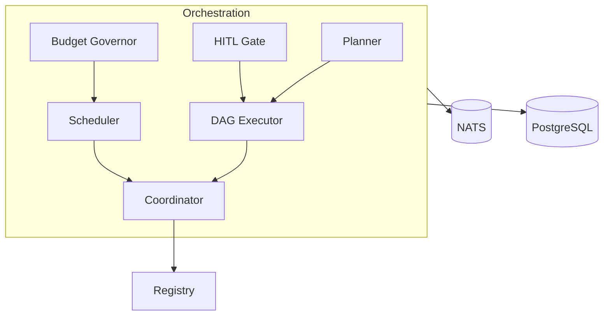
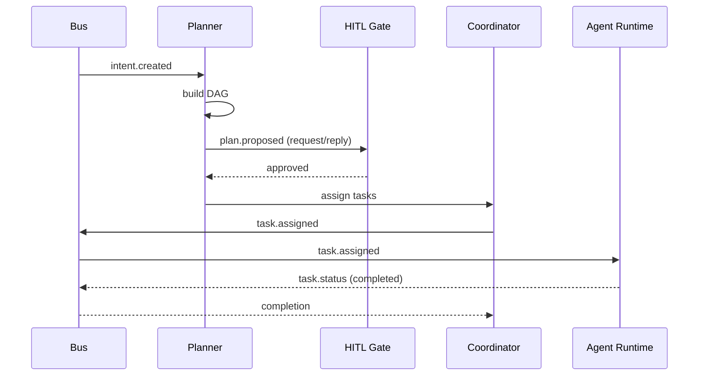
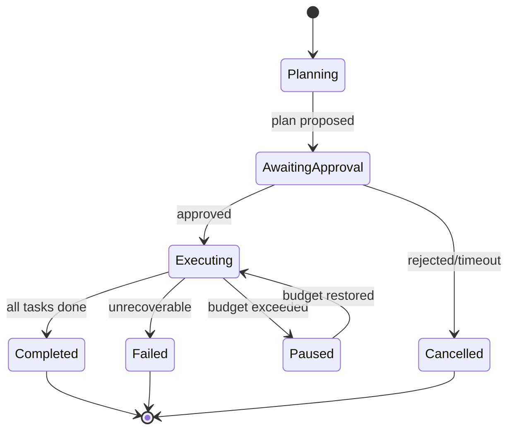
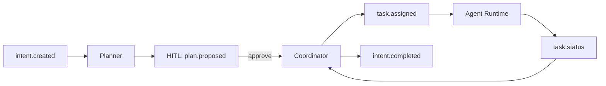

# SDD — 03. Orchestration Service

> **Part of:** DevOS SDD v1.0-draft · **Specs:** Phase 5.1, Phase 1 §5.1/§9.2, Phase 2.3 (Agent Protocol) · **Governance:** ADR-002 (DAG), ADR-007 (HITL), ADR-008 (Budget), Constitution T3/T5/T11, Eng §11 (Kernel authority)

---

## 1. Purpose
The Orchestration Service turns a received intent into an **approved plan**, then **coordinates a team of specialized agents** to execute it — enforcing human-in-the-loop gates, the budget governor, and task lifecycle. It is the control brain; it does not execute agent code itself (that is Agent Runtime §04).

## 2. Responsibilities
- **Planner:** decompose intent → task DAG.
- **DAG Executor:** run the graph in super-steps (ADR-002).
- **Agent Team Coordinator:** resolve agents by capability via Registry §09, assign tasks via bus.
- **Scheduler:** prioritize, respect concurrency + budget.
- **Budget Governor:** enforce token/cost ceiling before dispatch (ADR-008).
- **HITL Gate:** block on plan/deploy/secret approval (ADR-007).

## 3. Architecture


## 4. Interaction Sequence


## 5. Interfaces (ports)
- `RegistryPort.resolve(capability) → AgentId` (§09).
- `BusPort.publish/subscribe` (ADR-001).
- `PlanRepository`, `TaskRepository` (Phase 4, hexagonal).
- `BudgetPort.check(orgId) → remaining`.

## 6. APIs (from Gateway §02)
- `POST /v1/intents` (command, via GW) · `POST /v1/plans/:id/approve` · `POST /v1/plans/:id/reject`
- `POST /v1/tasks/:id/retry` · `DELETE /v1/intents/:id` (cancel) · `GET /v1/intents/:id` (status)
- All mutate via CQRS; reads served by Query §08.

## 7. Events
- **Consumes:** `intent.created`, `task.status`, `agent.registered`, `workspace.ready`, `budget.exceeded`.
- **Publishes:** `plan.proposed`, `plan.approved/rejected` (request/reply), `task.assigned`, `budget.exceeded`, `intent.completed/failed/cancelled`.

## 8. State Machine

*Task sub-state: `pending → in_progress → completed|failed|blocked`. Plan sub-state: `proposed → approved → executing → done`.*

## 9. Folder Structure
```
services/orchestration/
  planner/        # intent → DAG
  dag-executor/   # super-step runner
  coordinator/    # agent assignment
  scheduler/      # priority + concurrency
  governor/       # budget enforcement
  hitl/           # approval gates
  domain/         # Intent, Plan, Task aggregates
```

## 10. Dependencies
- Registry §09 (agent/provider discovery).
- Agent Runtime §04 (via bus `task.assigned`).
- Provider Gateway §05 (indirect, via Agent Runtime).
- Workspace Manager §06 (via bus `workspace.ready`).
- Notification §07 (via bus events).
- PostgreSQL, NATS, Query §08 (read models).

## 11. Data Flow


## 12. Failure Handling
- **Planner error:** emit `intent.failed` with reason; notify user.
- **HITL timeout (15 min):** auto-`reject` with `timeout` (safe default).
- **Agent task failed:** retry per policy (≤5 transient, ≤3 deterministic loop); escalate/reassign on exhaust.
- **Budget exceeded:** emit `budget.exceeded`, pause run, notify; resume on restore.
- **Bus partition:** queue locally; reconcile on heal (at-least-once).

## 13. Security
- Authorize plan approve/reject (scope `plan:approve`).
- Audit every mutation (`audit_log`).
- Enforce budget centrally (Constitution T5).
- Transparency: every action carries why/agent/provider/cost/files/rollback (T11).

## 14. Scalability
- Stateless; HPA on CPU. DAG + task state in PostgreSQL; no in-memory state.
- Scheduler backpressure prevents agent-runtime overload.
- Per-org isolation of plans/tasks.

## 15. Testing Strategy
- Unit: planner (golden intents → DAG), scheduler (priority), governor (budget math).
- Integration: DAG executor against bus + fake Agent Runtime.
- E2E: full intent → approved → deployed (scripted LLM fake).
- Chaos: HITL timeout, agent crash, budget storm (Phase 8).

## 16. Future Extensions
- RL-based self-improving planner (Puppeteer-style).
- Subgraph plans (per-team ownership).
- Predictive scheduling (prefetch warm workspaces).
