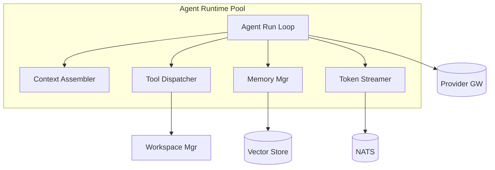
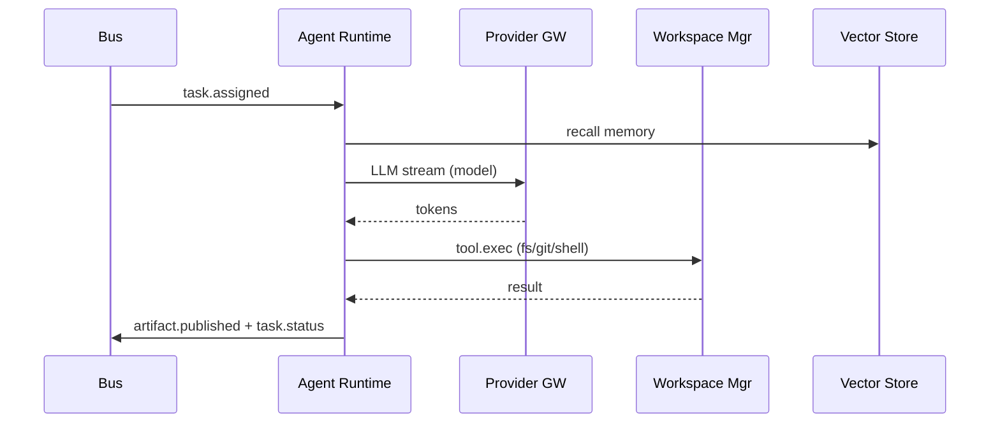
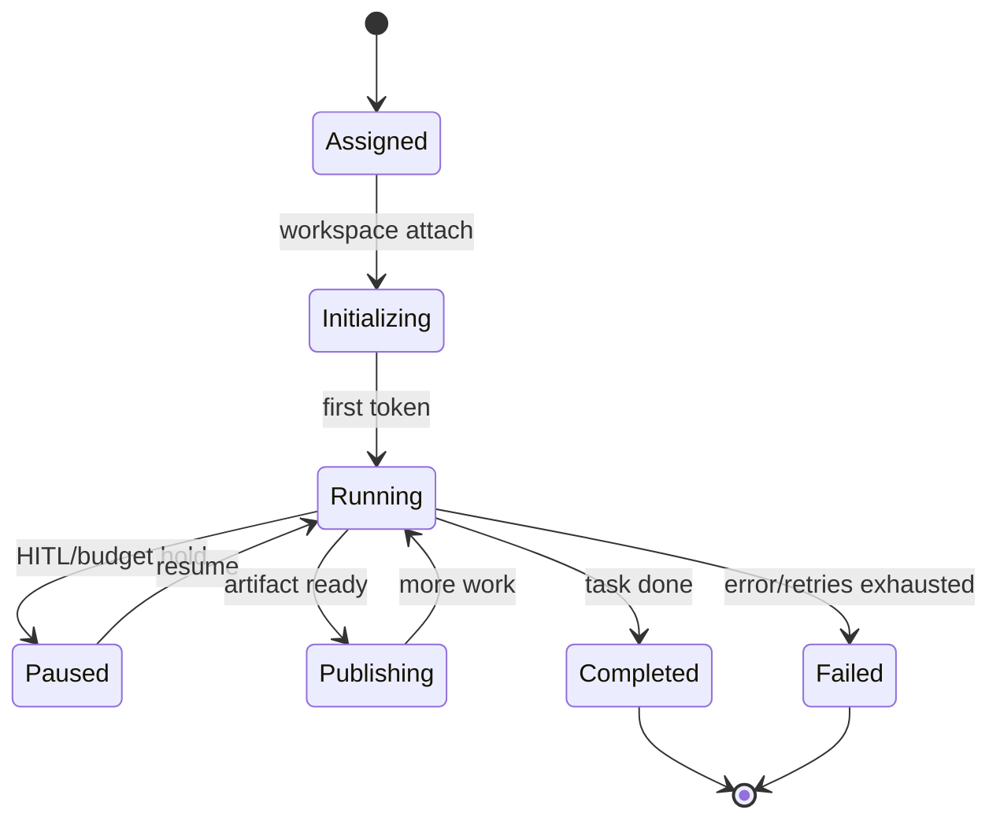
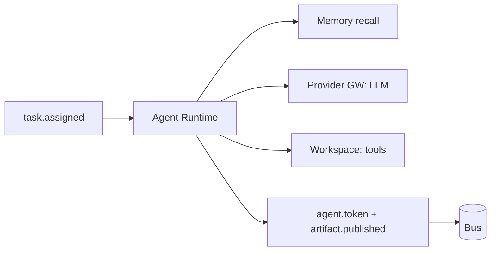

# SDD — 04. Agent Runtime

> **Part of:** DevOS SDD v1.0-draft · **Specs:** Phase 7 (AI Runtime), Phase 2.3 (Agent Protocol), Phase 5.1 · **Governance:** Constitution T4 (isolation), T11 (transparency), ADR-003 (provider), ADR-004 (workspace), Eng §11 (Kernel manages agent lifecycle)

---

## 1. Purpose
The Agent Runtime **executes agents**. It loads agent plugins, runs the observe→think→act→reflect loop, dispatches tools against isolated workspaces, manages memory, streams tokens, and publishes typed artifacts. It is a **tenant of the Kernel** (Eng §11): it requests scheduling; the Kernel authorizes.

## 2. Responsibilities
- Load agent plugins by id (from Registry §09).
- Assemble context (memory recall + RAG + task + peer artifacts).
- Call LLM via Provider Gateway §05 (streaming).
- Dispatch tools (fs, git, shell, browser, db, secret.get, deploy) to Workspace §06.
- Publish `agent.token`, `artifact.published`, `task.status`.
- Enforce loop guards (max iterations, token budget).

## 3. Architecture


## 4. Interaction Sequence


## 5. Interfaces (ports)
- `AgentPlugin`: `handler(ctx, task): AsyncIterable<AgentEvent>` (Phase 2.3).
- `LLMProvider` (via Provider GW §05): `complete/stream/embed`.
- `ToolPort` (via Workspace §06): `invoke(tool, args, ctx)`.
- `MemoryPort`: `recall/store/blackboard`.
- `BusPort`: publish/subscribe. `BudgetHandle`: remaining tokens.

## 6. APIs
- Consumes `task.assigned` (bus). No public REST (invoked by Orchestration via bus).
- Internal gRPC health + `AgentPlugin` loader.
- Agent plugins implement `AgentPlugin` interface; self-register with Registry §09.

## 7. Events
- **Consumes:** `task.assigned`, `review.comment` (if target agent), `workspace.ready`.
- **Publishes:** `agent.token` (stream), `artifact.published`, `task.status`, `review.comment` (Reviewer), `task.failed`.

## 8. State Machine


## 9. Folder Structure
```
services/agent-runtime/
  loop/          # run loop
  context/       # assembler + RAG
  memory/        # recall/store
  tools/         # tool dispatcher
  stream/        # token streaming
  plugins/       # loaded agent plugins (symlink to plugins/agents)
  health/
```

## 10. Dependencies
- Provider Gateway §05, Workspace Manager §06, Registry §09.
- Vector store (Qdrant/pgvector), NATS, Orchestration §03 (via bus).
- Budget Governor (via Orchestration, ADR-008).

## 11. Data Flow


## 12. Failure Handling
- **LLM 429/5xx:** exponential backoff (≤5); escalate tier or fail task.
- **Tool error (deterministic):** route back to author agent via `review.comment` (≤3 loops).
- **Loop guard:** max iterations → `task.failed`.
- **Budget exceeded:** pause run, emit `budget.exceeded`.
- **Process crash:** one process per run (sidecar) isolates; Orchestration reassigns.

## 13. Security
- **No raw secrets in agent context**; `secret.get` resolves at proxy egress (T4).
- Tools execute only inside workspace pod (sandbox).
- Transparency: each artifact/token carries agent id, provider, cost, files, rollback (T11).
- Audit on tool use.

## 14. Scalability
- Pool of Python workers; HPA 5→200 on bus queue depth.
- Per-run sidecar isolation (noisy-neighbor control).
- Warm workers reduce cold start.

## 15. Testing Strategy
- **Agent behavior:** golden tasks + property assertions (Phase 8).
- Unit: loop guard, context assembler (fakes for LLM/Workspace).
- Integration: agent runs against fake providers + fake workspace.
- Chaos: LLM fault injection, workspace OOM, runaway loop.

## 16. Future Extensions
- Speculative execution; learned context compaction.
- Multi-modal agents (vision on UI screenshots).
- WASM agent plugins for near-native isolation/speed.
