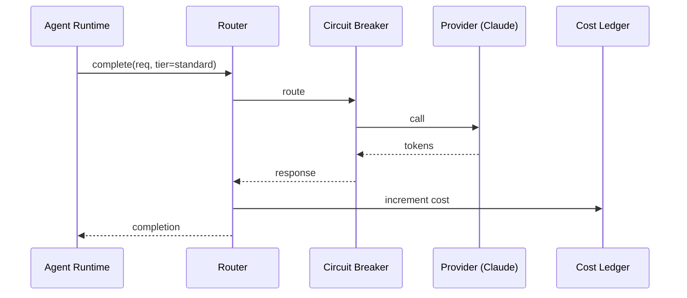
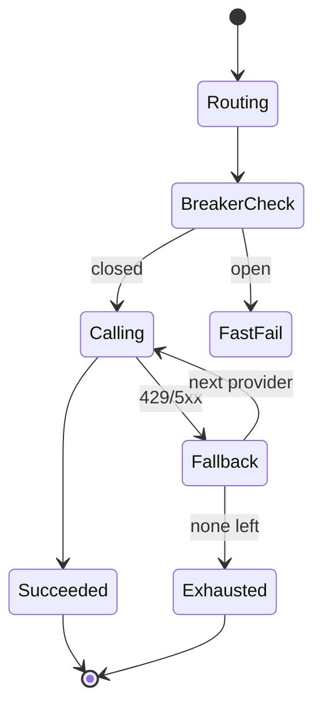
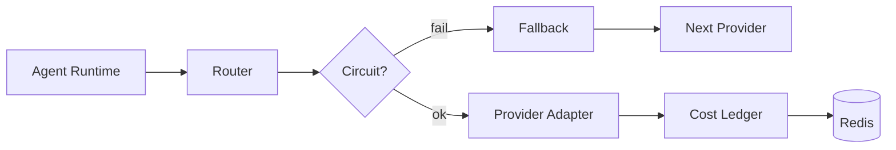

# SDD — 05. Provider Gateway

> **Part of:** DevOS SDD v1.0-draft · **Specs:** Phase 5.2, Phase 2.3 (ports) · **Governance:** Constitution T2 (no lock-in), T12 (open standards), ADR-003 (provider abstraction), ADR-008 (cost), T11 (transparency)

---

## 1. Purpose
The Provider Gateway is the **anti-lock-in layer**. It exposes a single `LLMProvider`/`ToolProvider`/`DeployProvider` port to the Agent Runtime while hiding the heterogeneity of Claude, Codex, Gemini, Aider, OpenRouter, Ollama, and deploy targets. It adds model routing, circuit breaking, fallback, and cost governance.

## 2. Responsibilities
- Route by capability + tier + cost + latency (Constitution T2).
- Circuit-break and fall back across providers.
- Track cost per org/user/task (ADR-008).
- Register adapters as plugins; expose capability flags.
- Never hardcode a provider in agent logic.

## 3. Architecture
```mermaid
flowchart LR
    AR[Agent Runtime] --> RT[Model Router]
    RT --> CB[Circuit Breaker]
    CB --> ADP[Adapter Pool]
    ADP --> C[Claude] CO[Codex] G[Gemini] O[OpenRouter] OL[Ollama]
    CB --> FB[Fallback Chain]
    RT --> LED[Cost Ledger Redis]
```

## 4. Interaction Sequence


## 5. Interfaces (ports)
- `LLMProvider`: `complete/stream/embed/costEstimate` + `capabilities()`.
- `ToolProvider`: `tools()/invoke()`.
- `DeployProvider`: `prepare/deploy/status`.
- `CostLedger`: `estimate/increment/remaining(orgId)`.

## 6. APIs (internal gRPC)
- `LLM.Complete`, `LLM.Stream`, `LLM.Embed`.
- `Tool.Invoke`.
- `Deploy.Prepare`, `Deploy.Deploy`, `Deploy.Status`.
- Adapter registry endpoints (List/Health).

## 7. Events
- **Consumes:** provider health (from Registry §09), `budget.exceeded`.
- **Publishes:** `provider.selected` (transparency, T11), cost ledger updates (internal).

## 8. State Machine


## 9. Folder Structure
```
services/provider-gateway/
  router/         # tier/capability/cost routing
  circuit/       # per-provider breaker (Redis)
  cost/          # ledger
  adapters/
    llm/         # claude, codex, gemini, aider, openrouter, ollama
    deploy/      # vercel, fly, aws, railway
```

## 10. Dependencies
- External providers (HTTP), Redis (circuit/ledger), Registry §09, NATS, Agent Runtime §04 (caller).

## 11. Data Flow


## 12. Failure Handling
- **Provider 429/5xx:** breaker opens after N consecutive; fallback chain.
- **Breaker open:** fast-fail to next provider; half-open probe.
- **Budget exhausted:** reject before call (`BUDGET_EXCEEDED`).
- **All providers down:** return degraded error; Orchestration marks task failed.

## 13. Security
- Provider API keys in secret manager; **never in logs/context**.
- Egress allowlist to provider URLs only.
- Capability flags prevent unsafe feature use.

## 14. Scalability
- Stateless; HPA on CPU.
- Redis-backed breakers/ledger shared across instances.
- Cost ledger atomic increments; nightly reconcile vs PG.

## 15. Testing Strategy
- Unit: router (tier/capability selection), ledger math.
- Contract: each adapter against a recorded provider fixture.
- Chaos: 429 storm → breaker + fallback; all-down → graceful fail.
- Cost: ledger accuracy under concurrency.

## 16. Future Extensions
- Speculative routing (race 2, use first).
- Fine-tune routing (learn best provider per task).
- Federated providers (user-owned keys, we bill).
