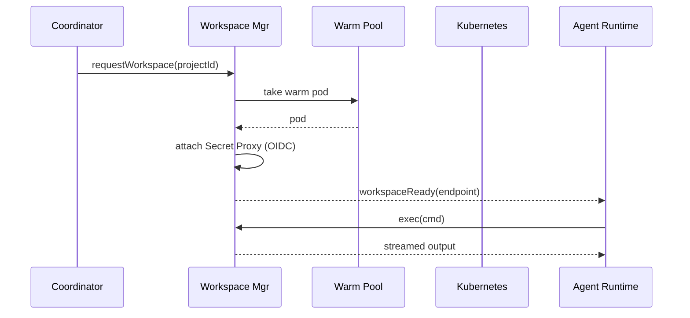
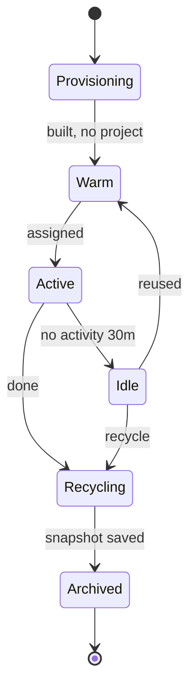
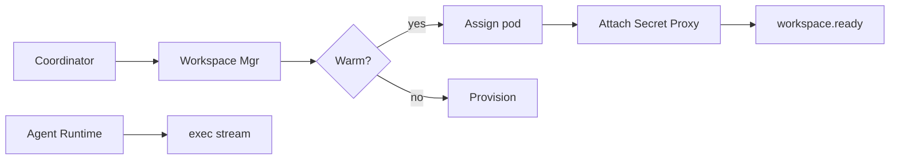

# SDD — 06. Workspace Manager

> **Part of:** DevOS SDD v1.0-draft · **Specs:** Phase 5.3, Phase 2.5 (secret proxy) · **Governance:** Constitution T4 (isolation + secret safety), ADR-004 (isolation), T11 (transparency), Eng §11 (Kernel manages workspace lifecycle)

---

## 1. Purpose
The Workspace Manager gives each agent run a **sealed, reproducible environment** (filesystem, git, package managers, CLI, browser, DB, secret proxy). It is the **only** authority that provisions/recycles workspaces (Eng §11). It guarantees isolation and that agents never see raw secrets.

## 2. Responsibilities
- Maintain a **warm pool** for < 5s provisioning.
- Provision/attach workspaces; attach **Secret Proxy** (OIDC short-lived).
- Execute CLI/tool commands (gRPC/WS) for Agent Runtime.
- Snapshot/recycle; persist artifacts to object store.
- Emit `workspace.ready` / `workspace.status`.

## 3. Architecture
```mermaid
flowchart LR
    subgraph POD[Workspace Pod]
      FS[FS] GIT[Git] PM[Pkg] CLI[CLI] BR[Browser] DB[DB] SP[Secret Proxy]
    end
    WM[Workspace Mgr]
    K8s[(Kubernetes)]
    VAULT[(Secret Vault OIDC)]
    WM --> K8s
    WM --> POD
    SP --> VAULT
    AR[Agent Runtime] -->|gRPC/WS| WM
```

## 4. Interaction Sequence


## 5. Interfaces (ports)
- `WorkspacePort`: `provision/attach/exec/snapshot/recycle/status`.
- `SecretProxy`: `resolve(ref) → ResolvedSecret` (egress-only).
- `ObjectStore`: `snapshot/restore`.

## 6. APIs (internal gRPC)
- `Workspace.Provision`, `Workspace.Attach`, `Workspace.Exec`, `Workspace.Snapshot`, `Workspace.Recycle`, `Workspace.Status`.

## 7. Events
- **Publishes:** `workspace.ready`, `workspace.status`.
- **Consumes:** `workspace.request` (from Orchestration §03).

## 8. State Machine


## 9. Folder Structure
```
services/workspace-mgr/
  pool/           # warm pool + autoscale
  provisioner/    # K8s/Firecracker
  secret-proxy/   # OIDC egress resolution
  lifecycle/      # recycle/snapshot
```

## 10. Dependencies
- Kubernetes API (or Firecracker), Secret Vault (OIDC), Object store, NATS, Agent Runtime §04.

## 11. Data Flow


## 12. Failure Handling
- **Provision timeout:** retry on new node; escalate if pool exhausted.
- **Pod OOM:** task failed → Orchestration retries on new pod.
- **Secret Proxy down:** agent cannot access secret; task fails safe (no secret leak).
- **Snapshot fail:** retry; if persistent, alert (artifact loss risk).

## 13. Security
- Per-pod isolation: seccomp, no privileged, egress deny by default (allowlist).
- **Secret Proxy:** value attached only at egress; never in agent env/context (T4).
- OIDC short-lived credentials; audit every secret access.
- Tenant network isolation (NetworkPolicies).

## 14. Scalability
- Warm pool autoscales to 0 during low traffic.
- HPA on pending provisions.
- Per-stack base images reduce warm time.

## 15. Testing Strategy
- Unit: lifecycle state machine, secret-proxy resolution (fake vault).
- Integration: provision timing (<5s p95), exec streaming.
- Security: isolation tests (no cross-pod FS/network), secret-leak assertions.
- Chaos: pod kill mid-run → recycle + retry.

## 16. Future Extensions
- Firecracker microVMs for tenant-grade isolation.
- GPU workspaces for ML agents.
- Cross-region workspace replication.
