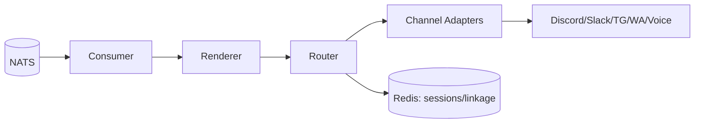
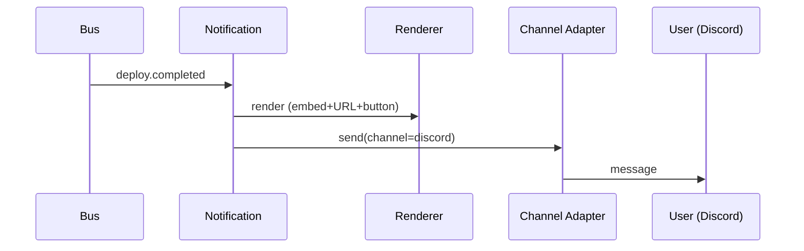
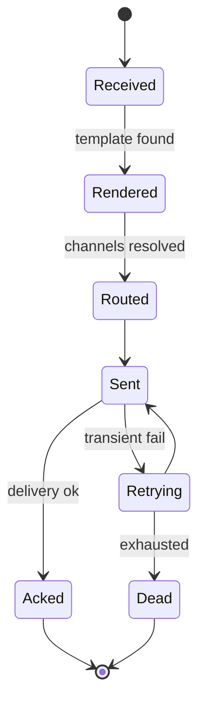
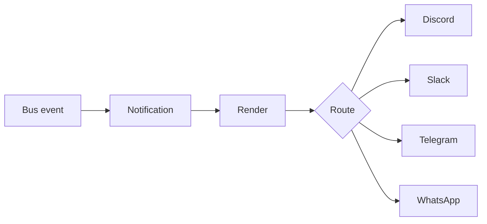

# SDD — 07. Notification Service

> **Part of:** DevOS SDD v1.0-draft · **Specs:** Phase 5.1, Phase 2.5 (Channel Adapters), Phase 3.3 (UX) · **Governance:** Constitution T1 (channel-agnostic), T6 (observability), ADR-006 (uniform intent)

---

## 1. Purpose
The Notification Service is the **outbound half of the channel boundary**. It consumes task/deploy/intent events from the bus, renders them via the appropriate Channel Adapter, and pushes to the originating (and optionally linked) channels. It owns the *sending* side; Ingress §01 owns *receiving*.

## 2. Responsibilities
- Subscribe to `task.*`, `deploy.*`, `intent.*` events.
- Render events into channel-native format (embeds, buttons, summaries).
- Route to originating channel always; linked sessions optionally.
- Batch progress (edit original message, not spam).
- Honor channel constraints (length, templates, buttons).

## 3. Architecture


## 4. Interaction Sequence


## 5. Interfaces (ports)
- `BusConsumer.subscribe(topics)`.
- `ChannelProvider.render(evt) → ChannelMessage` / `send(msg)`.
- `SessionStore` (Redis): originating + linked channels per intent.

## 6. APIs
- Consumes bus events (no public REST).
- Webhook receiver for channel delivery status (e.g., Discord interaction callbacks).
- Internal health.

## 7. Events
- **Consumes:** `task.assigned/status`, `agent.token` (sampled), `artifact.published`, `review.passed`, `deploy.completed`, `task.failed`, `budget.exceeded`, `intent.completed/failed`.
- **Publishes:** none to bus (channel sends are side-effects, not events).

## 8. State Machine


## 9. Folder Structure
```
services/notification/
  consumer/    # bus subscriptions
  renderer/    # event → channel message
  router/      # channel resolution + batching
  adapters/    # reuse plugins/channels (send half)
```

## 10. Dependencies
- NATS, Channel Adapters (§10), Redis (sessions/linkage), Intent/Project store (for routing).

## 11. Data Flow


## 12. Failure Handling
- **Channel API down:** retry with backoff; cap retries → `Dead` + alert.
- **Render error:** fall back to plain-text summary.
- **User not linked:** skip non-originating; always deliver to originating.
- **Message too long:** trim + link to Web app.

## 13. Security
- Channel tokens in secret manager; never logged.
- **Never include raw secrets** in notifications (T4/T11).
- Respect user notification preferences (future).

## 14. Scalability
- Stateless; HPA on bus lag.
- Redis for session/linkage shared state.
- Batching reduces channel API calls.

## 15. Testing Strategy
- Unit: renderer per channel (golden events → message).
- Unit: router resolution (originating + linked).
- Integration: event → channel mock send.
- Chaos: channel down → retry/dead.

## 16. Future Extensions
- Rich media (diff files, screenshots).
- Notification preference center; digest mode.
- Voice call-out for critical failures.
