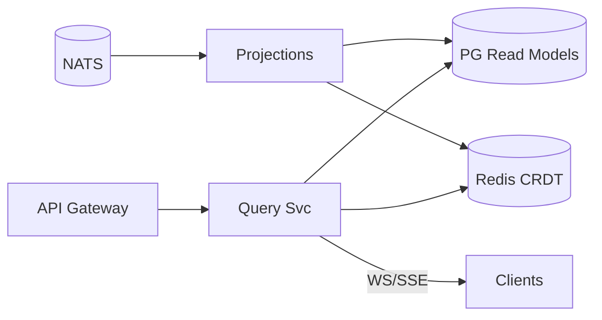
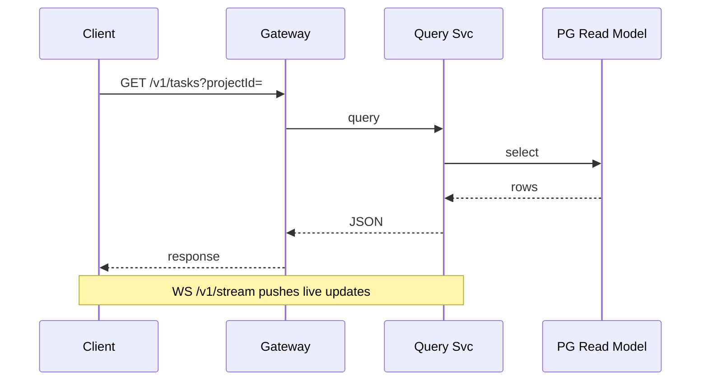
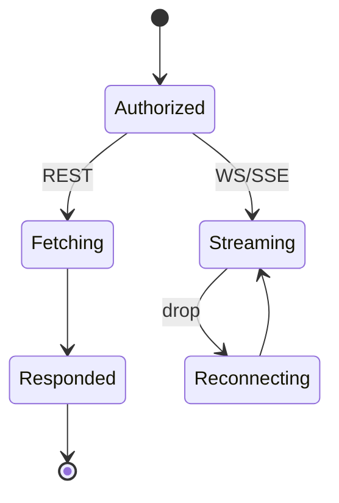
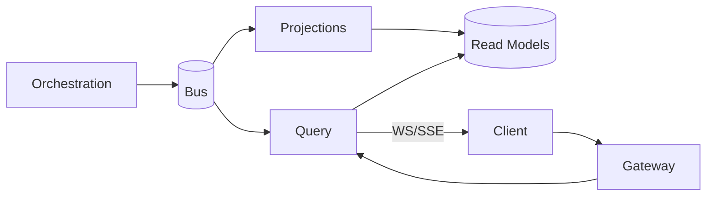

# SDD — 08. Query (Read) Service

> **Part of:** DevOS SDD v1.0-draft · **Specs:** Phase 5.1, Phase 2.1 (API), Phase 4 (CQRS read models) · **Governance:** ADR-001 (bus), Constitution T6 (observability), T9 (offline-first via CRDT)

---

## 1. Purpose
The Query Service serves **all read traffic** (dashboards, task boards, file trees, live streams) from materialized read models + Redis CRDT docs. It implements the **CQRS read side**, keeping writes (Orchestration §03) separate from reads.

## 2. Responsibilities
- Serve REST read endpoints (`/v1/projects`, `/tasks`, `/plans`, `/intents/:id`).
- Project bus events into read models (projections).
- Terminate WS/SSE for live updates; fan-out to subscribers.
- Serve CRDT doc snapshots (Yjs) for client sync (ADR-005).

## 3. Architecture


## 4. Interaction Sequence


## 5. Interfaces (ports)
- `ReadModelRepository` (PG projections).
- `CrdtStore` (Redis Yjs docs).
- `BusConsumer` (for projections).
- `StreamHub` (WS/SSE fan-out).

## 6. APIs
- `GET /v1/projects`, `/v1/projects/:id`, `/v1/projects/:id/files`
- `GET /v1/tasks?projectId=&status=`, `/v1/tasks/:id`
- `GET /v1/plans/:id`, `/v1/intents/:id`, `/v1/agents`, `/v1/deployments/:id`
- `WS /v1/stream?intentId=`, `GET /v1/intents/:id/stream` (SSE)
- `GET /v1/projects/:id/metrics`, `/alerts`, `/logs`

## 7. Events
- **Consumes:** `task.*`, `artifact.*`, `plan.*`, `deploy.*`, `agent.token` (for projections).
- **Publishes:** none to bus; forwards to WS/SSE subscribers.

## 8. State Machine


## 9. Folder Structure
```
services/query/
  handlers/      # REST endpoints
  projections/   # bus → read models
  stream/        # WS/SSE hub
  crdt/          # Yjs doc serving
```

## 10. Dependencies
- PostgreSQL (read models), Redis (CRDT), NATS (projections + live), API Gateway §02, Orchestration §03 (source of truth via events).

## 11. Data Flow


## 12. Failure Handling
- **Read model lag:** tolerate < 500ms; critical paths (HITL) read write-model (Orchestration) directly.
- **Downstream down:** `503`; WS client reconnects with last event id.
- **CRDT doc missing:** serve empty doc, client initializes.

## 13. Security
- AuthZ on every read (scope + tenant scoping).
- Never expose other orgs' data (tenant filter on all queries).
- Redact secrets in any returned payloads.

## 14. Scalability
- Stateless; HPA on CPU.
- Read replicas for PG; Redis for hot CRDT docs.
- WS fan-out efficient via StreamHub.

## 15. Testing Strategy
- Unit: projection logic (event → model).
- Integration: REST + WS against PG/Redis fixtures.
- Load: many concurrent streams.
- Security: tenant-isolation tests.

## 16. Future Extensions
- GraphQL for flexible client queries.
- Columnar warehouse for analytics dashboards.
- Edge query cache (CDN) for public project views.
