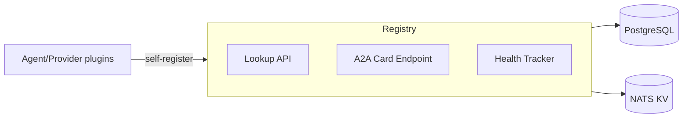
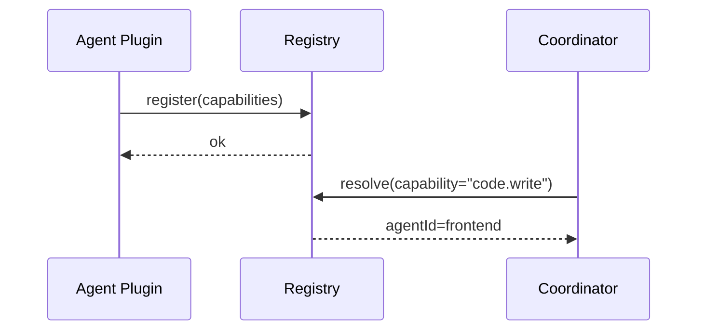
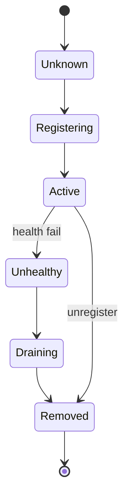
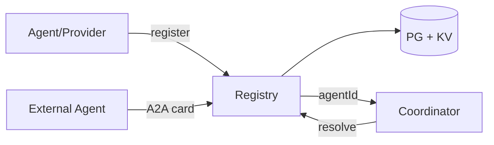

# SDD — 09. Registry Service

> **Part of:** DevOS SDD v1.0-draft · **Specs:** Phase 5.1, Phase 2.3 (discovery/A2A) · **Governance:** Constitution T2 (no lock-in), T12 (open standards/A2A), ADR-003 (provider abstraction), Eng §11 (Kernel manages plugin lifecycle)

---

## 1. Purpose
The Registry is the **discovery backbone**. It tracks available agent plugins and provider/tool/deploy adapters, their capabilities, and health; it exposes internal lookup and external **A2A Agent Cards** so both internal services and external agents can join the team.

## 2. Responsibilities
- Register/unregister agents and providers (with capability flags).
- Serve capability-based lookup (Orchestration §03, Provider GW §05).
- Expose A2A `Agent Cards` (JSON-RPC 2.0 / SSE) for externals.
- Track health; mark unhealthy → draining.
- Be the source of truth for Kernel plugin lifecycle (Eng §11).

## 3. Architecture


## 4. Interaction Sequence


## 5. Interfaces (ports)
- `RegistryPort`: `register/resolve/list/capabilities(agentId)`.
- `A2AGateway`: `agentCard(id) → JSON`, `listCards()`.
- `HealthPort`: `report(agentId, status)`.

## 6. APIs
- `GET /v1/agents`, `GET /v1/agents/:id/capabilities`
- `GET /v1/providers`, `GET /v1/providers/:id`
- `GET /.well-known/agent-card/:id` (A2A, open standard T12)

## 7. Events
- **Consumes:** `agent.registered`, `provider.health`, `plugin.loaded/unloaded`.
- **Publishes:** none (lookup is request/reply); health changes reflected in KV.

## 8. State Machine


## 9. Folder Structure
```
core/registry/
  api/          # lookup + A2A
  cards/        # A2A Agent Card generator
  health/       # health tracker
  store/        # PG + KV
```

## 10. Dependencies
- PostgreSQL, NATS KV, services (self-registering), Orchestration §03 / Provider GW §05 (consumers).

## 11. Data Flow


## 12. Failure Handling
- **Registry down:** services cache last-known registry; degrade to cached agents (no new discovery).
- **Stale entry:** TTL + health probes; auto-drain expired.
- **Duplicate register:** idempotent upsert by agent id.

## 13. Security
- Auth on registration (only Kernel/trusted services register).
- Capability allowlist; untrusted externals sandboxed (A2A).
- Audit registration changes.

## 14. Scalability
- Replicated; KV-backed for low-latency lookup.
- Read-heavy; cache agent lists per consumer.

## 15. Testing Strategy
- Unit: register/resolve/capabilities logic.
- Integration: A2A card fetch (open-standard schema validation).
- Health: unhealthy → draining transition.
- Security: unauthenticated register rejected.

## 16. Future Extensions
- Federated registries (cross-org agent sharing).
- Capability negotiation protocol.
- Signed plugin attestation.
