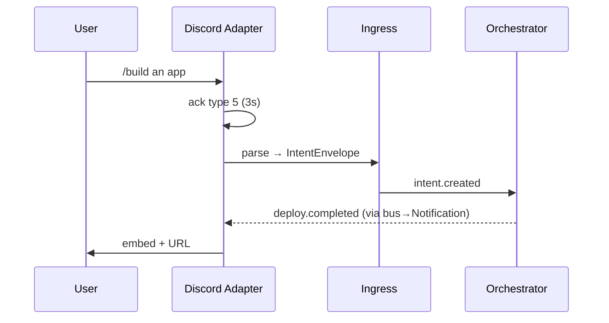
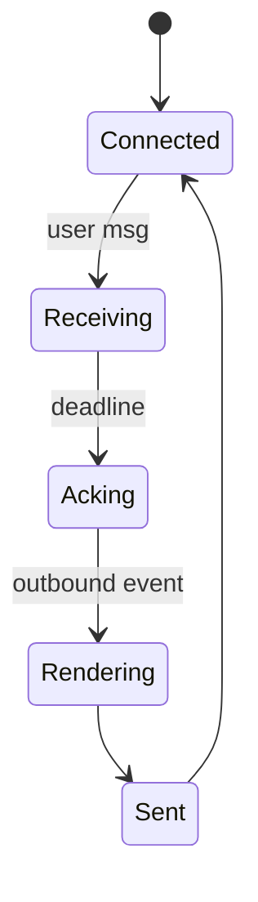
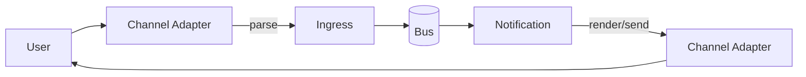

# SDD — 10. Channel Adapters (Subsystem)

> **Part of:** DevOS SDD v1.0-draft · **Specs:** Phase 2.5, Phase 3.3 · **Governance:** Constitution T1 (channel-agnostic), T12 (open standards), ADR-006 (uniform intent), T6 (observability)

---

## 1. Purpose
Channel Adapters are the **edge translators** between each of the 9 surfaces (Desktop, Web, Mobile, WhatsApp, Telegram, Discord, Slack, Voice, REST) and the channel-agnostic core. They implement the `ChannelProvider` port so Ingress §01 (inbound) and Notification §07 (outbound) stay uniform. No channel logic leaks into core services.

## 2. Responsibilities
- **Inbound (`ack` + `parse`):** honor ACK deadline, translate raw → canonical `IntentEnvelope`.
- **Outbound (`render` + `send`):** translate core events → channel-native messages.
- Declare `supports` (buttons, longText, voice, attachments).
- Handle channel quirks (Discord 3s, WhatsApp 20s + templates, Voice barge-in).

## 3. Architecture
```mermaid
flowchart LR
    subgraph ADP[Channel Adapters]
      D[Discord] S[Slack] T[Telegram] W[WhatsApp] V[Voice]
      WB[Web] DE[Desktop] M[Mobile] R[REST]
    end
    subgraph CORE[Core]
      ING[Ingress §01]
      NOT[Notification §07]
    end
    D -->|parse| ING
    NOT -->|render/send| D
    V -->|parse| ING
    NOT -->|render/send| V
```

## 4. Interaction Sequence (Discord example)


## 5. Interfaces (ports)
- `ChannelProvider`:
  - `ackDeadlineMs`, `ack(raw)`
  - `parse(raw): IntentEnvelope`
  - `render(evt): ChannelMessage`
  - `send(msg)`
  - `supports: { buttons, longText, voice, attachments }`

## 6. APIs
- Inbound webhooks: `/webhooks/discord`, `/slack`, `/telegram`, `/whatsapp`, voice WS.
- Outbound: adapter calls channel SDK/API (Discord/Slack/TG/WA REST, Voice RT).
- Web/Desktop/Mobile/REST use SDK → Gateway §02 (not adapters for ingress).

## 7. Events
- **Inbound →** `intent.created` (via Ingress).
- **Outbound ←** all `task.*` / `deploy.*` / `intent.*` (via Notification).

## 8. State Machine (per channel session)


## 9. Folder Structure
```
plugins/channels/
  discord/   slack/   telegram/   whatsapp/
  voice/     web/     desktop/    mobile/    rest/
  shared/    # ChannelProvider base + ACK strategies
```

## 10. Dependencies
- Intent Ingress §01 (inbound host), Notification §07 (outbound host), NATS, bus envelope schema.

## 11. Data Flow


## 12. Failure Handling
- **ACK miss risk:** pre-ACK then process (Discord/Slack).
- **Invalid signature:** reject 401; never publish.
- **Channel API down:** inbound queued; outbound retry/backoff.
- **WhatsApp cold start:** use approved template; free-form after opt-in.

## 13. Security
- Verify every webhook signature.
- Channel tokens in secret manager.
- No raw secrets in messages (T4/T11).
- Template compliance (WhatsApp policy).

## 14. Scalability
- Per-adapter horizontal instances.
- Shared `ChannelProvider` SDK reduces duplication.
- ACK deadlines met via pre-ACK pattern.

## 15. Testing Strategy
- Per-channel parse/render golden tests.
- ACK-timing tests (3s/20s).
- Signature-verification tests.
- Voice: barge-in interruption tests.

## 16. Future Extensions
- Email channel; native CLI binary.
- VR/AR review mode.
- Richer voice (agent voices, standup mode).
