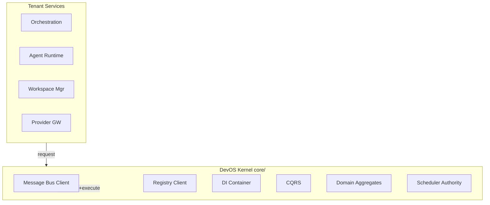
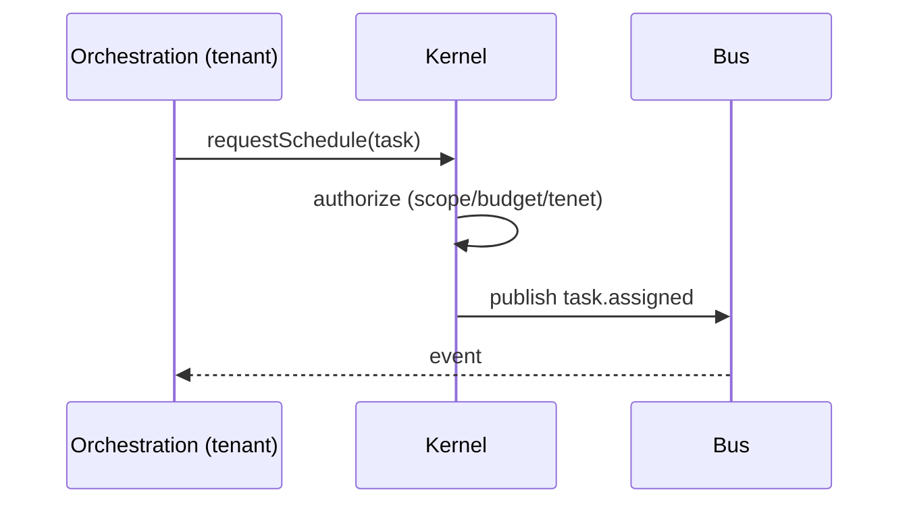
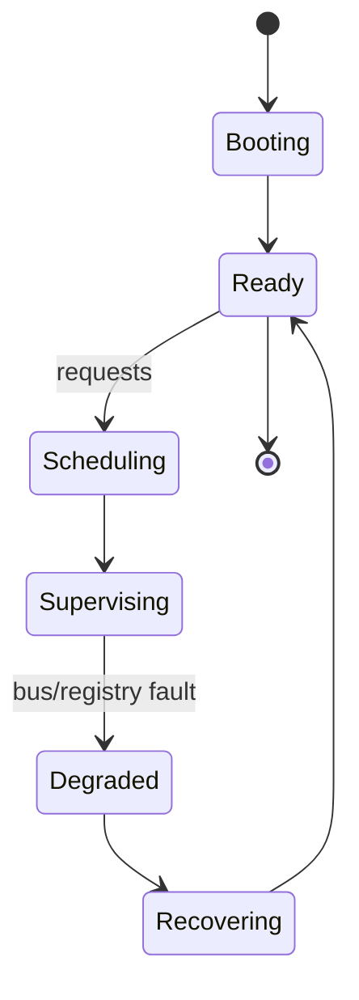
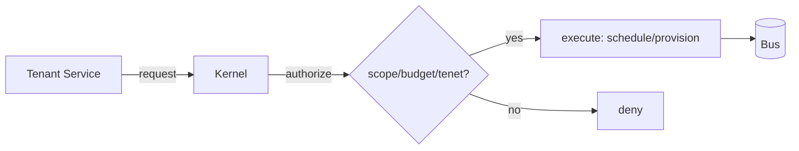

# SDD — 11. DevOS Kernel (core/)

> **Part of:** DevOS SDD v1.0-draft · **Specs:** Phase 1 (Microkernel), Phase 5.1 (Registry/DI) · **Governance:** Eng §11 (sole runtime authority), Constitution T5/T7/T11, ADR-001 (bus), ADR-002 (DAG), ADR-003 (ports)

---

## 1. Purpose
The **DevOS Kernel** is the microkernel (`core/`) and the **only runtime component permitted** to schedule tasks, manage agents, workspaces, providers, plugins, and runtime lifecycle (Eng §11). All other services are tenants that *request*; the Kernel *authorizes and executes*. It embodies the Constitutional tenets centrally.

## 2. Responsibilities
- **Schedule:** dispatch agent runs; drive DAG execution (ADR-002).
- **Manage agents:** lifecycle, registration, discovery, assignment.
- **Manage workspaces:** provisioning + lifecycle (ADR-004).
- **Manage providers:** registration + routing config (ADR-003).
- **Manage plugins:** load/unload + lifecycle.
- **Manage runtime lifecycle:** start/stop, scaling, health.
- Own the **bus**, **registry**, **DI container**, **CQRS**, **domain aggregates**.

## 3. Architecture


## 4. Interaction Sequence


## 5. Interfaces (ports)
- `BusPort`, `RegistryPort`, `DIPort`, `CQRSPort`, `SchedulerPort`.
- `KernelAuthority`: `requestSchedule/requestProvision/registerPlugin/...` (tenants call these; Kernel decides).

## 6. APIs
- Internal libraries consumed by services at composition root.
- Control-plane APIs: `kernel.schedule`, `kernel.provision`, `kernel.register`, `kernel.health`.

## 7. Events
- **Owns** the bus; emits/handles core lifecycle events (`workspace.ready`, `agent.registered`, `budget.exceeded`).
- Enforces HITL gates and budget at the authority layer (T3/T5).

## 8. State Machine


## 9. Folder Structure
```
core/
  bus/       # NATS client + schema
  registry/  # registry client (see §09)
  di/        # dependency injection
  cqrs/      # command/query separation
  domain/    # Intent, Plan, Task, Project aggregates
  scheduler/ # authority for scheduling/lifecycle
```

## 10. Dependencies
- NATS JetStream (bus), PostgreSQL (aggregates), Registry §09, all tenant services (Orchestration/Agent Runtime/Workspace/Provider GW).

## 11. Data Flow


## 12. Failure Handling
- **Bus partition:** queue + replay on heal (at-least-once).
- **Scheduler overload:** backpressure; reject new requests with `429`.
- **Registry inconsistency:** consensus via KV; last-writer with TTL.
- **Kernel crash:** control plane HA; tenants reconnect.

## 13. Security
- Central enforcement of T3 (HITL), T4 (isolation), T5 (budget), T10 (audit), T11 (transparency).
- Only Kernel may mutate agent/workspace/provider/plugin state.
- All mutations audited.

## 14. Scalability
- Bus RF=3; Kernel control plane replicated (HA).
- Scheduler sharded by org for scale.
- Tenants scale independently; Kernel stays the authority.

## 15. Testing Strategy
- Unit: scheduler authority, DI wiring, CQRS separation.
- Integration: tenant request → Kernel authorize → bus event.
- Security: unauthorized tenant mutation rejected.
- Chaos: bus partition, registry loss.

## 16. Future Extensions
- WASM plugin runtime (sandbox + speed).
- Multi-region super-cluster (NATS super-cluster).
- Policy engine (OPA) for dynamic tenet enforcement.
