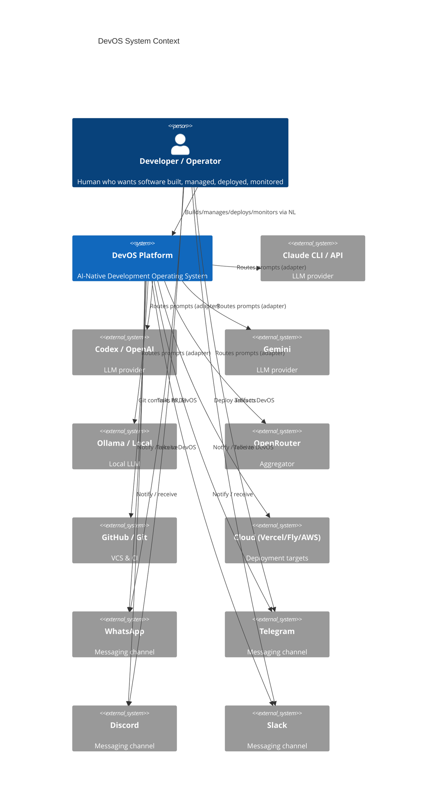
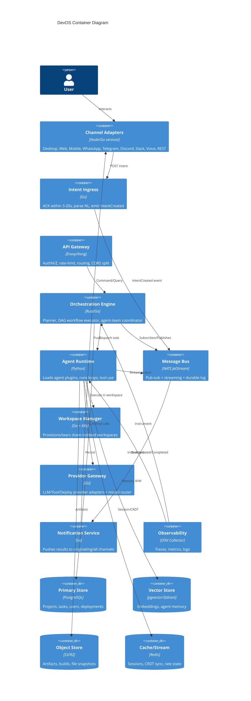
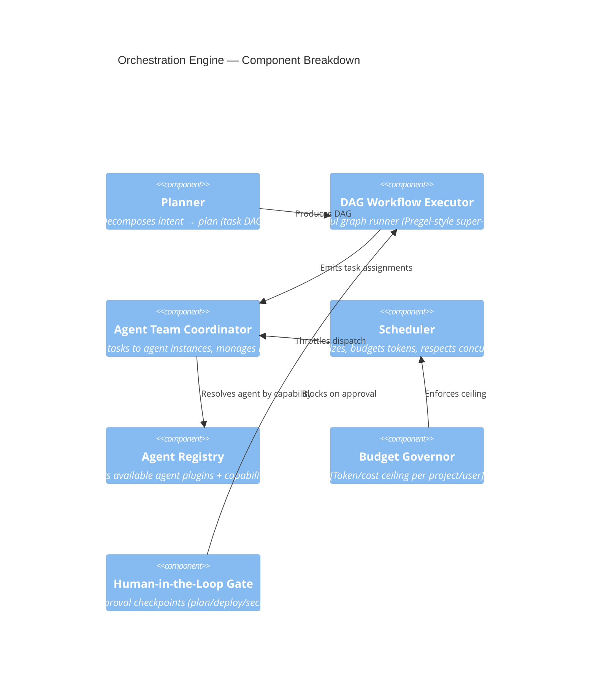
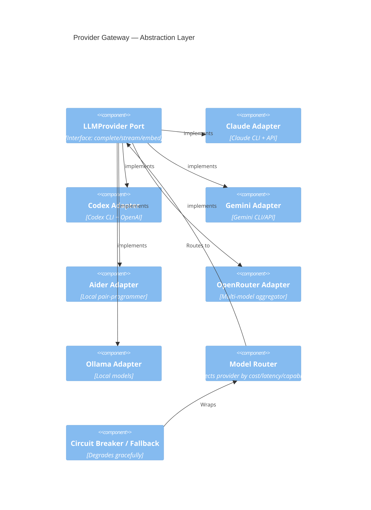
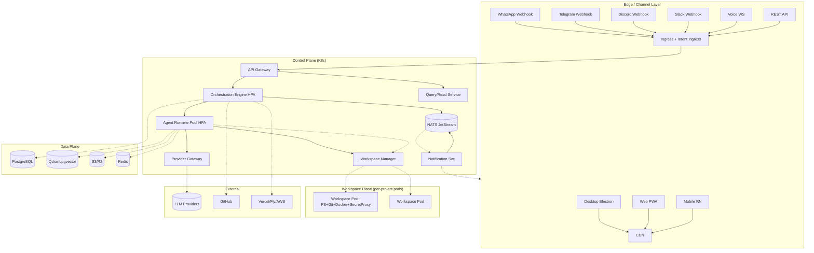
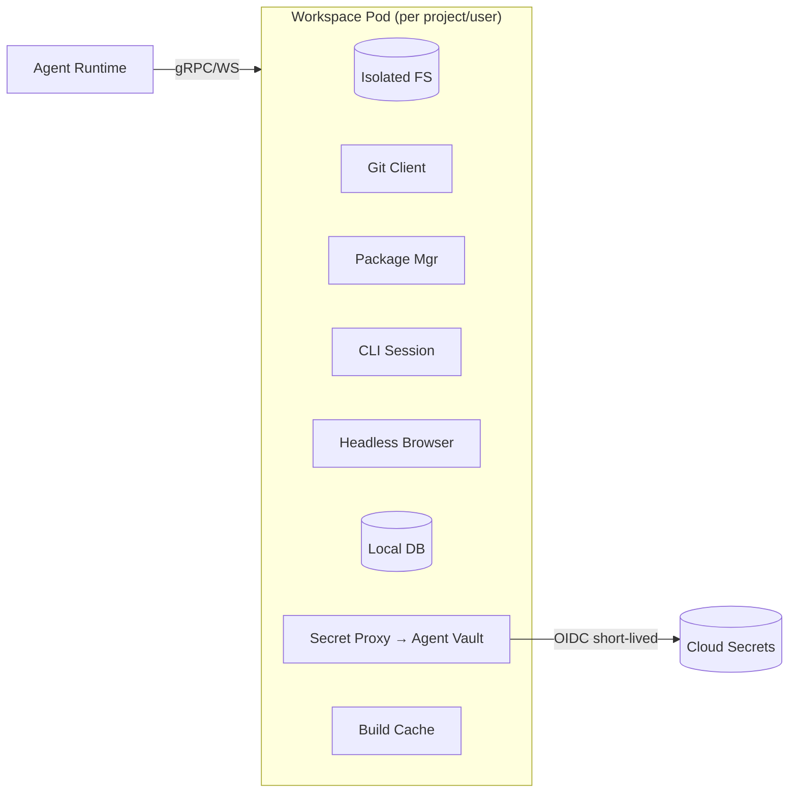
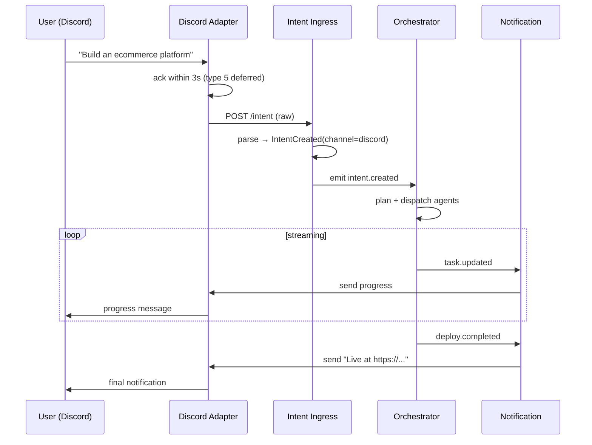
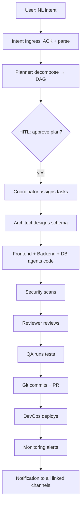

# Phase 1 — System Architecture: DevOS

> **Status:** In Progress
> **Depends on:** Phase 0 (Research Synthesis)
> **Purpose:** Define the production-grade architecture for an AI-Native Development Operating System controllable from 9 channels, orchestrating a pluggable multi-agent team over isolated workspaces via a provider-agnostic AI runtime.

---

## 1. Purpose & Responsibilities

### 1.1 Purpose
DevOS is **not an IDE and not a chat app** — it is an *operating system for software development*. Its responsibility is to convert human intent (expressed in natural language over any channel) into deployed, monitored software through an orchestrated team of specialized AI agents, without requiring the human to manually perform each step.

### 1.2 Top-Level Responsibilities
- **Intent ingestion** from 9 channels with uniform semantics.
- **Planning & decomposition** of intent into tasks and agent assignments.
- **Orchestration** of a multi-agent team via a stateful graph engine.
- **Execution** of agent work inside isolated, sandboxed workspaces.
- **Provider abstraction** so no LLM/tool vendor is hardcoded.
- **Deployment & monitoring** of produced software.
- **Notification** back to the originating channel (and all linked channels).
- **Observability, security, and cost governance** across all of the above.

---

## 2. Architecture Principles (Binding)

| Principle | How it is enforced in DevOS |
|-----------|------------------------------|
| Clean Architecture / Hexagonal | All domain logic sits behind ports; infrastructure (providers, channels, storage) are adapters. |
| DDD | Bounded contexts: `Intent`, `Planning`, `Orchestration`, `Agent`, `Workspace`, `Deployment`, `Notification`, `Observability`. |
| SOLID | Single-responsibility agents; interface-segregated provider/ channel contracts. |
| Event-Driven | All cross-context communication via the **Message Bus**; no direct context-to-context calls. |
| CQRS where useful | Command side (intent→action) separate from Query side (status/dashboards). |
| Plugin / Microkernel | Core = kernel (bus, registry, scheduler). Agents, providers, channels, tools = plugins. |
| Provider Abstraction | `LLMProvider`, `ToolProvider`, `DeployProvider`, `ChannelProvider` interfaces. |
| Dependency Injection | Runtime wiring via DI container; nothing `new`s its dependencies. |
| Async / Streaming First | Every operation is async; every agent output streams over SSE/WebSocket. |
| Workspace Isolation | Each workspace = sealed container/pod; no shared FS/process/network by default. |
| Observability First | Every span, metric, and log flows to OpenTelemetry pipeline from day one. |
| Security by Design | Agent Vault, OIDC, least-privilege, audit trail on every mutation. |
| Cloud Native | 12-factor services, stateless where possible, K8s/HPA, edge relays. |
| Offline First | Client state via CRDT (Yjs); reconnect-and-sync; queue intents locally. |

---

## 3. C4 — Level 1: System Context



**Key context decisions:**
- The human never talks to providers directly. DevOS is the only system the human addresses.
- Channels are *equal citizens* — a project started on Discord can be queried from the Desktop app.
- Providers are *pluggable backends*, hidden behind DevOS adapters.

---

## 4. C4 — Level 2: Container Diagram



---

## 5. C4 — Level 3: Key Component Diagrams

### 5.1 Orchestration Engine (Core Kernel)



### 5.2 Provider Gateway (Abstraction Layer)



---

## 6. Deployment Diagram



---

## 7. Architectural Decision Records (ADRs)

### ADR-001: Event-Driven Core with NATS JetStream
- **Decision:** All cross-context communication uses NATS JetStream (pub-sub + durable streams + KV + object store).
- **Rationale:** Research shows pub-sub message pools (MetaGPT) and event-driven frameworks (AutoGen v0.4, CrewAI Flows) outperform direct calls. JetStream gives at-least-once delivery, replay, and persistence.
- **Alternatives:** Kafka (heavier ops), Redis Streams (weaker replay), RabbitMQ (no native streaming).
- **Tradeoff:** Operational complexity vs. scalability. Mitigated by managed NATS (Synadia/Confluent).

### ADR-002: Stateful DAG Orchestration (Pregel-style)
- **Decision:** Workflows are DAGs executed in super-steps; nodes may be agents, tools, humans, or subgraphs.
- **Rationale:** ChatDev v2 (DAG YAML) and LangGraph (super-steps) validate this. Supports map-reduce, conditional edges, human nodes.
- **Alternatives:** Linear pipeline (too rigid), pure LLM-agent negotiation (non-deterministic, unauditable).

### ADR-003: Provider Abstraction via Ports
- **Decision:** `LLMProvider`, `ToolProvider`, `DeployProvider`, `ChannelProvider`, `VectorProvider` are interfaces; concrete adapters are plugins.
- **Rationale:** Every major framework ships this; avoids vendor lock-in (explicit requirement).
- **Tradeoff:** Lowest-common-denominator feature risk → solved by *capability flags* per provider.

### ADR-004: Workspace Isolation via Containers/MicroVMs
- **Decision:** Each workspace = sealed pod (FS, git, pkg-mgr, CLI, browser, DB, secret-proxy). Pre-warmed pool for <5s cold start.
- **Rationale:** Docker sandboxing is consensus (SWE-agent, OpenHands). Secret proxy = Infisical Agent Vault pattern.
- **Alternatives:** Full VMs (slow), shared FS (insecure).

### ADR-005: CRDT Client Sync (Yjs + Edge Relay)
- **Decision:** Client shared state (file trees, agent panels, task boards) syncs via Yjs CRDTs over an edge WebSocket relay.
- **Rationale:** Local-first + realtime + offline (Yjs, Liveblocks, PartyKit). Satisfies "Offline First."
- **Tradeoff:** CRDT memory overhead → bounded doc sizes, server-side compaction.

### ADR-006: Channel Adapters Funnel to Uniform Intent
- **Decision:** Every channel emits the same `IntentCreated` event with channel metadata; backend is channel-agnostic.
- **Rationale:** Research shows no platform unifies all 9 channels; this is the differentiator. ACK window (3s Discord / 20s WhatsApp) honored at adapter.
- **Tradeoff:** Channel-specific UX nuance lost → solved by `ChannelContext` passed through, not acted on by core.

### ADR-007: Human-in-the-Loop as First-Class Gate
- **Decision:** Approval checkpoints (plan review, deploy, secret access) are explicit DAG nodes, not exceptions.
- **Rationale:** AutoGen/Claude Agent Teams treat HITL as core. Prevents autonomous disasters.

### ADR-008: Budget Governor
- **Decision:** Per-project/per-user token & cost ceilings enforced by a governor before dispatch.
- **Rationale:** Multi-agent costs ~3× single-agent. Unbounded spend is existential risk.

---

## 8. Provider Abstraction — Interface Contracts

```typescript
// LLM Provider Port
interface LLMProvider {
  id: string;
  capabilities(): CapabilityFlags;        // streaming, embed, functionCall, vision...
  complete(req: CompletionRequest): Promise<Completion>;
  stream(req: CompletionRequest): AsyncIterable<Token>;
  embed(text: string): Promise<number[]>;
  costEstimate(req: CompletionRequest): Cost;
}

// Tool Provider Port
interface ToolProvider {
  id: string;
  tools(): ToolSpec[];
  invoke(tool: string, args: any, ctx: WorkspaceCtx): Promise<ToolResult>;
}

// Deploy Provider Port
interface DeployProvider {
  id: string;
  prepare(artifact: Artifact): Promise<DeployPlan>;
  deploy(plan: DeployPlan): Promise<DeployResult>;
  status(url: string): Promise<Health>;
}

// Channel Provider Port
interface ChannelProvider {
  id: string;
  ack(intent: Intent): Promise<void>;            // honor 3s/20s window
  send(msg: OutboundMessage): Promise<void>;     // push notification
  parse(raw: RawWebhook): Intent;                // channel→uniform intent
}

// Vector Provider Port
interface VectorProvider {
  upsert(ns: string, vec: Vector): Promise<void>;
  query(ns: string, vec: number[], k: number): Promise<Hit[]>;
}
```

---

## 9. Multi-Agent Orchestration Engine

### 9.1 Agent Taxonomy (Plugins)
| Agent | Role | Tools | Emits |
|-------|------|-------|-------|
| Planner | Decompose intent → DAG | memory, search | Plan |
| Architect | System design, schema | memory, browser | Design docs |
| Frontend | UI code | workspace, git | Files |
| Backend | API/services | workspace, git | Files |
| Database | Schema/migrations | workspace, db | Migrations |
| DevOps | CI/CD, infra | workspace, cloud | Pipelines |
| Automation | Scripts, bots | workspace | Scripts |
| Security | Audit, scan | workspace, scanner | Findings |
| QA | Tests, eval | workspace, runner | Test results |
| Documentation | Docs | workspace | Markdown |
| Reviewer | Code review | git, diff | Review |
| Git | Commit/PR | git | Commits |
| Deployment | Ship | deploy provider | Release |
| Monitoring | Observe | metrics | Alerts |
| Memory | Persist/recall | vector store | Memories |
| Research | Web/repo research | browser, search | Reports |
| Product Manager | Requirements, priorities | memory | Specs |

### 9.2 Communication Topology
```
                  ┌──────────────┐
                  │  Message Bus  │  (pub-sub + streaming)
                  └──────┬───────┘
        ┌────────────────┼────────────────┐
        ▼                ▼                ▼
   [Planner]        [Architect]       [Frontend]
        │                │                │
        └──── publish(artifact) ──────────┘
                  ▼
            [Reviewer] subscribes to "code.*"
                  ▼
            [QA] subscribes to "review.passed"
```
Agents **never call each other directly** — they publish typed artifacts; subscribers filter by role/topic. This is the MetaGPT pub-sub pool + A2A opacity principle.

---

## 10. Message Bus — Event Catalog (Sample)

| Topic | Producer | Consumers | Payload |
|-------|----------|-----------|---------|
| `intent.created` | Ingress | Orchestrator | Intent + channel ctx |
| `plan.proposed` | Planner | HITL gate, user | DAG |
| `task.assigned` | Coordinator | Agent Runtime | Task + agent id |
| `agent.token` | Agent Runtime | Bus/UI (stream) | Streamed token |
| `artifact.published` | Any agent | Subscribers by topic | Typed artifact |
| `review.passed` | Reviewer | QA, Deploy | Ref |
| `deploy.completed` | Deployment | Notification, Monitoring | URL |
| `task.failed` | Any | Coordinator, Notification | Error |
| `budget.exceeded` | Governor | Coordinator, User | Ceiling |

---

## 11. Workspace Isolation Design



- **Lifecycle:** `provision → warm → active → idle → recycle/snapshot`.
- **Cold start:** pre-warmed pool (Firecracker microVM or container) target < 5s.
- **Secret Proxy:** Agents request `secret://db/password`; proxy attaches real value at egress, never into agent context.

---

## 12. Channel / Remote Control Design



---

## 13. Data Flow — "Build an Ecommerce Platform"



---

## 14. Folder Structure (Monorepo)

```
devos/
├── apps/
│   ├── desktop/            # Electron + React
│   ├── web/                # Next.js PWA
│   ├── mobile/             # React Native
│   ├── gateway/            # API Gateway (Envoy config / Kong)
│   └── ingress/            # Intent Ingress service
├── services/
│   ├── orchestration/      # Planner, DAG exec, coordinator, scheduler
│   ├── agent-runtime/      # Agent loop, tool use, memory
│   ├── workspace-mgr/      # Provision/recycle workspaces
│   ├── provider-gateway/   # LLM/Tool/Deploy adapters
│   ├── notification/       # Channel push
│   └── query/              # CQRS read side
├── plugins/
│   ├── agents/             # One folder per agent plugin
│   ├── providers/llm/      # claude, codex, gemini, aider, openrouter, ollama
│   ├── providers/deploy/   # vercel, fly, aws, railway
│   ├── channels/           # whatsapp, telegram, discord, slack, voice, rest
│   └── tools/              # git, docker, browser, db, scanner
├── core/
│   ├── bus/                # NATS client, event schemas
│   ├── registry/           # Agent/provider discovery
│   ├── di/                 # Dependency injection container
│   ├── cqrs/               # Command/Query separation
│   └── domain/             # DDD aggregates: Intent, Plan, Task, Project...
├── packages/
│   ├── contracts/          # Shared TS/Proto interfaces (ports)
│   ├── crdt-sync/          # Yjs client sync
│   ├── ui-kit/             # Shared component library
│   └── sdk/                # Public REST/JS SDK
├── infra/
│   ├── k8s/                # Manifests, HPA, operators
│   ├── terraform/          # Cloud infra
│   └── helm/               # Charts
├── specs/                  # This documentation set
└── tests/
    ├── unit/  ├── integration/  ├── e2e/  ├── load/  └── chaos/
```

---

## 15. Tradeoffs & Risks

| Decision | Tradeoff | Risk | Mitigation |
|----------|----------|------|------------|
| Event-driven bus | Ops complexity | Bus outage = full halt | Managed NATS, multi-AZ, replay |
| Microkernel + plugins | Plugin API churn | Breaking changes | Versioned plugin contracts, schema registry |
| Provider abstraction | LCD features | Loses provider-specific power | Capability flags, escape-hatch passthrough |
| Workspace isolation | Cold-start latency | Slow conversational feel | Pre-warmed pool, microVM |
| CRDT sync | Memory overhead | Large docs blow memory | Bounded docs, server compaction |
| Multi-agent | 3× token cost | Runaway spend | Budget governor, model router |
| 9 channels | Surface area | More attack surface, more bugs | Channel adapters isolated, uniform intent |
| HITL gates | Friction | Slower autonomy | Configurable gate strictness per project |

---

## 16. Future Extensions

1. **A2A Gateway:** Expose internal agents via Google A2A `Agent Cards` so external agents join teams.
2. **Federated workspaces:** Cross-region workspace replication for geo-distributed teams.
3. **Agent marketplace:** Third-party agent plugins with revenue share.
4. **Self-improving planner:** RL-based orchestrator (Puppeteer-style) replacing static DAGs.
5. **Voice-first mode:** Full duplex voice where the user *talks* to the agent team in standups.
6. **Compliance mode:** Full audit, immutable logs, SOC2/HIPAA packaged deployment.

---

*End of Phase 1 — System Architecture. Proceeds to Phase 2 (Specification — Engineering Docs).*
