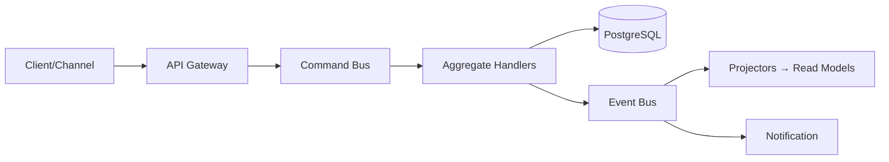

# Phase 2.2 — Data Models & Database Schemas (Specification)

> **Status:** Draft
> **Depends on:** Phase 1 (Architecture)
> **Scope:** Domain aggregates, PostgreSQL schemas, vector store design, object store layout, cache keys.

---

## 1. Purpose & Responsibilities

Define the persistent shape of DevOS: how projects, intents, plans, tasks, agents, workspaces, deployments, users, and memories are stored and related. Must support:
- CQRS read/write separation.
- Auditability (every mutation logged).
- Multi-tenant isolation (org → user → project).
- Time-travel on agent output (token-level replay).

---

## 2. Bounded Contexts (DDD)

```
Identity (users, orgs, keys)
Intent (raw NL → parsed)
Planning (plans, DAGs, approvals)
Execution (tasks, agent runs, artifacts)
Workspace (pods, sessions, secrets)
Delivery (deployments, releases, rollbacks)
Observation (metrics, alerts, logs)
Memory (short/long-term, vectors)
```

---

## 3. PostgreSQL Schema (Core)

### 3.1 Identity
```sql
CREATE TABLE orgs (
  id            UUID PRIMARY KEY DEFAULT gen_random_uuid(),
  name          TEXT NOT NULL,
  plan          TEXT NOT NULL DEFAULT 'free',
  created_at    TIMESTAMPTZ NOT NULL DEFAULT now()
);

CREATE TABLE users (
  id            UUID PRIMARY KEY DEFAULT gen_random_uuid(),
  org_id        UUID NOT NULL REFERENCES orgs(id),
  email         TEXT UNIQUE,
  display_name  TEXT,
  created_at    TIMESTAMPTZ NOT NULL DEFAULT now()
);

CREATE TABLE api_keys (
  id            UUID PRIMARY KEY DEFAULT gen_random_uuid(),
  org_id        UUID NOT NULL REFERENCES orgs(id),
  user_id       UUID REFERENCES users(id),
  name          TEXT NOT NULL,
  key_hash      TEXT NOT NULL,           -- bcrypt/argon2, never store raw
  scopes        TEXT[] NOT NULL,
  revoked_at    TIMESTAMPTZ,
  created_at    TIMESTAMPTZ NOT NULL DEFAULT now()
);
```

### 3.2 Projects & Intent
```sql
CREATE TABLE projects (
  id            UUID PRIMARY KEY DEFAULT gen_random_uuid(),
  org_id        UUID NOT NULL REFERENCES orgs(id),
  name          TEXT NOT NULL,
  slug          TEXT NOT NULL,
  repo_url      TEXT,
  workspace_id  UUID,                     -- active workspace
  settings      JSONB NOT NULL DEFAULT '{}',
  created_at    TIMESTAMPTZ NOT NULL DEFAULT now(),
  UNIQUE(org_id, slug)
);

CREATE TABLE intents (
  id            UUID PRIMARY KEY DEFAULT gen_random_uuid(),
  org_id        UUID NOT NULL REFERENCES orgs(id),
  project_id    UUID REFERENCES projects(id),
  channel       TEXT NOT NULL,            -- discord|telegram|web|...
  channel_user_id TEXT,
  text          TEXT NOT NULL,
  status        TEXT NOT NULL DEFAULT 'received',  -- received|planning|executing|completed|failed|cancelled
  plan_id       UUID,
  priority      TEXT NOT NULL DEFAULT 'normal',
  trace_id      TEXT,
  created_at    TIMESTAMPTZ NOT NULL DEFAULT now(),
  completed_at  TIMESTAMPTZ
);
CREATE INDEX idx_intents_org_status ON intents(org_id, status);
```

### 3.3 Plans (DAG) & Tasks
```sql
CREATE TABLE plans (
  id            UUID PRIMARY KEY DEFAULT gen_random_uuid(),
  intent_id     UUID NOT NULL REFERENCES intents(id),
  dag           JSONB NOT NULL,            -- nodes + edges
  status        TEXT NOT NULL DEFAULT 'proposed',  -- proposed|approved|rejected|executing|done
  approved_by   UUID REFERENCES users(id),
  created_at    TIMESTAMPTZ NOT NULL DEFAULT now()
);

CREATE TABLE tasks (
  id            UUID PRIMARY KEY DEFAULT gen_random_uuid(),
  plan_id       UUID NOT NULL REFERENCES plans(id),
  project_id    UUID NOT NULL REFERENCES projects(id),
  agent_id      TEXT NOT NULL,             -- frontend|backend|...
  parent_task_id UUID REFERENCES tasks(id),
  title         TEXT NOT NULL,
  status        TEXT NOT NULL DEFAULT 'pending',  -- pending|in_progress|blocked|completed|failed
  input         JSONB,
  output        JSONB,
  token_usage   JSONB,                     -- {prompt, completion, cost}
  depends_on    UUID[],
  created_at    TIMESTAMPTZ NOT NULL DEFAULT now(),
  completed_at  TIMESTAMPTZ
);
CREATE INDEX idx_tasks_plan ON tasks(plan_id);
CREATE INDEX idx_tasks_status ON tasks(status);
```

### 3.4 Agent Runs (token-level replay)
```sql
CREATE TABLE agent_runs (
  id            UUID PRIMARY KEY DEFAULT gen_random_uuid(),
  task_id       UUID NOT NULL REFERENCES tasks(id),
  agent_id      TEXT NOT NULL,
  model         TEXT NOT NULL,             -- claude-sonnet-5|gpt-...
  provider      TEXT NOT NULL,
  started_at    TIMESTAMPTZ NOT NULL DEFAULT now(),
  ended_at      TIMESTAMPTZ,
  status        TEXT NOT NULL
);

CREATE TABLE agent_tokens (
  run_id        UUID NOT NULL REFERENCES agent_runs(id),
  seq           BIGINT NOT NULL,
  delta         TEXT NOT NULL,
  created_at    TIMESTAMPTZ NOT NULL DEFAULT now(),
  PRIMARY KEY(run_id, seq)
);  -- append-only; supports full replay
```

### 3.5 Artifacts
```sql
CREATE TABLE artifacts (
  id            UUID PRIMARY KEY DEFAULT gen_random_uuid(),
  task_id       UUID NOT NULL REFERENCES tasks(id),
  project_id    UUID NOT NULL REFERENCES projects(id),
  kind          TEXT NOT NULL,            -- code|doc|test|schema|config
  path          TEXT NOT NULL,            -- workspace-relative
  object_key    TEXT NOT NULL,            -- S3/R2 key
  hash          TEXT,
  created_at    TIMESTAMPTZ NOT NULL DEFAULT now()
);
```

### 3.6 Workspaces
```sql
CREATE TABLE workspaces (
  id            UUID PRIMARY KEY DEFAULT gen_random_uuid(),
  org_id        UUID NOT NULL REFERENCES orgs(id),
  project_id    UUID REFERENCES projects(id),
  status        TEXT NOT NULL DEFAULT 'provisioning', -- provisioning|warm|active|idle|recycling
  pod_name      TEXT,
  region        TEXT,
  secret_proxy_ep TEXT,
  created_at    TIMESTAMPTZ NOT NULL DEFAULT now(),
  last_used_at  TIMESTAMPTZ
);
```

### 3.7 Deployments
```sql
CREATE TABLE deployments (
  id            UUID PRIMARY KEY DEFAULT gen_random_uuid(),
  project_id    UUID NOT NULL REFERENCES projects(id),
  intent_id     UUID REFERENCES intents(id),
  provider      TEXT NOT NULL,            -- vercel|fly|aws|railway
  environment   TEXT NOT NULL DEFAULT 'production',
  url           TEXT,
  status        TEXT NOT NULL DEFAULT 'pending', -- pending|building|live|failed|rolled_back
  release_tag   TEXT,
  created_at    TIMESTAMPTZ NOT NULL DEFAULT now()
);
```

### 3.8 Audit Log
```sql
CREATE TABLE audit_log (
  id            BIGSERIAL PRIMARY KEY,
  org_id        UUID NOT NULL,
  actor_id      UUID,
  action        TEXT NOT NULL,            -- intent.create|plan.approve|deploy.execute
  entity_type   TEXT NOT NULL,
  entity_id     UUID NOT NULL,
  payload       JSONB,
  created_at    TIMESTAMPTZ NOT NULL DEFAULT now()
);
CREATE INDEX idx_audit_org_time ON audit_log(org_id, created_at DESC);
```

---

## 4. Vector Store (Qdrant / pgvector)

**Collections:**
| Collection | Dimensions | Payload | Purpose |
|------------|-----------|---------|---------|
| `code_embeddings` | 1536 | `{project_id, file, chunk}` | RAG over codebase |
| `agent_memory` | 1536 | `{agent_id, project_id, type}` | Long-term agent memory |
| `intent_history` | 1536 | `{org_id, intent_id}` | Similar-intent recall |

**Index:** HNSW, cosine similarity, per-project namespace isolation.

---

## 5. Object Store (S3 / R2) Layout

```
devos/
  orgs/{orgId}/
    projects/{projectId}/
      workspaces/{wsId}/
        snapshots/{ts}.tar.zst
      artifacts/{artifactId}/{file}
      builds/{buildId}/
      git/{sha}.bundle
  intents/{intentId}/
    attachments/
```

---

## 6. Cache / CRDT (Redis)

| Key Pattern | Type | TTL | Purpose |
|-------------|------|-----|---------|
| `rate:{orgId}` | Counter | 60s | Intent rate limit |
| `budget:{orgId}` | Hash | 30d | Token/cost remaining |
| `crdt:{projectId}:{doc}` | String | — | Yjs doc binary |
| `session:{userId}` | Hash | 24h | Auth/session |
| `ws:{projectId}` | String | — | Active workspace id |

---

## 7. Data Flow: Write Path (CQRS)



Read path hits materialized read models (separate tables or Redis), never the write aggregates.

---

## 8. Migrations & Versioning

- Tool: `golang-migrate` / `Flyway`.
- Naming: `0001_init.up.sql` / `0001_init.down.sql`.
- Backward-compatible only in minor; breaking in major with dual-write window.

---

## 9. Tradeoffs

| Choice | Tradeoff |
|--------|----------|
| PostgreSQL + JSONB | Flexible DAG/artifacts vs. less strict schema |
| Append-only tokens | Full replay vs. storage growth (TTL + compaction) |
| Vector in same PG (pgvector) | Simpler ops vs. scale limits → Qdrant for enterprise |
| CQRS read models | Freshness lag (ms) vs. read scalability |

---

## 10. Future Extensions

- Sharding by `org_id` for multi-tenant scale.
- Columnar store (ClickHouse) for audit/observability analytics.
- Graph DB (Neo4j) for agent dependency visualization.

---

*End of Phase 2.2 — Data Models & Database Schemas.*
