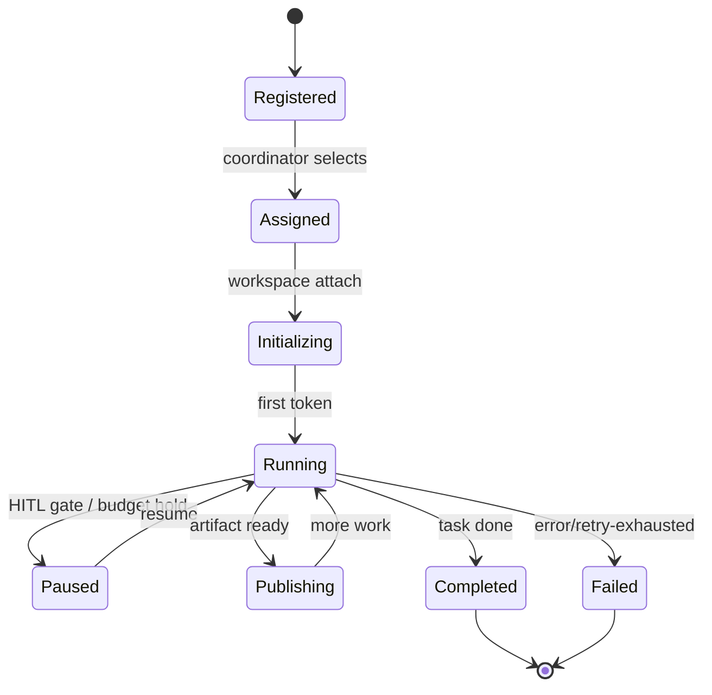
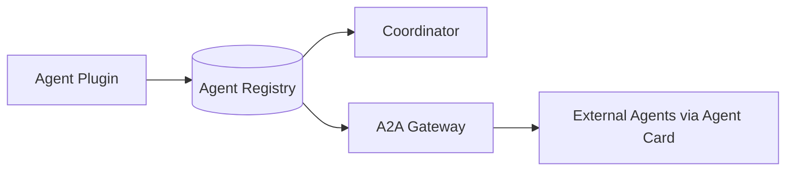

# Phase 2.3 — Agent Communication Protocol (Specification)

> **Status:** Draft
> **Depends on:** Phase 1 (Architecture), Phase 0 (Research: MetaGPT pub-sub, A2A)
> **Scope:** How agents are defined, discovered, invoked, and how they communicate through the bus without direct coupling.

---

## 1. Purpose & Responsibilities

The Agent Protocol defines:
- The **plugin contract** every agent implements.
- The **discovery** mechanism (Agent Registry / A2A Agent Cards).
- The **communication** rules (publish/subscribe to typed artifacts).
- The **lifecycle** states of an agent run.
- The **tool surface** agents may use.

**Core rule (from research):** *Agents never call each other directly.* They publish typed artifacts to the bus; subscribers filter by topic/role. This preserves opacity (A2A principle) and enables replay/audit.

---

## 2. Agent Plugin Contract

```typescript
interface AgentPlugin {
  id: string;                        // "frontend", "reviewer"
  role: string;                     // human-readable role
  description: string;
  capabilities: Capability[];        // ["code.write","test.run","git.commit"]
  subscribesTo: TopicFilter[];      // which artifacts it consumes
  publishesTo: Topic[];             // which artifacts it emits
  systemPrompt: string;             // role persona
  modelPreference: ModelTier;       // cheap|standard|premium
  maxConcurrent: number;
  handler(ctx: AgentContext, task: Task): AsyncIterable<AgentEvent>;
}
```

### 2.1 AgentContext
```typescript
interface AgentContext {
  traceId: string;
  projectId: string;
  workspace: WorkspaceHandle;        // gRPC/WS to sandbox
  memory: MemoryPort;                // vector + KV
  tools: ToolPort;                   // git, docker, browser, db, scanner
  bus: BusPort;                      // publish/subscribe
  budget: BudgetHandle;              // remaining tokens
  llm: LLMProvider;                  // routed provider
}
```

---

## 3. Agent Lifecycle (State Machine)



---

## 4. Topic Taxonomy (Pub-Sub)

| Topic | Publisher(s) | Subscriber(s) |
|-------|--------------|---------------|
| `plan.proposed` | Planner | HITL, User |
| `design.schema` | Architect | Backend, DB, Frontend |
| `code.file` | Frontend/Backend | Reviewer, QA |
| `test.result` | QA | Reviewer, Deployment |
| `review.comment` | Reviewer | Author agent (loop) |
| `security.finding` | Security | Architect, Backend |
| `git.commit` | Git agent | Deployment, Monitoring |
| `deploy.result` | Deployment | Notification, Monitoring |
| `memory.stored` | Memory | (any, future recall) |

**Filtering:** Subscribers apply `TopicFilter` (topic + project + capability). A Reviewer subscribes to `code.file` where `project_id = current`.

---

## 5. Artifact Schema (Typed Inter-Agent Contract)

```typescript
interface Artifact {
  id: string;
  kind: "code" | "doc" | "test" | "schema" | "config" | "review" | "report";
  path?: string;                     // workspace-relative for code/config
  producer: string;                 // agent id
  projectId: string;
  taskId: string;
  schemaVersion: number;
  payload: unknown;                 // typed per kind
  createdAt: string;
}
```

Example `code.file`:
```json
{
  "id":"art_1","kind":"code","path":"src/App.tsx",
  "producer":"frontend","projectId":"proj_x","taskId":"t_1",
  "schemaVersion":1,
  "payload":{"language":"tsx","content":"...","diff":"..."}
}
```

---

## 6. Discovery — Agent Registry & A2A Gateway



**Internal registry entry:**
```json
{ "id":"reviewer", "role":"Code Reviewer", "capabilities":["review.read"], "subscribesTo":["code.file"], "publishesTo":["review.comment"] }
```

**External (A2A) Agent Card** (JSON-RPC 2.0 / SSE per research):
```json
{
  "name":"External Security Scanner",
  "description":"Scans for CVEs",
  "skills":[{"id":"scan","tags":["security"]}],
  "endpoint":"https://ext.example/a2a",
  "auth":"oauth2"
}
```

---

## 7. Tool Surface (What Agents Can Do)

| Tool | Provider | Sandboxed? |
|------|----------|-----------|
| `fs.read/write` | Workspace FS | Yes (pod) |
| `git.*` | Git client | Yes |
| `shell.exec` | Workspace CLI | Yes (ephemeral) |
| `browser.fetch` | Headless browser | Yes |
| `db.query` | Local DB in pod | Yes |
| `pkg.install` | Package mgr | Yes |
| `secret.get` | Secret Proxy → Vault | Proxy-only |
| `deploy.run` | Deploy provider | External |

Agents **never** receive raw secrets; `secret.get` returns a resolved value at proxy egress (Infisical Agent Vault pattern).

---

## 8. Failure & Retry

- Transient (provider 429/5xx): exponential backoff, up to 5 attempts.
- Deterministic (compile error): route back to author agent via `review.comment` loop (max 3).
- Budget exceeded: emit `budget.exceeded`, pause run, notify user.
- Poison (crash): mark `Failed`, alert Coordinator, optional re-assign.

---

## 9. Tradeoffs & Risks

| Decision | Risk | Mitigation |
|----------|------|------------|
| Pub-sub only | Latency for tight agent loops | In-process direct call *allowed only within same task subgraph* |
| Typed artifacts | Schema evolution pain | `schemaVersion` + registry; backward-compat window |
| Plugin isolation | Plugin can crash host | Separate process per agent run (sidecar) |
| External A2A | Untrusted agents | Sandbox + capability allow-list + budget cap |

---

## 10. Future Extensions

- **Agent marketplaces** with signed plugins.
- **Self-improving agents** (Puppeteer-style RL orchestrator).
- **Cross-org agent sharing** via federated A2A.

---

*End of Phase 2.3 — Agent Communication Protocol.*
