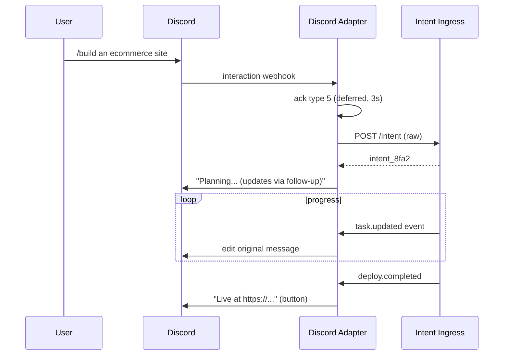
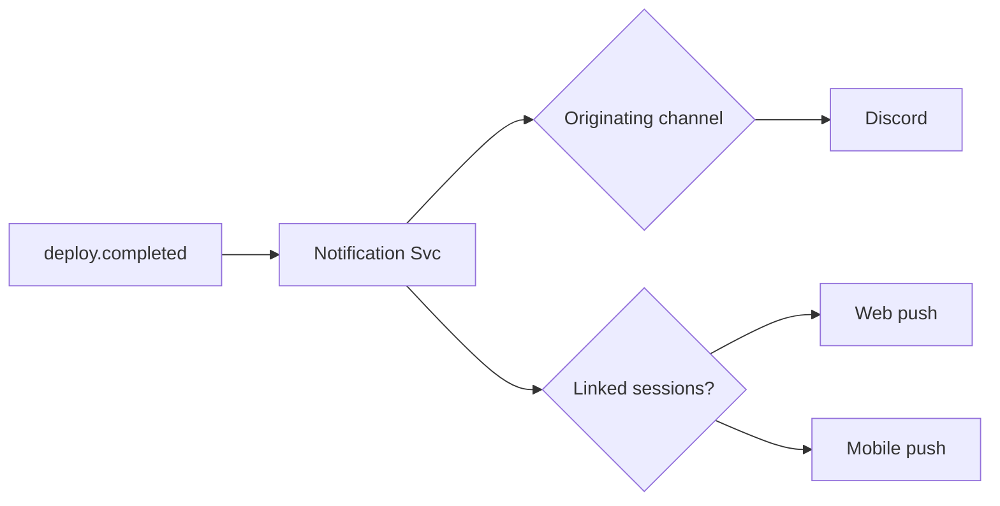

# Phase 2.5 — Channel Adapter Contracts (Specification)

> **Status:** Draft
> **Depends on:** Phase 1 (ADR-006), Phase 0 (Discord 3s/WhatsApp 20s, CRDT)
> **Scope:** How each of the 9 control surfaces (Desktop, Web, Mobile, WhatsApp, Telegram, Discord, Slack, Voice, REST) connects to the uniform backend.

---

## 1. Purpose & Responsibilities

Channel Adapters are the **edge translators** between a human's surface of choice and DevOS's channel-agnostic core. Each adapter:
1. **ACKs** within the channel's hard window (Discord 3s, WhatsApp 20s, Telegram none, Slack 3s).
2. **Parses** raw input → canonical `IntentCreated` envelope.
3. **Subscribes** to outbound events for that intent and **renders** them back to channel-native format.
4. **Honors** channel constraints (message length, buttons, templates).

The core never knows which channel initiated an intent.

---

## 2. Adapter Interface

```typescript
interface ChannelProvider {
  id: "discord" | "slack" | "telegram" | "whatsapp" | "voice" | "web" | "desktop" | "mobile" | "rest";
  ackDeadlineMs: number;                       // 3000 | 20000 | 0 | ...
  ack(raw): Promise<void>;                     // must return within deadline
  parse(raw): IntentEnvelope;                  // → canonical
  render(evt: OutboundEvent): ChannelMessage;  // → channel-native
  send(msg: ChannelMessage): Promise<void>;    // push
  supports: {
    buttons: boolean; longText: boolean;
    voice: boolean; attachments: boolean;
  };
}
```

---

## 3. Channel Matrix

| Channel | ACK | Input Style | Output Style | Notes |
|---------|-----|-------------|--------------|-------|
| Desktop | n/a (WS) | Rich UI | Rich UI + terminal | Full feature set, CRDT sync |
| Web | n/a (WS/SSE) | Rich UI | Rich UI | PWA, offline-capable |
| Mobile | n/a (WS) | Taps/NL | Cards/notifications | RN, push notifs |
| Discord | 3s (type 5 deferred) | Slash cmd + NL | Embeds + buttons | 15-min follow-up window |
| Slack | 3s (`response_url`) | `/devos` + NL | Blocks + buttons | Bolt framework |
| Telegram | none | NL + inline keyboards | Markdown + keyboards | Long-poll or webhook |
| WhatsApp | 20s | NL (templates cold) | Text + buttons | Meta Cloud API, template gate |
| Voice | realtime | Speech (full-duplex) | TTS + optional screen | Barge-in, interim ASR |
| REST | n/a | JSON | JSON | Service/CI integration |

---

## 4. Discord Adapter (Reference Implementation)



**Key constraints honored:**
- Immediate `ACK` (HTTP 200 + type 5) within 3s.
- Long-running progress via **message edits** (not new messages) to avoid spam.
- `plan.proposed` rendered as an **embed with Approve/Reject buttons** (component interaction).

---

## 5. WhatsApp Adapter

- Cold-start (no prior conversation): must use **approved template** ("Hi! I'm DevOS. Reply BUILD to start.").
- After opt-in: free-form NL accepted.
- 20s ACK window → adapter immediately replies "Working on it..." then streams via follow-up messages.
- Rich UI limited → use numbered options for HITL ("1) Approve  2) Revise").

---

## 6. Voice Adapter

- **Transport:** WebSocket with bidirectional audio (e.g., Realtime API style).
- **Pipeline:** ASR (streaming) → Intent Ingress → Orchestrator → TTS (streaming).
- **Barge-in:** User speech interrupts TTS mid-sentence; adapter cancels current TTS and re-ingests.
- **Standup mode:** User can say "Ask the frontend agent for status" → routed as intent with `channel=voice`.

---

## 7. Desktop / Web / Mobile (Rich Clients)

- Connect via `wss://api.devos.ai/v1/stream?intentId=...`.
- Share **one CRDT doc per project** (Yjs) for file tree, task board, agent panel.
- Desktop adds: local terminal pane, full workspace file browser, offline queue.
- Mobile: push notifications via FCM/APNs for `deploy.completed` / `task.failed`.

---

## 8. Notification Routing

When an intent completes, the Notification Service pushes to:
- **Originating channel** (always).
- **All channels where the user has an active session for that project** (optional, configurable).



---

## 9. Tradeoffs & Risks

| Decision | Risk | Mitigation |
|----------|------|------------|
| Uniform intent envelope | Loses channel nuance | `ChannelContext` carried but not acted on by core |
| ACK deadline per channel | Missed ACK = dropped | Adapter pre-ACKs then processes async |
| WhatsApp templates | Cold-start friction | Pre-authored template library |
| Voice latency | Conversational lag | Streaming ASR/TTS, aggressive barge-in |
| 9 surfaces | Maintenance burden | Shared `ChannelProvider` SDK + ui-kit |

---

## 10. Future Extensions

- **Email channel** (long-form intent via email).
- **CLI channel** (`devos build "..."` native binary).
- **VR/AR channel** for spatial dev review.

---

*End of Phase 2.5 — Channel Adapter Contracts.*
