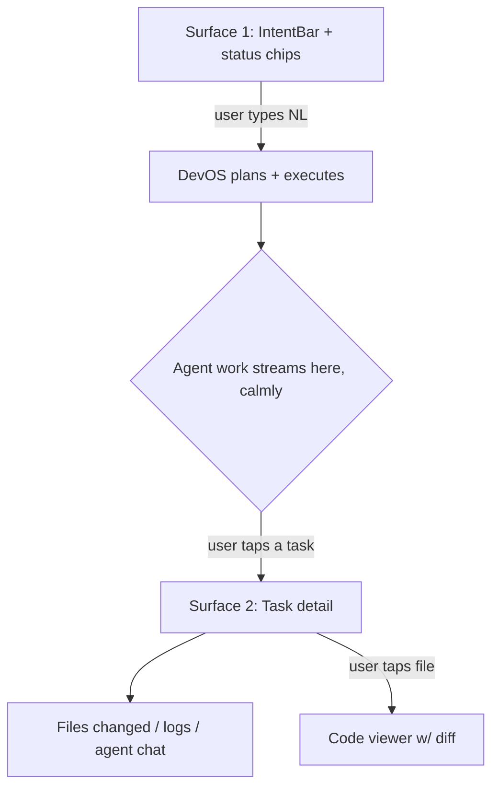

# Phase 3.1 — Design System & UX Principles (Specification)

> **Status:** Draft
> **Depends on:** Phase 0 (NN/g progressive disclosure, Claude Agent Teams), Phase 1 (ADR-005 CRDT, ADR-007 HITL)
> **Scope:** Foundational design language, interaction principles, and the shared component library used across all 9 surfaces.

---

## 1. Purpose & Responsibilities

The design system ensures **every DevOS surface feels like one product** — whether you're on Discord, a phone, or the Desktop app. It must:
- Encode the **2-level progressive disclosure** rule (NN/g): conversational surface → drill-down.
- Provide a **shared component library** (`packages/ui-kit`) consumable by Desktop, Web, Mobile.
- Define **agent-aware** primitives (agent panel, task board, live token stream).
- Stay **calm under load** — long-running autonomous work should not overwhelm the user.

---

## 2. UX Principles (Binding)

| # | Principle | Application |
|---|-----------|-------------|
| P1 | **Natural language first** | NL is the primary input on every surface; no command syntax required. |
| P2 | **Two-level disclosure** | Surface 1 = conversation + status. Surface 2 = drill into task/agent/workspace. Never nest deeper than 2. |
| P3 | **Strong information scent** | Every "details" trigger clearly labels what's behind it. |
| P4 | **Async by default** | Work happens autonomously; user is *notified*, not blocked. |
| P5 | **Agent opacity with control** | Show agents as calm rows; expandable for logs; never auto-scroll spam. |
| P6 | **One source of truth** | Same project state on all surfaces via CRDT sync. |
| P7 | **Graceful degradation** | Rich surfaces (Desktop) show everything; thin surfaces (WhatsApp) show summaries + numbered choices. |
| P8 | **Human always in loop** | Approve/Reject gates are explicit, never buried. |

---

## 3. Visual Language

### 3.1 Tokens
```
Color:    neutral-forward (slate scale), 1 accent (devos-violet #6D5EF0),
          semantic: success/warning/danger/info
Type:     Inter (UI) + JetBrains Mono (code/tokens)
Spacing:  4px base unit (4/8/12/16/24/32)
Radius:   8px cards, 6px controls, 999px pills
Motion:   ≤200ms ease-out; respect prefers-reduced-motion
Density:  Comfortable default; compact mode for power users
```

### 3.2 Dark-first
Dark theme primary (developer context), light theme available. System-aware via `prefers-color-scheme`.

---

## 4. Core Components (`packages/ui-kit`)

| Component | Purpose | Used on |
|-----------|---------|---------|
| `<IntentBar>` | NL input + attach + priority | All rich surfaces |
| `<AgentPanel>` | Keyboard-navigable agent rows; idle collapse to count | Desktop/Web/Mobile |
| `<TaskBoard>` | `pending/in_progress/blocked/completed` columns, deps | Desktop/Web |
| `<TokenStream>` | Live streaming agent output, copyable | Desktop/Web |
| `<PlanReview>` | DAG visualization + Approve/Reject | Desktop/Web/Mobile |
| `<WorkspaceTree>` | File browser (CRDT-synced) | Desktop/Web |
| `<TerminalPane>` | Streaming CLI session | Desktop |
| `<DeployCard>` | URL, health, rollback | All |
| `<AlertStack>` | Non-blocking notifications | All |
| `<ChannelSurface>` | Renders rich content into channel-native format | Adapter layer |

---

## 5. Interaction Models

### 5.1 The Conversation → Drill-down Flow


### 5.2 Agent Panel Behavior (from research)
- Idle agents collapse into a single count chip ("3 agents idle") — reduces clutter.
- Active agent = expandable row with live token stream + a **message** affordance (talk to that agent directly).
- Failed agent = red row with error text + "Retry" / "Take over" buttons.

### 5.3 Progressive Disclosure Rule
```
Level 1: IntentBar + status chips + AgentPanel(summary)
   ↓ (tap agent / task)
Level 2: Task detail / file diff / logs
   ✗ NO Level 3 — keep it shallow
```

---

## 6. Accessibility

- WCAG 2.2 AA minimum.
- Keyboard-first navigation (all components focusable, `Cmd+K` command palette).
- Screen-reader announcements for async completions (`aria-live`).
- Color contrast ≥ 4.5:1; never rely on color alone (icons + text).

---

## 7. Responsive Strategy

| Breakpoint | Behavior |
|------------|----------|
| Desktop ≥1280 | 3-pane: Intent/Conversation | TaskBoard | WorkspaceTree+Terminal |
| Tablet 768–1279 | 2-pane: Conversation+Tasks | Workspace (toggle) |
| Mobile <768 | Single-pane tabs: Chat / Tasks / Files |

---

## 8. Tradeoffs & Risks

| Decision | Risk | Mitigation |
|----------|------|------------|
| 2-level cap | Power users want depth | Compact mode + command palette exposes more |
| Calm-by-default | User may miss detail | Configurable verbosity per project |
| Shared kit across 9 surfaces | One-size-fits-all weakness | `ChannelSurface` adapter tailors output |
| Dark-first | Light-only environments | Full light theme, not afterthought |

---

## 9. Future Extensions

- **Voice UI surface** with waveform + live transcript overlay.
- **Spatial/AR review** mode for 3D project visualization.
- **Theming SDK** so enterprises rebrand their DevOS tenant.

---

*End of Phase 3.1 — Design System & UX Principles.*
