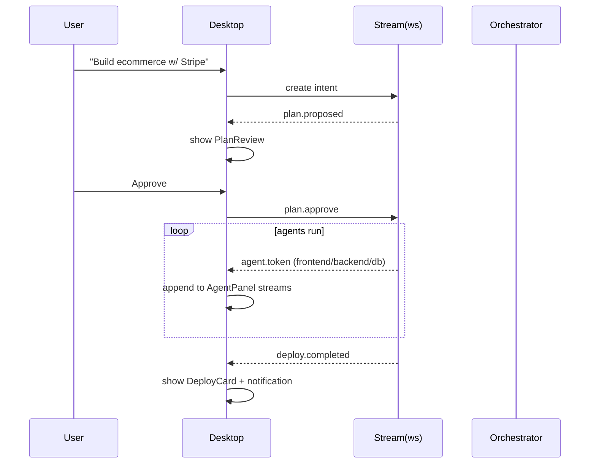
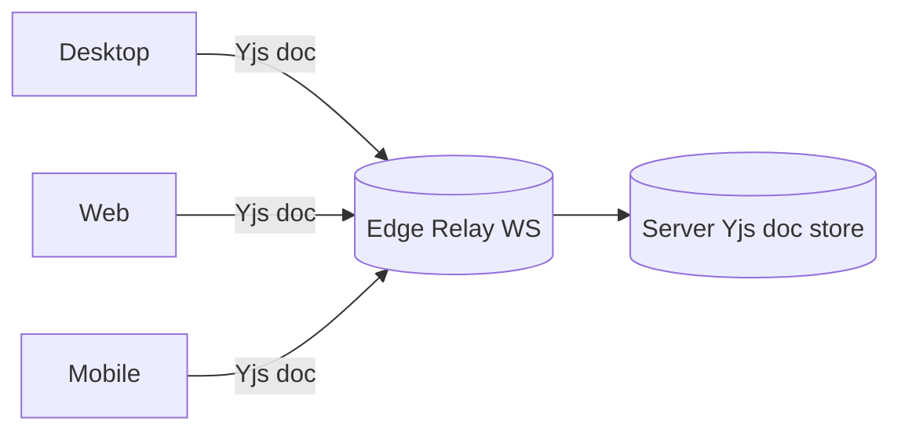

# Phase 3.2 — Desktop, Web & Mobile App UX (Specification)

> **Status:** Draft
> **Depends on:** Phase 3.1 (Design System), Phase 1 (CRDT sync, Workspace Isolation)
> **Scope:** Rich client surfaces — Electron Desktop, Next.js Web PWA, React Native Mobile.

---

## 1. Purpose & Responsibilities

These three surfaces are the **full-fidelity** experience. They share `packages/ui-kit` and a single CRDT-synced project state. Responsibilities:
- Accept NL intent and render autonomous agent work in real time.
- Provide deep drill-down (files, logs, terminal) within the 2-level rule.
- Stay usable offline (Web/Mobile PWA) and reconnect-and-sync.

---

## 2. Desktop App (Electron + React)

### 2.1 Layout (3-pane)
```mermaid
flowchart LR
    subgraph L["Left: Project Rail"]
        PR[Project list + status]
    end
    subgraph C["Center: Conversation + AgentPanel + TaskBoard"]
        CV[IntentBar]
        AP[Agent rows (collapsible)]
        TB[Tasks w/ deps]
    end
    subgraph R["Right: WorkspaceTree + TerminalPane + DeployCard"]
        WT[File tree]
        TP[CLI stream]
        DC[Deploy status]
    end
```

### 2.2 Key Features
- **Local terminal pane** streaming `workspace.exec` output.
- **Full file browser** with inline diff viewer (CRDT-synced).
- **Offline queue:** intents typed offline are queued, sent on reconnect.
- **Native menus:** `Cmd+K` palette, `Cmd+Enter` submit intent.
- **Multi-window:** one window per project.

### 2.3 Sequence — "Build ecommerce"


---

## 3. Web App (Next.js PWA)

### 3.1 Differences from Desktop
- No native terminal — uses **browser-streamed** CLI pane (xterm.js over WS).
- **Installable PWA**, offline cache for UI shell + last-known state.
- Shared URL: `/p/:projectId` deep-links to a project (shareable).
- Role-based views: owner sees all; collaborator sees scoped tasks.

### 3.2 Responsive
- ≥1280: same 3-pane as Desktop.
- <1280: collapses to tabbed single-pane (Chat / Tasks / Files).

---

## 4. Mobile App (React Native)

### 4.1 Layout
- **Tabs:** Chat | Tasks | Files | Settings.
- **Chat:** IntentBar (NL) + status chips + expandable agent rows.
- **Tasks:** read-only board (tap → detail + logs).
- **Files:** read-only tree + file preview (no edit on mobile by default).
- **Push:** FCM/APNs for `deploy.completed`, `task.failed`, `plan.proposed` (with Approve/Reject quick actions).

### 4.2 Mobile-specific
- **Quick approve:** notification action buttons (Approve / Reject) without opening app.
- **Voice input:** mic button on IntentBar → ASR → intent.
- **Thin rendering:** summaries only; "Open in Desktop" deep link for heavy work.

---

## 5. Shared State (CRDT)



All three surfaces bind to the **same Yjs document per project**. Edits (task status, file selection, agent panel expansion) sync in real time; offline edits merge on reconnect.

---

## 6. Tradeoffs & Risks

| Decision | Risk | Mitigation |
|----------|------|------------|
| Electron Desktop | Heavy bundle/ memory | Lazy-load, separate renderer per window |
| Single CRDT doc | Large doc memory | Bounded doc; split per concern (tasks vs files) |
| Mobile read-only | User wants edit | Quick "request change" → intent |
| PWA offline | Stale state | Versioned sync, conflict banner |

---

## 7. Future Extensions

- **Collaborative cursors** (multiple humans in one project).
- **Desktop plugin API** for custom panes.
- **Watch mode:** mobile gets live video of Desktop screen-share of build.

---

*End of Phase 3.2 — Desktop, Web & Mobile UX.*
