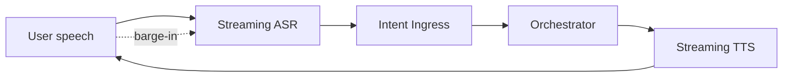

# Phase 3.3 — Messaging & Voice Channel UX (Specification)

> **Status:** Draft
> **Depends on:** Phase 3.1 (Design System), Phase 2.5 (Channel Adapters), Phase 0 (Discord 3s, WhatsApp 20s, Voice)
> **Scope:** Thin-surface UX for Discord, Slack, Telegram, WhatsApp, and Voice — where rich UI is limited and ACK windows are hard constraints.

---

## 1. Purpose & Responsibilities

These channels are **conversational-first and bandwidth-limited**. The UX must:
- Honor each platform's ACK and message-format constraints.
- Translate DevOS's rich internal state into **scannable, actionable** messages.
- Provide HITL (approve/reject) via native UI primitives (buttons, numbered lists).
- Never spam — batch progress into edited messages, not floods.

---

## 2. Discord UX

### 2.1 Patterns
- **Command:** `/devos build an ecommerce site` (slash command) or plain NL in a linked channel.
- **Immediate ACK:** Bot replies with a *deferred* "Planning…" embed within 3s.
- **Progress:** Bot **edits** the original embed (status chips: 🟡 Planning → 🔵 Coding → 🟢 Deploying). No new messages per token.
- **HITL:** `plan.proposed` → embed with **Approve** / **Reviate** buttons (component interaction).
- **Completion:** Embed updates with live URL + a "View in App" button.

### 2.2 Embed Structure
```
┌─ 🤖 DevOS · Ecommerce Platform ──────────┐
│ Status: 🔵 Coding (Frontend, Backend, DB) │
│ Tasks:  4 done · 2 in progress · 0 failed │
│ ─────────────────────────────────────────  │
│ [Approve Plan] [Request Changes]           │
└────────────────────────────────────────────┘
```

---

## 3. Slack UX

- **Command:** `/devos build ...` or mention `@devos`.
- **ACK:** `response_url` 3s ack "Working on it…".
- **Progress:** Block Kit message **updated in place**.
- **HITL:** Block Kit buttons (Approve / Reject with modal for feedback).
- **Threads:** Agent updates posted as **thread replies** to keep channels clean.

---

## 4. Telegram UX

- **Input:** NL message or `/build` command; inline keyboards for choices.
- **ACK:** No hard deadline → bot can stream multiple messages, but still batches.
- **Progress:** Edits previous message (Markdown formatting).
- **HITL:** Inline keyboard buttons (✅ Approve / ✏️ Revise).
- **Rich media:** Sends file diffs as code blocks or attached `.diff` files.

---

## 5. WhatsApp UX

- **Cold start:** Must use **approved template** ("👋 I'm DevOS. Reply BUILD to start.").
- **After opt-in:** Free-form NL.
- **ACK:** 20s window → immediate "⏳ On it…" then batched updates.
- **HITL:** Numbered list — "Plan ready: 1) Approve 2) Revise". User replies "1".
- **Completion:** Text + link. No rich buttons (use link previews).

---

## 6. Voice UX

### 6.1 Full-Duplex Pipeline


### 6.2 Behaviors
- **Interim transcripts** shown live (if a screen is attached) or spoken back.
- **Barge-in:** User interrupting TTS cancels current utterance and re-ingests.
- **Standup mode:** "Ask the security agent for the latest findings" → routed intent with `channel=voice`.
- **Confirmations:** High-stakes actions (deploy) require spoken "yes, deploy" or push confirmation.

---

## 7. Notification Strategy (All Channels)

| Event | Discord/Slack | Telegram/WhatsApp | Voice | Mobile/Desktop |
|-------|--------------|-------------------|-------|----------------|
| plan.proposed | Embed + buttons | Keyboard | Speak + push | PlanReview |
| task.failed | Edit + 🔴 | "Task X failed" | Speak | AlertStack |
| deploy.completed | Embed + URL | URL | Speak URL | DeployCard + push |
| budget.exceeded | DM user | DM user | Speak | AlertStack |

Originating channel always notified; linked sessions optionally.

---

## 8. Tradeoffs & Risks

| Decision | Risk | Mitigation |
|----------|------|------------|
| Batch via edit | User sees lag | Min 2s edit throttle; key milestones always push |
| Numbered HITL (WhatsApp) | Ambiguous input | Strict parse; "reply 1 or 2" prompt |
| Voice barge-in | Cut-off understanding | ASR buffering + intent re-merge |
| Template gate (WhatsApp) | Cold friction | Pre-authored, friendly templates |

---

## 9. Future Extensions

- **Discord threads per agent** for deep debugging.
- **Slack Canvas** integration for plan docs.
- **Voice personas** (different agent voices).

---

*End of Phase 3.3 — Messaging & Voice Channel UX.*
