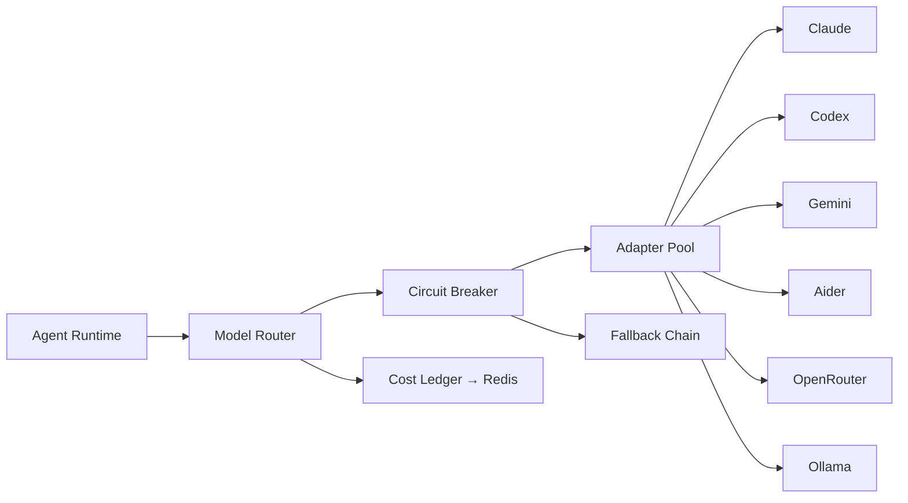
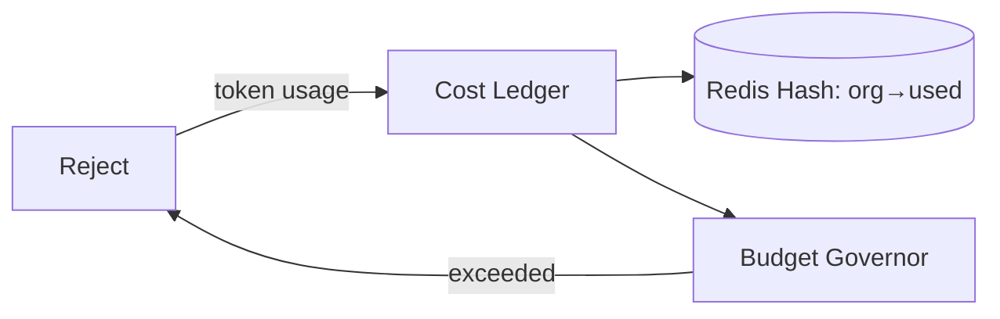

# Phase 5.2 — Provider Gateway (Deep Dive)

> **Status:** Draft
> **Depends on:** Phase 1 (ADR-003 Provider Abstraction), Phase 0 (provider abstraction research)
> **Scope:** LLM/Tool/Deploy provider abstraction, model routing, fallback, cost governance.

---

## 1. Purpose & Responsibilities

The Provider Gateway is the **anti-lock-in layer**. It exposes a single `LLMProvider`/`ToolProvider`/`DeployProvider` port to the Agent Runtime while hiding the heterogeneity of Claude, Codex, Gemini, Aider, OpenRouter, Ollama, and deployment targets. It also enforces:
- **Model routing** by capability, cost, latency.
- **Circuit breaking / fallback** when a provider is unhealthy.
- **Cost tracking** per org/user/task.

---

## 2. Architecture



---

## 3. Model Tiers & Routing

| Tier | Use | Default Models |
|------|-----|----------------|
| `cheap` | Triage, classification, routing | Haiku 4.5, GPT-mini, Gemini-flash |
| `standard` | Most agent work | Sonnet 5, GPT-4o, Gemini-Pro |
| `premium` | Synthesis, architecture, review | Opus 4.8, Opus 4.7, GPT-5 |

**Routing logic:**
```
1. Agent declares modelPreference (tier).
2. Router filters providers with required capabilityFlag (streaming, functionCall, vision).
3. Picks lowest-cost healthy provider; tracks latency p50/p95.
4. On failure → next provider in tier; if all fail → escalate tier or fail.
```

---

## 4. Adapter Interface (Port)

```typescript
interface LLMProvider {
  id: string;
  capabilities(): CapabilityFlags;
  complete(req: CompletionRequest): Promise<Completion>;
  stream(req: CompletionRequest): AsyncIterable<Token>;
  embed(text: string): Promise<number[]>;
  costEstimate(req: CompletionRequest): Cost;
}
```

**Capability flags:** `streaming`, `functionCall`, `vision`, `embedding`, `jsonMode`, `longContext`. Agents check flags before calling.

---

## 5. Circuit Breaker & Fallback

- **States:** `closed` → `open` (after N consecutive 5xx/429) → `half-open` (probe).
- **Per-provider** breaker in Redis.
- **Fallback chain:** `claude → openrouter(claude) → codex → gemini → ollama(local)`.
- **Budget-aware:** If org budget exhausted → reject with `BUDGET_EXCEEDED` before any call.

---

## 6. Cost Ledger



Every completion updates `budget:{orgId}` hash. Governor polls before dispatch (see Phase 1 ADR-008).

---

## 7. Adapter Registry (Plugin)

```
plugins/providers/llm/
  claude/    → ClaudeAdapter (CLI + API)
  codex/     → CodexAdapter
  gemini/    → GeminiAdapter
  aider/     → AiderAdapter
  openrouter/→ OpenRouterAdapter
  ollama/    → OllamaAdapter
plugins/providers/deploy/
  vercel/ fly/ aws/ railway/
```

Each adapter self-registers capabilities at boot via Registry Service.

---

## 8. Tradeoffs & Risks

| Decision | Risk | Mitigation |
|----------|------|------------|
| LCD feature set | Lose provider power | Capability flags + passthrough escape |
| Fallback chains | Latency on cascade | Per-tier breaker; fast-fail |
| Cost ledger in Redis | Race conditions | Atomic increments; reconcile vs PG nightly |
| Local Ollama | Quality gap | Only used as last-resort fallback |

---

## 9. Future Extensions

- **Speculative routing:** fire to 2 providers, use first, cancel other.
- **Fine-tune routing:** learn per-task which provider performs best.
- **Federated providers:** user brings their own key, we route + bill.

---

*End of Phase 5.2 — Provider Gateway.*
