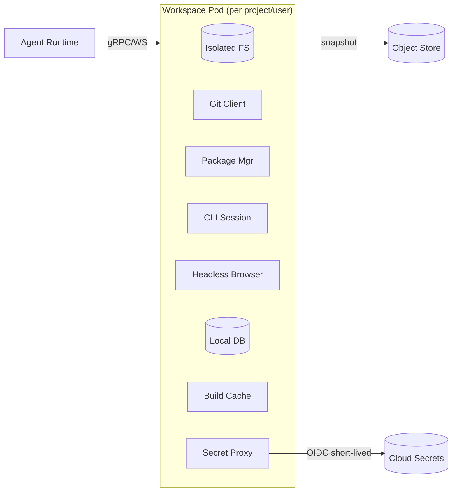
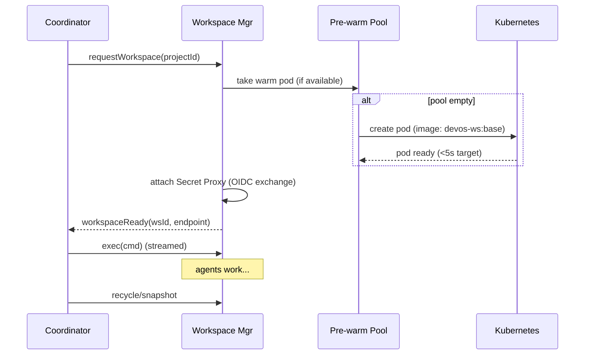

# Phase 5.3 — Workspace Manager (Deep Dive)

> **Status:** Draft
> **Depends on:** Phase 1 (ADR-004 Isolation), Phase 0 (Docker sandbox, Infisical Agent Vault)
> **Scope:** Isolated, per-project execution environments — provisioning, warm pool, secret proxy, lifecycle.

---

## 1. Purpose & Responsibilities

The Workspace Manager gives each agent run a **sealed, reproducible environment** containing filesystem, git, package managers, CLI, headless browser, local DB, build cache, and a secret proxy. Responsibilities:
- Provision < 5s via pre-warmed pool.
- Enforce **no shared FS/process/network** across workspaces by default.
- Attach **Secret Proxy** (Agent Vault pattern) — agents never see raw secrets.
- Snapshot/recycle workspaces; persist artifacts to object store.

---

## 2. Workspace Anatomy



---

## 3. Provisioning Flow



---

## 4. Isolation Guarantees

| Dimension | Mechanism |
|-----------|-----------|
| Filesystem | Per-pod volume; no host mount beyond image |
| Process | Pod sandbox; seccomp; no privileged |
| Network | Default deny egress except allowlisted (provider URLs, package registries, secret proxy) |
| Secrets | Injected only at Secret Proxy egress; never in agent env/context |
| Resources | CPU/mem limits per pod; OOM-kill → task fail → retry |

---

## 5. Secret Proxy (Agent Vault Pattern)

- Agent calls `secret.get("db/password")`.
- Proxy resolves via OIDC short-lived token → cloud secret manager.
- Attaches real value **only at egress** (e.g., to a DB connection string), never returns it to agent context.
- Audit-logged: which agent accessed which secret, when.

```typescript
interface SecretProxy {
  resolve(ref: string): Promise<ResolvedSecret>; // value attached at egress only
  audit(agentId: string, ref: string): void;
}
```

---

## 6. Lifecycle States

```
provisioning → warm → active → idle → (recycle | snapshot→archive)
                                ↑________↓ (reuse)
```

- **warm:** pre-built, no project attached; assigned on request.
- **idle:** project attached but no activity > 30 min → snapshot + recycle (cost save).
- **archive:** snapshot stored in object store; restored on next intent.

---

## 7. Image Strategy

- **Base image:** `devos-ws:base` (git, node, python, go, docker-cli, chromium, psql).
- **Per-stack images:** `devos-ws:node`, `:python`, `:rust` for faster warm.
- **Ephemeral layers:** agent-installed packages live in pod volume, discarded on recycle.

---

## 8. Tradeoffs & Risks

| Decision | Risk | Mitigation |
|----------|------|------------|
| Container (not VM) | Stronger isolation desire | Seccomp + egress deny; microVM option (Firecracker) for high-security tenants |
| Pre-warm pool | Idle cost | Autoscale pool to 0 during low traffic |
| Per-pod DB | Setup latency | Lazy-init on first DB tool call |
| Snapshot/recycle | Context loss | Persist git + artifacts to object store before recycle |

---

## 9. Future Extensions

- **Firecracker microVMs** for tenant-grade isolation.
- **GPU workspaces** for ML agent tasks.
- **Cross-region workspace replication** for geo teams.

---

*End of Phase 5.3 — Workspace Manager.*
