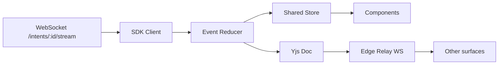

# Phase 6 — Frontend Client Architecture (Specification)

> **Status:** Draft
> **Depends on:** Phase 3 (UI/UX), Phase 1 (ADR-005 CRDT), Phase 2.1 (API/WS)
> **Scope:** Client-side architecture for Desktop (Electron), Web (Next.js PWA), Mobile (React Native) — unified via shared packages.

---

## 1. Purpose & Responsibilities

The frontend turns the backend's autonomous agent streams into a **calm, actionable UI** on every rich surface. Responsibilities:
- Bind to real-time agent/task events over WebSocket/SSE.
- Sync shared project state via Yjs CRDT (offline-first).
- Render within the 2-level progressive disclosure rule.
- Reuse one component library (`packages/ui-kit`) and one state core across all three apps.

---

## 2. Monorepo Package Layout

```
packages/
  contracts/    # TS types mirroring backend ports (single source of truth)
  ui-kit/       # Design-system components (Phase 3.1)
  crdt-sync/    # Yjs doc bindings + edge-relay client
  sdk/          # Typed client (REST + WS + SSE)
  state/        # Shared stores (Zustand/Redux) + event reducers
apps/
  desktop/  web/  mobile/
```

---

## 3. Real-Time Data Flow



- **Event reducer** applies backend frames (`agent.token`, `task.assigned`, `deploy.completed`) to local store.
- **CRDT doc** holds collaborative state (task statuses, file selection, agent panel expansion) synced across surfaces.
- **Idempotency:** events deduplicated by `id` (from envelope).

---

## 4. State Management

| Concern | Approach |
|---------|----------|
| Server-streamed state | Event-sourced reducer over WS frames |
| Collaborative UI state | Yjs CRDT (file tree, agent panel) |
| Local UI state | Component-level (no global) |
| Persistence | CRDT doc mirrored to IndexedDB (offline) |
| Cache | React Query for read-model fetches |

---

## 5. Offline-First (Web/Mobile PWA)

1. UI shell + last-known state cached via service worker.
2. Intents typed offline → queued in IndexedDB.
3. On reconnect: CRDT merges, queued intents flushed.
4. Conflict banner if server state diverged.

---

## 6. Shared Component Contract

Every component consumes `packages/contracts` types and emits domain events via `packages/sdk`. No component imports backend internals.

```typescript
// contracts (mirrors backend)
export type TaskStatus = "pending"|"in_progress"|"blocked"|"completed"|"failed";
export interface Task { id: string; agentId: string; status: TaskStatus; title: string; }
```

---

## 7. Performance Budgets

| Surface | First Paint | Bundle |
|---------|-------------|--------|
| Web | < 1.5s | < 250KB gz (initial) |
| Desktop | < 1s (native shell) | lazy chunks |
| Mobile | < 2s | < 300KB gz |

- Code-split per route; virtualize long task/agent lists; throttle token-stream renders (batched 50ms).

---

## 8. Tradeoffs & Risks

| Decision | Risk | Mitigation |
|----------|------|------------|
| Single shared store + CRDT | Complexity | Clear separation: server-state vs collab-state |
| PWA offline | Stale state | Versioned merge + conflict UI |
| Monorepo | Build coupling | Turborepo caching; independent deploys |
| Event-sourced reducer | Replay bugs | Deterministic reducers; snapshot every N events |

---

## 9. Future Extensions

- **React Server Components** for Web read paths.
- **Expo EAS** OTA updates for Mobile.
- **Tauri** alternative to Electron for lighter Desktop.

---

*End of Phase 6.1 — Frontend Architecture. App-specific: 6.2 Desktop, 6.3 Web, 6.4 Mobile.*
