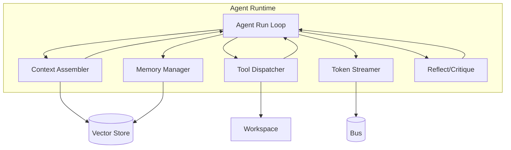

# Phase 7 — AI Runtime: Agent Execution Engine (Specification)

> **Status:** Draft
> **Depends on:** Phase 1 (Architecture), Phase 2.3 (Agent Protocol), Phase 5.2 (Provider Gateway)
> **Scope:** How agents actually execute — the run loop, tool use, context/memory management, streaming, and multi-agent coordination. *Provider abstraction itself is in Phase 5.2.*

---

## 1. Purpose & Responsibilities

The AI Runtime is where **intent becomes code**. It owns:
- The **agent run loop** (observe → think → act → reflect).
- **Tool use** against the workspace (fs, git, shell, browser, db, secret proxy).
- **Context assembly** — what the model sees each turn (RAG, memory, task state).
- **Memory** — short-term (turn) + long-term (vector) + cross-session.
- **Streaming** — token-level output to the bus.
- **Coordination** — publishing artifacts, subscribing to peer outputs.

---

## 2. Runtime Layers



---

## 3. Agent Run Loop

```
observe:  load task + subscribed artifacts + memory recall
think:    assemble context → call LLM (streaming) → collect thought/action
act:      if action=tool → dispatch to workspace; if action=artifact → publish
reflect:  critique output (self or Reviewer agent); loop or terminate
terminate: mark task completed, publish final artifact
```

**Loop guardrails:**
- Max iterations (e.g., 25) to prevent runaway.
- Token budget per run (from Budget Governor).
- HITL pause points (plan approve, deploy, secret access).

---

## 4. Tool Use (Agent-Computer Interface)

Following SWE-agent's ACI insight (research: well-designed interface beats complexity):
- **Tight tool surface:** `fs.read/write`, `git.*`, `shell.exec`, `browser.fetch`, `db.query`, `secret.get`, `deploy.run`.
- **Structured results:** every tool returns typed `ToolResult` (success/bytes/diff), not free text.
- **Sandboxed:** all tools execute inside the workspace pod (Phase 5.3).
- **Streaming:** `shell.exec` output streams token-by-token to the bus.

```typescript
interface ToolResult {
  ok: boolean;
  stdout?: string;
  stderr?: string;
  diff?: string;
  error?: string;
  metadata?: Record<string, unknown>;
}
```

---

## 5. Context Assembly & Memory

### 5.1 Context Window Strategy
```
[System: role persona]
[Memory: retrieved long-term relevant to task]
[Task: current assignment + dependencies]
[Artifacts: subscribed peer outputs]
[Workspace: current file tree + open files]
[History: recent turns (short-term)]
[Tool results: last N]
```
- **Token budget** for context enforced; oldest/least-relevant trimmed first.
- **RAG:** code embeddings retrieved for relevant files (vector store).

### 5.2 Memory Tiers (from ChatDev research)
| Tier | Store | Lifetime | Use |
|------|-------|----------|-----|
| Short-term | In-run buffer | One task | Conversation turns |
| Long-term (vector) | Qdrant/pgvector | Cross-session | Recall prior decisions |
| Blackboard | Bus/pub-sub | Project lifetime | Shared agent facts |
| File | Workspace FS | Project lifetime | Source of truth |

### 5.3 Memory Manager API
```typescript
interface MemoryPort {
  recall(query: string, ctx: AgentContext): Promise<MemoryHit[]>;
  store(fact: MemoryFact, ctx: AgentContext): Promise<void>;
  blackboard(topic: string): Promise<Fact[]>;
}
```

---

## 6. Streaming & Coordination

- Every LLM token → `agent.token` event on bus (high-volume stream, TTL 24h).
- Final artifacts → typed `artifact.published` (consumed by subscribers).
- Peer coordination: Frontend agent subscribes to `design.schema` from Architect; Reviewer subscribes to `code.file`.
- **No direct agent-to-agent calls** (Phase 2.3 rule).

---

## 7. Reflection & Self-Correction

- After each tool action, agent reflects: "Did this achieve the task?"
- On compile/test failure → routes back via `review.comment` loop (max 3).
- Reviewer agent provides external critique; author agent iterates.

---

## 8. Tradeoffs & Risks

| Decision | Risk | Mitigation |
|----------|------|------------|
| Tight ACI tool surface | Less flexible than free shell | Extensible tool registry; power tools for advanced agents |
| Short-term-only context | Lost cross-task context | Long-term vector recall + blackboard |
| Reflection loops | Extra tokens/latency | Bounded iterations; cheap-model reflection |
| Streaming everything | Bus load | Dedicated TOKENS stream; TTL; sampling for observers |

---

## 9. Future Extensions

- **Speculative execution:** agent pre-computes likely next step.
- **Learned context compression:** summarize old turns automatically.
- **Multi-modal agents:** vision on UI screenshots for frontend agents.

---

*End of Phase 7.1 — AI Runtime Overview. Detailed: 7.2 Execution Engine, 7.3 Context & Memory.*
