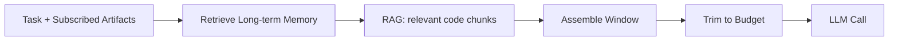

# Phase 7.2 — Context Assembly & Token Optimization (Deep Dive)

> **Status:** Draft
> **Depends on:** Phase 7.1, Phase 0 (token cost: multi-agent ~3× single-agent)
> **Scope:** How context is built per turn, memory retrieval, and token budgeting to keep cost and latency in check at scale.

---

## 1. The Cost Problem (from Research)

ChatDev consumed **22,949 tokens / 148s** vs GPT-Engineer's **7,183 tokens / 16s** — multi-agent is ~3× more expensive. With millions of developers, unbounded context = existential cost risk. **Token optimization is a first-order platform feature, not an afterthought.**

---

## 2. Context Assembly Pipeline



**Window composition (target ≤ model context, typically 8–32K active):**
| Slice | Max Tokens | Source |
|-------|-----------|--------|
| System persona | 500 | Agent plugin |
| Long-term memory | 2K | Vector recall (top-k) |
| Task + deps | 1K | Task repo |
| Peer artifacts | 3K | Bus subscriptions |
| Workspace snapshot | 2K | File tree + open files |
| Recent turns | 4K | Short-term buffer |
| Tool results | 2K | Last N results |

---

## 3. Trimming Strategy (when over budget)

1. Drop oldest short-term turns (summarize to 1 line first).
2. Reduce RAG chunks (top-k 10 → 5).
3. Shrink workspace snapshot (file tree only, no previews).
4. If still over: paginate tool results.
5. Last resort: escalate to `premium` model with larger context.

---

## 4. Memory Retrieval

- **Embedding:** `LLMProvider.embed()` → 1536-dim vector.
- **Index:** per-project namespace in Qdrant; HNSW, cosine.
- **Recall:** top-k (k=5–10) by similarity to current task + recent turns.
- **Blackboard:** high-signal facts (e.g., "Using PostgreSQL") published to bus, retrieved by peers without re-embedding.

```typescript
async recall(query: string, ctx): Promise<MemoryHit[]> {
  const vec = await llm.embed(query);
  return vectorStore.query(ctx.projectId, vec, 8);
}
```

---

## 5. Token Budgeting (per run)


- Each `complete/stream` call estimated pre-flight via `costEstimate()`.
- Run aborts if `estimated > remaining`; emits `budget.exceeded`, pauses, notifies user.
- Cross-run accounting: `budget:{orgId}` hash decremented atomically.

---

## 6. Caching for Cost

| Cache | Key | Saving |
|-------|-----|--------|
| Prompt prefix | hash(system + memory + task) | Reuse across similar tasks |
| Embedding | hash(text) | Skip re-embed |
| Common RAG | project + query hash | Skip vector query |
| Provider semantic cache | exact prompt | Provider-side discount |

---

## 7. Model Routing for Cost (tie-in to 5.2)

- **Reflection/trim:** `cheap` tier (Haiku).
- **Tool selection:** `standard` tier.
- **Synthesis/architecture:** `premium` tier (Opus).
- Net effect: ~40–50% token savings vs all-premium (LangGraph stateless→stateful finding).

---

## 8. Tradeoffs & Risks

| Decision | Risk | Mitigation |
|----------|------|------------|
| Aggressive trimming | Lost context → worse output | Summarize before drop; recall on demand |
| Cheap-model reflection | Misjudges | Bounded; human/Reviewer backstop |
| Per-run budget | Premature abort | Tunable ceiling; user override |
| Caching | Stale cache | TTL + invalidation on artifact change |

---

## 9. Future Extensions

- **Automatic context compaction** (LLM summarizes old turns to fit).
- **Cross-project memory transfer** (learned patterns).
- **Predictive prefetch** of likely-needed RAG chunks.

---

*End of Phase 7.2 — Context Assembly & Token Optimization.*
