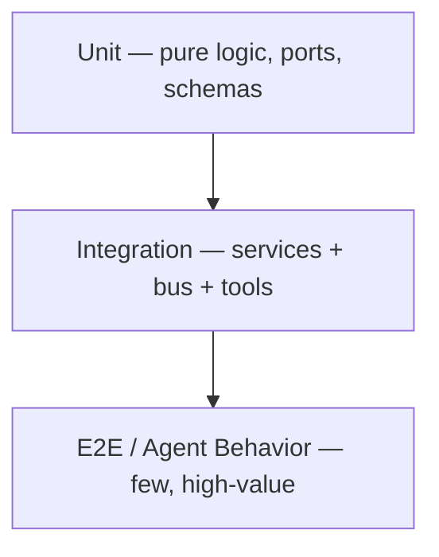

# Phase 8 — Testing & Quality Assurance (Specification)

> **Status:** Draft
> **Depends on:** All prior phases
> **Scope:** Unit, integration, E2E, load, chaos, and — critically — **agent behavior testing** for an autonomous multi-agent system.

---

## 1. Purpose & Responsibilities

Testing DevOS is harder than a typical app because **the system makes non-deterministic LLM-driven decisions**. QA must verify:
- Deterministic infrastructure (services, bus, DB) behaves correctly.
- Agents produce **acceptable** outputs (not exact) within constraints.
- The orchestration **coordinates** correctly even when agents vary.
- The platform survives load, failure, and provider outages.

---

## 2. Test Pyramid (Adapted)



| Layer | Tooling | Coverage Target |
|-------|---------|-----------------|
| Unit | Go test / Vitest / PyTest | 80% of non-LLM logic |
| Integration | Testcontainers + NATS + PG | All service boundaries |
| E2E | Playwright (UI) + custom harness (agents) | Critical user journeys |
| Load | k6 / Locust | SLA under 10× normal |
| Chaos | Chaos Mesh / Gremlin | Failure recovery |

---

## 3. Unit & Integration

- **Ports faked:** `LLMProvider` fake returns scripted completions; `Workspace` fake returns scripted tool results.
- **Schema tests:** every event envelope validated against JSON schema / Protobuf.
- **Repository tests:** against test PG (migrations applied).
- **Bus tests:** publish/subscribe with dedupe verification.

---

## 4. Agent Behavior Testing (Novel)

Because agent output is non-deterministic, we test **properties, not exact strings**.

### 4.1 Golden-Task Eval
- A curated set of ~200 tasks (e.g., "add a login route", "fix failing test X").
- Each run against a **scripted LLM fake** (deterministic) for regression + against **real providers** (sampled) for quality.
- **Pass criteria:** compiles, tests pass, no secrets leaked, artifact published.

### 4.2 Property-Based Assertions
```typescript
expect(agentOutput).toSatisfyAll([
  noRawSecrets(),
  compilesIn(workspace),
  testsPass(workspace),
  artifactPublished("code.file"),
  withinTokenBudget(run),
]);
```

### 4.3 Agent Isolation Tests
- Each agent plugin tested in isolation with fakes for bus/tools/llm.
- Verify it subscribes/publishes correct topics (protocol compliance).

### 4.4 Multi-Agent Coordination Tests
- Run Planner → Frontend → Reviewer with fakes; assert DAG completed, review passed, no deadlock.
- Inject a failing agent; assert retry/escalation path.

---

## 5. E2E Journeys

| Journey | Steps | Assert |
|---------|-------|--------|
| "Build ecommerce" via Web | NL → approve plan → watch agents → deploy | Live URL, no errors |
| Via Discord | Slash cmd → buttons → completion | Embed updated, URL sent |
| Budget exceeded | Force tiny budget | `budget.exceeded`, pause, notify |
| Provider down | Kill Claude adapter | Fallback to Codex, success |
| Workspace crash | Kill pod mid-run | Task failed, retried on new pod |

---

## 6. Load & Performance

- **Intent throughput:** k6 posts 10× normal intent rate; assert ACK < deadline, no backlog.
- **Token stream:** verify bus sustains token volume at p95 < 200ms.
- **Workspace warm pool:** simulate cold spikes; assert provision < 5s p95.
- **Bus:** inject 1M events; assert replay + dedupe correct.

---

## 7. Chaos & Resilience

| Failure | Injected | Expected |
|---------|----------|----------|
| Provider 429 storm | Fault injection | Circuit opens, fallback, no crash |
| NATS partition | Network chaos | At-least-once, replay on heal |
| Workspace OOM | Memory bomb | Task failed, retried, pod recycled |
| Agent runaway loop | Bad prompt | Max-iteration guard triggers |
| Secret proxy down | Kill | Agent can't access secret; task fails safe |

---

## 8. Security Testing

- **Secret leakage:** assert no raw secret appears in any artifact/token/agent context.
- **Tenant isolation:** assert workspace A cannot read workspace B.
- **AuthZ:** assert scope enforcement on every endpoint.
- **Prompt injection:** feed malicious intent; assert sandbox holds, no escape.

---

## 9. CI/CD Pipeline

```mermaid
flowchart LR
    PR --> LINT[Lint + Type]
    LINT --> UNIT[Unit + Integration]
    UNIT --> AGENT[Agent Behavior (scripted)]
    AGENT --> E2E[E2E (sampled)]
    E2E --> CHAOS[Chaos (nightly)]
    CHAOS --> DEPLOY[Deploy to staging]
```

- **Gates:** Unit/Integration on every PR; Agent Behavior (scripted) on PR; real-provider eval nightly; chaos nightly.
- **Flaky handling:** agent real-provider tests marked non-blocking (sampled) to avoid CI flakiness.

---

## 10. Tradeoffs & Risks

| Decision | Risk | Mitigation |
|----------|------|------------|
| Real-provider eval | Cost + flakiness | Sampled, nightly, non-blocking |
| Property vs exact | Misses subtle regressions | Golden tasks + human review sample |
| Chaos in CI | Environment fragility | Nightly, isolated cluster |

---

## 11. Future Extensions

- **Continuous agent eval dashboard** tracking quality over model versions.
- **Synthetic user simulation** (agents testing agents).
- **Red-team harness** for prompt-injection resilience scoring.

---

*End of Phase 8 — Testing & QA.*
