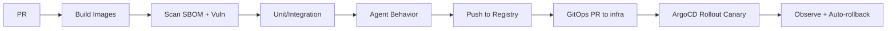

# Phase 9 — Deployment & Infrastructure (Specification)

> **Status:** Draft
> **Depends on:** Phase 5 (Backend), Phase 4 (Database), Phase 8 (Testing)
> **Scope:** Cloud-native deployment, container orchestration, CI/CD, observability, scaling, and disaster recovery for a multi-tenant platform at millions-of-developers scale.

---

## 1. Purpose & Responsibilities

Define how DevOS is built, shipped, run, observed, and recovered. Responsibilities:
- **Reproducible builds** (container images, immutable artifacts).
- **GitOps deployment** to Kubernetes with progressive delivery.
- **Observability** across services + agents (tracing, metrics, logs).
- **Autoscaling** per workload (HPA by queue depth / CPU).
- **Multi-tenancy** isolation and quota enforcement.
- **DR** with defined RTO/RPO.

---

## 2. Infrastructure Topology

```mermaid
flowchart TB
    subgraph CLOUD["Cloud (Multi-AZ / Multi-Region)"]
        direction TB
        subgraph K8S["Kubernetes Cluster"]
            ING[Ingress + Gateway]
            CTRL[Control Plane svc]
            RT[Agent Runtime Pool]
            WM[Workspace Mgr + Pods]
            DAT[Data: PG / Redis / Qdrant]
            BUS[NATS JetStream]
        end
        OBJ[(Object Store S3/R2)]
        REG[Container Registry]
    end
    subgraph EDGE["Edge"]
        CDN[CDN for Web/Mobile assets]
        RELAY[CRDT Edge Relay (PartyKit-style / CF Workers)]
    end
    DEV[CI/CD] --> REG
    REG --> K8S
```

---

## 3. Container & Build Strategy

- **Base images:** Distroless / Chainguard for minimal attack surface.
- **Multi-stage:** build → minimal runtime.
- **SBOM:** generated per image; scanned in CI.
- **Immutability:** images tagged by git SHA; no latest in prod.
- **Workspace images:** `devos-ws:base` + per-stack variants (Phase 5.3).

---

## 4. Kubernetes & GitOps

- **Orchestrator:** EKS/GKE/AKS (cloud-agnostic manifests).
- **GitOps:** ArgoCD / Flux reconciles `infra/k8s` from git.
- **Progressive delivery:** Argo Rollouts (canary 10% → 50% → 100%, automated analysis).
- **HPA:** per service (see Phase 5.1 table).
- **Resource quotas:** per namespace (per tenant pool for Agent Runtime).

```yaml
# example: agent-runtime HPA
apiVersion: autoscaling/v2
kind: HorizontalPodAutoscaler
metadata: { name: agent-runtime }
spec:
  scaleTargetRef: { kind: Deployment, name: agent-runtime }
  minReplicas: 5
  maxReplicas: 200
  metrics:
    - type: External
      external: { metric: { name: bus_queue_depth }, target: { averageValue: "50" } }
```

---

## 5. CI/CD Pipeline



- **Branch policy:** `main` protected; prod via tagged release.
- **Auto-rollback:** on error-rate/SLA breach during rollout.
- **Environment promotion:** dev → staging → prod, GitOps-driven.

---

## 6. Observability (OpenTelemetry First)

Per architecture principle "Observability First":
- **Traces:** OTel SDK in every service; **agent spans** (per run, per tool call) for multi-agent visibility.
- **Metrics:** Prometheus; RED (rate/errors/duration) + business (intents/min, token cost).
- **Logs:** structured JSON → OTel Collector → Loki/Cloud.
- **Dashboards:** Grafana; SLO panels (ACK latency, deploy success, token cost).
- **Alerting:** PagerDuty; severity-based.

### 6.1 Agent Tracing Example
```
trace: intent_8fa2
  ├─ orchestration.dispatch
  ├─ agent_run.frontend (span)
  │    ├─ llm.stream (claude, 12K tokens)
  │    ├─ tool.fs.write (src/App.tsx)
  │    └─ artifact.publish
  ├─ agent_run.backend
  └─ deploy.completed
```
This makes multi-agent token/latency/path fully auditable.

---

## 7. Scaling Strategy

| Dimension | Approach |
|-----------|----------|
| Stateless services | HPA on CPU/queue |
| Agent Runtime | HPA on bus queue depth (5→200) |
| Workspaces | Warm pool autoscale to 0; Firecracker for burst |
| DB | Read replicas; `org_id` sharding >100M |
| Vector | Dedicated Qdrant cluster |
| Bus | JetStream RF=3, multi-AZ |
| Edge | CDN + relay autoscale |

---

## 8. Multi-Tenancy & Quotas

- **Namespaces:** per tenant pool (Agent Runtime) for noisy-neighbor isolation.
- **Quotas:** ResourceQuota + LimitRange per tenant; budget ceiling in Governor.
- **Network:** NetworkPolicies default-deny; allowlist egress.
- **Secrets:** Per-tenant secret scopes; Vault namespaces.

---

## 9. Disaster Recovery

| Component | RPO | RTO | Mechanism |
|-----------|-----|-----|-----------|
| PostgreSQL | <5 min | <15 min | WAL archiving + PITR |
| Redis/CRDT | <1 min | <5 min | AOF + snapshot |
| Object | 0 (versioned) | <5 min | Cross-region replication |
| NATS | 0 | <5 min | RF=3 + replay |
| Services | 0 | <10 min | Multi-AZ, health probes |

- **Game days:** quarterly chaos drills (Phase 8.7).
- **Runbooks:** per failure mode.

---

## 10. Cost Optimization

- **Spot/preemptible** for Agent Runtime + warm pool (fault-tolerant by design).
- **Autoscale to 0** for idle workspaces.
- **Budget Governor** prevents runaway spend (Phase 1 ADR-008).
- **Per-tenant cost attribution** via agent spans → billing.

---

## 11. Tradeoffs & Risks

| Decision | Risk | Mitigation |
|----------|------|------------|
| Kubernetes complexity | Ops burden | GitOps + managed control plane |
| Canary rollout | Slower ship | Automate analysis; fast rollback |
| Spot instances | Preemption | Fault-tolerant runtime; re-queue |
| Multi-region | Data gravity | Shard by org; eventual cross-region |

---

## 12. Future Extensions

- **Multi-region active-active** with NATS super-cluster.
- **Serverless agent runs** (only pay per execution).
- **Edge agent execution** (Cloudflare Workers + Durable Objects) for light tasks.
- **Self-hosted DevOS** appliance for enterprise air-gapped deploy.

---

*End of Phase 9.1 — Deployment & Infrastructure.*
